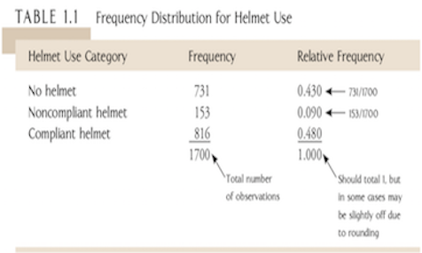

## Assessment

* Assignments: 3 in number each worth 10%
  
    + Practice questions for the procedures 
  
    + Unit outline gives dates
  
* Midsemester Test of about 60 minutes 

    + Multi choice only; 20 qs of 5 alternatives

    + Formula sheet provided
  
    + Non-programmable calculatior allowed: HSC calculator recommended

* Final Exam during the exam period

    + Normal ‘supply answer’ type questions

    + Formula sheet provided
  
    + Non-programmable calculatior allowed: HSC calculator recommended

## What is Statistics?

* Statistics is a collection of methods which help  to describe, summarise, interpret and analyse data. More precisely, it is a body of principles allow one to design valid processes of data collection, developing techniques for data analysis and make reliable inferences from their data.

* Statistics helps to understand and quantify the variation in the data and to identify sources that contribute to this variation.

* Statistics provides answers for making decisions and creating policy.
  
## Why should every one study Statistics?

* DATA (Numerical information) is everywhere. Regardless of your field, interests, lifestyle, etc., you will almost definitely have to make decisions based on data, or evaluate decisions someone else has made based on data
  
* Statistical techniques help us to form decisions that affect our daily lives

* The knowledge of statistical methods help us understand how decision are made and give us a better understanding of how they impact our lives
    
  
## Applications of statistics to various grounds

* Astronomy: Exploring the lifecycle of stars in our Galaxy

* Governments collect data to predict future infrastructure needs. (ABS)

* Modelling of climate, biological systems, ocean currents

* Finance: Equity Research analysts from Morgan Stanly evaluate many facets of a particular stock before making a "buy" or "sell" recommendation

* Economics: Collection of data for key economics indicators: GDP, unemployment, interest rates

* Education: Collection of test scores.

## Course structure

* Descriptive Statistics
      
* Basic probablistic and combinatorics techniques
      
* Probability Distribution
      
* Statistical Inference

## Learning Outcomes

1. Ways statistics is used.

2. Know the differences between descriptive and inferential
statistics

3. Understand the differences between a sample and a population.

4. Identify types of data

    + Explain the difference between qualitative and quantitative variables.
   
    + Compare the differences between discrete and continuous variables.
   
    + Recognize the levels of measurement in data.
   
5. Select appropriate descriptive statistics

6. Choose the correct type of plot

7. Explain the limitations of each type of plot

Once you achieve these objectives you will be ready to work with some data sets and begin to explore the information it contains all of the exmaples in this lectures.


## Population, Sample and Observations

* The **units** on which we data is measured - such as persons, cars, animals, or plants- are called **observations**.

    + Notation: $\omega$

* The collection of all units is called *population* and is represented by $\Omega$.

    + When we refer to $\omega\in\Omega$, we mean a single unit out of all units.
    
    + If we consider a selection of observations $\omega_1,\omega_2,\cdots, \omega_n$, then these observations are called *sample*. A sample is always a subset of the population, $\{\omega_1,\omega_2,\cdots,\omega_n,\}\subseteq\Omega$
    
    
## What is data?

Data is **information** about the set of subjects being studied (like road fatalities)

* Most commonly, data refers to the sample, not the population.

## Type of Data

* When using statistics we need to consider the data we need – preferably in advance – including the data type and source.  Data collected for a purpose usually is more useful but secondary data sources are often cheaper. 

* Identifying the type of data contained in a variable is a critical first step in data analysis as it allows you to identify appropriate statistical procedures.

* Statistical data can be classified into the following groups:

    + Categorical data

        + Nominal: Observation of unordered variables. Examples: eyecolour, car model, gender.

        + Ordinal: Observations can be ranked but the ranks are not quantitatively significant. Examples: voter preference on a ballot.
    
    + Quantitative data
    
        + Interval: The observations follow a quantitative scale which permits arithmetic operation but **without an arbitrary zero**. Examples: temperature on Celsius scale

        + Ratio: The data is fully quantitative and the scale is fixed. Examples: height, share yields. Temperature on **Kelvin** scale

We are generally concerned with determining if quantitative data is <span style="color:red">discrete</span> or <span style="color:red">continuous </span>.


## Type of Data: Summary

<center>
```{r echo=FALSE}
library("DiagrammeR")
grViz("
digraph CFA {
# All
node [fontname = Helvetica, fontcolor = White]
# Box
node [shape = box, style=filled, color=Purple, width=1 label='Type'][fillcolor = Purple]
a ;
# Box
node [shape = box, style=filled, color=violet, width=0.7, label='Qualitative or categorical\\n (Categories)'][fillcolor = violet]
b1 ;
# Box
node [shape = box, style=filled, color=violet, width=0.7, label='Quantitative or numerical\\n Measurements'][fillcolor = violet]
b2 ;
# Box
node [shape = box, style=filled, color=violet, width=0.5, label='Ordinal\\n(ordered)'][fillcolor = violet]
b11 ;
# Box
node [shape = box, style=filled, color=violet, width=0.5, label='Nominal\\n(non-ordered)'][fillcolor = violet]
b12 ;
# Box
node [shape = box, style=filled, color=violet, width=0.5, label='Interval\\n(With arbitrary 0)'][fillcolor = violet]
b21 ;
# Box
node [shape = box, style=filled, color=violet, width=0.5, label='Ratio\\n(With fixed scale)'][fillcolor = violet]
b22 ;
# Box
node [shape = box, style=filled, color=violet, width=0.5, label='Discrete\\n(separated)'][fillcolor = violet]
b221 ;
# Box
node [shape = box, style=filled, color=violet, width=0.5, label='Continuous\\n(continuum)'][fillcolor = violet]
b222 ;
# Box
node [shape = box, style=filled, color=violet, width=0.5, label='Binary\\n(2 categories)'][fillcolor = violet]
b111 ;
# Box
node [shape = box, style=filled, color=violet, width=0.5, label='(3+ categories)'][fillcolor = violet]
b112 ;
# Box
node [shape = box, style=filled, color=violet, width=0.5, label='Binary\\n(2 categories)'][fillcolor = violet]
b121 ;
# Box
node [shape = box, style=filled, color=violet, width=0.5, label='(3+ categories)'][fillcolor = violet]
b122 ;
# Draws
a -> b1 [fontname = Helvetica,fontsize=8]
a -> b2  [fontname = Helvetica,arrowsize = 0.5]
b1->b11 [fontname = Helvetica,style=dashed,fontsize=8]
b1->b12 [fontname = Helvetica,style=dashed,fontsize=8]
b2->b21 [fontname = Helvetica,style=dashed,fontsize=8]
b2->b22 [fontname = Helvetica,style=dashed,fontsize=8]
b11->b111 [fontname = Helvetica,style=dashed,fontsize=8]
b11->b112 [fontname = Helvetica,style=dashed,fontsize=8]
b12->b121 [fontname = Helvetica,style=dashed,fontsize=8]
b12->b122 [fontname = Helvetica,style=dashed,fontsize=8]
b22->b221 [fontname = Helvetica,style=dashed,fontsize=8]
b22->b222 [fontname = Helvetica,style=dashed,fontsize=8]
}
")
```
</center>

---

```{r, echo=FALSE}
library("DiagrammeR")

grViz(" 
  digraph CFA {
  # All
  node [fontname = Helvetica, fontcolor = White]
    # Box
    node [shape = box, style=filled, color=SteelBlue4, width=1, label='Population',fontsize=10][fillcolor = SteelBlue4]
    a ; 
    # Sample

    node [shape = ellipse, style=filled, color=SteelBlue3, width=0.5, label='Sample',fontsize=10][fillcolor = SteelBlue3]
    b ; 
    # Draws
    a -> b [label = ' Sampling ',fontsize=6]
    b -> a [label = '   Infer the character\\n of the population',fontsize=6,fontsize=6]
  }
")
```

## Levels of Measurement of Variables

**Nominal**: Unordered categorical variables. These can be either binary (only two categories, like gender: male or female) or multinomial (more than two categories, like marital status: married, divorced, never married, widowed, separated). The key thing here is that there is no logical order to the categories.

**Ordinal**: Ordered categories. Still categorical, but in an order. Likert items with responses like: “Never, Sometimes, Often, Always” are ordinal.

**Interval**: Numerical values *without* a true zero point. (<span style="color:purple">This means, zero point is arbitrary</span>) The idea here is the intervals between the values are equal and meaningful, but the numbers themselves are arbitrary. 0 does not indicate a complete lack of the quantity being measured. IQ and degrees Celsius or Fahrenheit are both interval.

**Ratio**: Numerical values with a true zero point.

Interval and Ratio variables can be further split into two types: discrete and continuous. Discrete variables, like counts, can only take on whole numbers: number of children in a family, number of days missed from work. Continuous variables can take on any number, even beyond the decimal point.

Not always obvious is that these levels of measurement are not only about the variable itself. Also important are the meaning of the variable within the research context and how it was measured.

*How to distingush interval and ratio data?*

Take temperature on the Celsius scale for instance. In an interval scale, subtraction is defined.  In a ratio scale, division is defined.  The classic example is the Celsius versus Kelvin temperature scales.  On the Celsius scale, a difference of one degree is a meaningful quantity, but you can't say that 100 degrees Celsius is twice as hot as 50 degrees Celsius because the zero point is arbitrary.  On the Kelvin scale, the zero point represents the complete absence of molecular motion, so you can actually say that 100 Kelvins is twice as hot as 50 Kelvins.

The difference between interval and ratio scales is that interval scales have no true zero, whereas ratio scales do. For example, Celsius scale has no such thing as “no temperature”, wheres a linear scale has a true zero length. That is the difference.

[More information](http://psc.dss.ucdavis.edu/sommerb/sommerdemo/scaling/levels.htm)

## Exploratory Data Analysis

* Before going into the actual statistical modelling and analysis of a data set, it is often useful to make some simple characterization of the data in terms of summary statistics and graphics.

* Summarizing and visualizing variables and relationships between two variables is often known as <span style="color:red">descriptive statistics</span> (also known as exploratory data analysis). 

* Our aim now is have you learnt how to use visualisation and transformation to explore your data in a systematic way, a task that statisticians call **exploratory data analysis (EDA)**. 

    * EDA is an iterative cycle. More precisely, EDA refers to a set of procedures for producing descriptive and graphical summaries of the data.
    
    * The benefit of EDA is that it allows you to examine the data as they are without making any assumptions.
    
    * It is a useful way to examine your data, understand relationship among variables.
    
    * Identify any issues such as data entry errors.

The type of summary statistics and visualization methods depend on the type of variable(s) being analyzed (categorical or quantitative)

## Two main branches

* **Descriptive statistics**: The branch of statistics that includes methods for organising and summarizing data.

    * We commonly describe sample drawn from a population in such a way that they are believed to represent the population. 

* **Inferential statistics**: The branch of statistics that involves generalizing from a sample to the population from which the sample was selected and assessing the reliability of such generalization.

    * We draw conclusions about the population from the results gained in the sample. This is **statistical inference**.

## Types of Descriptive Statistics

* Graphical
      
      + Qualitative/Categorical: Bar charts, Pie charts
      
      + Quantitative Data: Line plots, Histograms, Scatterplots
      
      + Quasi-numerical: Stemplots, Dotplot,  Boxplots and Frequency table
      
* Numerical

      + Central tendency: Mean, median, mode
      
      + Spread: Variance, Stdv, Range, Interquartile Range (IQR), Coefficient of Variation (CV)
      
      + Other features: Skewness, Kurtosis
      
## Data Visualisation: Bar chart
 

A **bar chart** is a graph of a frequency distribution of categorical data. Each category in the frequency distribution is represented by a bar or rectangle, and the picture is constructed in such a way that the *area* of each bar is proportional to the corresponding frequency or relative frequency.

## Bar plot: a basic example in R

Suppose, we have a vector of maximum temperatures (in degree Celsius) for seven days as follows
```{r}
max.temp <- c(22, 27, 26, 24, 23, 26, 28)
```
Now we can make a bar plot out of this data.
```{r,fig.width=7,fig.height=3.7}
barplot(max.temp)
```

## Data Visualisation: Comparative bar chart
 Bar charts can also be used to give a visual comparison of two or more groups. This is accomplished by constructing two or more bar charts that use the same set of horizontal and vertical axes, as illustrated in Example 3.1.

<center>


</center>


## Data Visualisation: Pie chart

Categorical data with a relatively small number of possible categories. 
Example: Scientists and Nonscientiest do not see Eye-to-Eye

Scientists and nonscientists were asked to indicate if they agreed or disagreed with the following statement: “When something is run by the government, it is usually inefficient and wasteful.” 

<center>

</center>


## Discrete Numerical Data Visualisation: Stemplots

A stem-and-leaf display is an effective and compact way to summarize univariate numerical data. Each number in the data set is broken into two pieces, a stem and a leaf. The **stem** is the first part of the number and consists of the beginning digit(s). The **leaf** is the last part of the number and consists of the final digit(s).

**Example**: A noise metre was used to detect the noise level ( in decibel ) during a concert in the Hong Kong stadium . The results are recorded below.

```{r}
d=c(82,74,88,66,58,74,78,84,96,76,62,68,72,92,86,76,52,
76,82,78)
stem(d)
```

## Discrete Numerical Data Visualisation: Stemplots

**Pros**:

* Easy to construct

* Permit the viewer to reconstruct the data set

* Easy to identify the order observations

**Cons**:

* Only suitable for describing small set of data

* Little flexibility in the choice of stem

* Does not convey a rapid reading of class frequency

## Data Visualisation: Frequency Distributions and Histogram

As you have seen, a stemplot is not always an effective way to summarize data; it is unwieldy when the data set contains a large number of observations. Frequency distributions and histograms are displays that work well for large data sets.

## Frequency distribution: qualitative data

Barplot is used to represent frequency distribution for categorical/qualitative data

```{r,fig.height=4.5}
grade<- c("A","A","B","C","D","D","A","B","C","C",
          "B","A","A","B","B","C","A","A","A","C")
library(plyr)
y<-count(grade)
barplot(y$freq,names.arg=y$x,main="Frequency Table of Grades",col=c("red","blue","green","yellow"))
```

## Relative frequency
```{r,fig.height=5}
n<-sum(y$freq)
rf<- y$freq/n
barplot(rf,names.arg=y$x,main="Frequency Table of Grades",col=c("red","blue","green","yellow"))
```

## Frequency distribution for quantitative data

A frequency distribution is a tabular presentation of statistical data that aids the analysis of large data sets. Frequency distribution summarize statistical data by assigning it to specified groups, or intervals. In order to build a frequency distribution,

**Procedure**

* Step 1: Define the classes (intervals).

    + We first need to define the classes to which observations will be assigned. By definition, an interval is the set of values that an observation may take on. classes must be *mutually exclusive* in a way that each observation can be placed in only one class, and the total set of intervals should cover the total range of values for the entire population.
    
    + The number of classes used is an important consideration. If too few intervals are used, the data may be too broadly summarised and important characteristics may be lost. On the other hand, if too many intervals are used, the data may not be summarised enough.
    
    
* Step 2: Tally the observations.

    + After the intervals been defined, the observations must be tallied, or assigned to their appropriate interval.In other words, one must assign observations to the correct class.

* Step 3: Count the observations. Having tallied the data set, the number of observations that are assigned to each interval must be counted. The *absolute frequency*, or simply the frequency, is the actual number of observations that fall within a given interval.

---

##Example: Constructing a Frequency distribution

The following data are the annual returns for Intelco, Incc Common Stock. 
10.4%,22.5%,11.1%,-12.4%,9.8%,17.0%, 2.8%,8.4%,34.6%,-28.6%,0.6%,5.0%,-17.6%,5.6% , 8.9%,40.4%,-1.0%,-4.2%,-5.2%,21.0% 
<!---or
0.104,0.225,0.111,-0.124,0.098,0.170,0.028,0.084,0.346,-0.286,0.006,0.050,-0.176,0.056,0.089,0.404,-0.010,-0.042,-0.052,0.210
--->

**Solution**

>- Step 1: Define the class. For Intelco's stock, the range of return is 69% (-28.6% to 40.4%). Using a return interval of 1% would result in 69 separate intervals, which way too many. So let us use 8 nonoverlapping intervals with a width of 10%. The lowest return intervals will be $-30\%$.

|  Interval          |  Tallies |   Absolute Frequency| 
| :----------------- | :------- | :------------------ | 
| $[-30\%,-20\%)$    |    /     | 1                   | 
| $[-20\%,-10\%)$    |   //     | 2                   | 
| $[-10\%,  0\%)$    |  ///     | 3                   |
|   $[0\%, 10\%)$    |  /////// | 7                   |
| $[10\%,  20\%)$    |    ///   | 3                   |
| $[20\%,  30\%)$    |    //    | 2                   |
| $[30\%,  40\%)$    |    /     | 1                   |
| $[40\%,  50\%)$    |    /     | 1                   |
|   Total            |          | 20                  |


## Calculate and intepret relative frequencies and cumulative relative frequencies, given a frequency distribution.

The **relative frequency** is another useful way to present data. The relative frequency is calculated by dividing the absolute frequency of each return interval by the total number of observations. Simply stated, relative frequency is the percentage of total observations falling within each interval. Continuing with our example, the relative frequencies are presented in Figure 1

   |  Interval          | Absolute Frequency| Relative Frequency|
   | :----------------- | :-----------------| :-----------------|
   | $[-30\%,-20\%)$    | 1                 | 1/20=0.05         |
   | $[-20\%,-10\%)$    | 2                 | 2/20= 0.10        |
   | $[-10\%,  0\%)$    | 3                 | 3/20= 0.15        |
   |   $[0\%, 10\%)$    | 7                 | 7/20= 0.35        |
   | $[10\%,  20\%)$    | 3                 | 3/20=0.15         |
   | $[20\%,  30\%)$    | 2                 | 2/20=0.10         |
   | $[30\%,  40\%)$    | 1                 | 1/20=0.05         |
   | $[40\%,  50\%)$    | 1                 | 1/20=0.05         |
   |   Total            | 20                | 1                 |  
   
   Table: Absolute and Relative Frequencies of Intelco Returns


One can also compute the **cumulative absolute frequency** and **cumulative relative frequency**  by summing the absolute or relative frequencies starting at the lowest interval and progressing through the highest. The cumulative absolute frequencies and cumulative relative frequenciest for the Intelco stock returns are in the following

   |  Interval          | Absolute Frequency| Relative Frequency| Cumulative Abs. Freq.| Cumulative rel. Freq.|
   | :----------------- | :-----------------| :-----------------| :--------------------| :--------------------|
   | $[-30\%,-20\%)$    | 1                 |      0.05         | 1                    | 0.05                 |
   | $[-20\%,-10\%)$    | 2                 |      0.10         | 3                    | 0.15                 |
   | $[-10\%,  0\%)$    | 3                 |      0.15         | 6                    | 0.3                  |
   |   $[0\%, 10\%)$    | 7                 |      0.35         | 13                   | 0.65                 |
   | $[10\%,  20\%)$    | 3                 |      0.15         | 16                   | 0.80                 |
   | $[20\%,  30\%)$    | 2                 |      0.10         | 18                   | 0.90                 |
   | $[30\%,  40\%)$    | 1                 |      0.05         | 19                   | 0.95                 |
   | $[40\%,  50\%)$    | 1                 |      0.05         | 20                   | 1                    |
   |   Total            | 20                |        1          |
  
  Table: Absolute and Relative and cumulative Frequencies of Intelco Returns
 
*Note*:  the cumulative absolute frequency (cum. abs. freq.) or cumulative relative frequency (cum. rel. freq.) for any given interval is the sum of the absolute or relative frequencies up to and including the given interval.For instance, the cum. abs. freq. for $[0,0.1)$ interval is 13=1+2+3+7 and the cum. rel. freq. for this interval is 0.05+0.1+0.15+0.35=0.65.

## Example: Histogram

A **histogram** is the graphical presentation of the absolute frequency distribution. It is simply a bar chart of **continuous** data that has been classified into a frequency distribution. The attractive feature of a histogram is that it allows us quickly see where most of the observations are concentrated.

```{r}
# Read in DATA
Return<- c(0.104,0.225,0.111,-0.124,0.098,0.170,0.028,0.084,0.346,-0.286,0.006,0.050,-0.176,0.056,0.089,0.404,-0.010,-0.042,-0.052,0.210)
# Choose the class
breaks=c(-0.3,-0.2,-0.1,0,0.1,0.2,0.3,0.4,0.5)
# Produce a distribution table
table(cut(Return,breaks))
# Produce a histogram
hist(Return,br=breaks,freq=F,right=F, xlab="Return",main="Histogram for return of Inteco's stock")
```

## Data Visualisation: Histogram

```{r}
data=read.csv("DATA/pizza_delivery.csv")
hist(data$bill,freq=FALSE)
lines(density(data$bill,na.rm=T),col="red",lwd=4)
```

**Word of Caution**: [Histogram is NOT a bar chart!](https://www.forbes.com/sites/naomirobbins/2012/01/04/a-histogram-is-not-a-bar-chart/#21b253ec6d77)

## Data Visualisation/Spread measure: Boxplot

```{r}
boxplot(data$bill,horizontal=TRUE)
```

## Data Visualisation: Scatterplot

See lecture 2.

## Numerical Descriptions of Data

* A measure used to describe a characteristic of a population is referred to as a **parameter**. Examples: mean and standard deviation.

* Likewise, a **sample statistic** is used to measure a characteristic of a sample.

* In order to distinguish between parameters and statistics, different notations are used:

    + Greek letter for parameter (e.g. $\mu$ and $\sigma$)
    
    + Roman letter for statistic (e.g. $\bar{x}$ and $s$)
    
* Parameter are fixed (*typically unknown*) and statistics are random (*observed from our sample*)

## Symmetry

* The symmetry of a distribution is measured by calculating the skewness of the distribution.

    + Negative skewness: **left skewed** distribution.
    
    + Positive skewness: **right skewed** distribution.
    
    + Skewness close to 0, reasonably **symmetric** distribution.
    
* In general, we will only state that a distribution is skewed if the skew is strong and obvious.
<centre>

</centre>

## Measures of Central Tendency

* One important feature of the data we collect is the location of the data, that is, what are typical value of my observations?

* One way to describe the location of the data is to calculate a measure of central tendency. That is, where is the middle of the data?

* Three common measures of central tendency.

    + Mean : average
    
    + Median: middle, depends on data being ordered.
    
    + Mode: most frequent observations?
 
## Measures of Central Tendency: Mean

* Sample mean

    + With sample size $n$
    $$\bar{X}=\frac{\sum^n_{i=1}x_i}{n}=\frac{x_1+x_2+\cdots+x_n}{n}$$
    
* Polulation mean

    + With population size $N$
    $$\mu=\frac{\sum^N_{i=1}x_i}{n}=\frac{x_1+x_2+\cdots+x_N}{N}$$

## Measures of Central Tendency: Mean

* Issues with using the mean:

    + Can be sensitive to skewness.
    
    + The mean can be very sensitive to a few extreme values (Outliers).
    
* So we use the mean when the distribution is not strongly skewed, and has no outliers.


## Measures of Central Tendency: Median 

The median is the middle data point, after the data is ordered from smallest to largest.

* If $n$ is odd, then the median is the unique middle point as $x_{\frac{n+1}{2}}$.

* If $n$ is even, the median is the average of 2 middle values. That is $\frac{x_{n/2}+x_{n/2+1}}{2}$

## Measure of Central Tendency: Mode

* The mode is the value that occurs most often.

    + The mode is not affected by extreme values.
    
    + There may be more than one mode.
    
    + The mode may not exist at all.
    
    + Used for either numerical or categorical data
    
## Pizza delivery dataset

The pizza delivery dataset refers to an Italian restaurant which offers home delivery of pizza.

```{r}
#Read in data
data=read.csv("DATA//pizza_delivery.csv",header=T)
#Names of variables
names(data)
```

## Pizza delivery dataset

* Structure of Data
```{r}
str(data)
```

## Numerical summaries: Central tendency

We can find mean and median by hand. However, here our sample size is 1266. It is tedious to compute mean over these many observations. Fortunately we have R to perform this task.
```{r}
mean(data$bill)
median(data$bill)
```
* How did you find median? 

    + As the size of the data is 1266 (even), the median is found between the 633rd and 634th bill, or $\frac{42.9+42.9}{2}=42.9$.

* To find mode, sadly there is no R in-built function to use. Hence we have to create our own.
```{r}
x<-data$bill
y=names(table(x))[table(x)==max(table(x))]
y
```
    
## Mean, Median and Mode on the histogram

```{r}
hist(data$bill)
abline(v=mean(data$bill),col="green")
abline(v=median(data$bill),col="purple")
abline(v=y,col="pink")
```

## Mean, Median and Mode on the boxplot

* The median is the centre line on the boxplot.
```{r, fig.height=5}
boxplot(data$bill)
abline(h=mean(data$bill),col="green")
abline(h=median(data$bill),col="purple")
abline(h=y,col="pink")
```

As you see, both histogram and boxplot suggest that the mean and median of total bills from pizza delivery is about the same. In other words, our data is fairly symmetric. Note, this is not necessarily the case in practice. Very often, the two statistics differ greatly from each other due to outliers. In general, the median is more robust and a good summary for skewed data as it is NOT affected by outliers.


## Measure of Spread

*  Range
    
*  Variance
    
*  Standard Deviation
    
*  Quartile, IQR
    
## Measure of Spread: Range

*  Difference between the **largest** and the **smallest** observations:
    
$$\text{Range}=X_{\text{Largest}}-X_{\text{Smallest}}$$

## Measures of Spread: Variance

* Average (squared) distance of an observation from the mean.

* Variances of independent measurements **can be added together** (standard deviation cannot be added).

    + Sample Variance:
    \[s^2=\frac{\sum^n_{i=1}(X_i-\overline{X})^2}{n-1}\]
    + 
    \[\sigma^2=\frac{\sum^N_{i=1}(x_i-\mu)^2}{N}\]
    Caution: the sample variance has a denominator of $n-1$, but the population variance has a denominator of $N$.
    
## Measures of Spread: Standard Deviation

* The positive square root of the variance.

* It is easier to interpret as it has the **same units** as the data itself.

    + Sample Standard Deviation:
    $$ s=\sqrt{\frac{\sum^n_{i=1}(X_i-\overline{X})^2}{n-1}} $$
    
    + Population Standard Deviation:
    $$ \sigma=\sqrt{\frac{\sum^n_{i=1}(x_i-\mu)^2}{N}} $$
    
## Measures of Spread: Percentiles, Quartiles and IQR

* The **percentiles** are a set of values that divides the data into percentages.

* The quartiles are a set of 3 values (Q1, Q2, Q3) that roughly split the data into quarters

  * Q1 is the 25th percentile point

  * Q2 is the median

  * Q3 is the 75th percentile point

* IQR is equal to Q3-Q1 which represent the length of middle 50% of the data set.

    + Just like the median, the IQR is **robust**, so it is suitable as a summary of spread for skewed data

## The Five Number Summary

* One neat way to summarise the data is the 5 number summary, which is drawn by the boxplot.
<center>

</center>

## Example

For illustration purpose, Let us consider the test scores of 9 students in Quantum Physics.

```{r}
scores <- c(78,93,68,84,90,74,64,55,80) # Created the vector object scores using c() function
scores #print the scores
```
To begin with, we first need to sort the scores,
```{r}
sort(scores)
```
* By inspection, we can see that 55 is the *minimum* score and 93 is the *maximum* score. 

* Recall that *Median* is the middle value of the observation which divides the data into two parts. Half of the observations have value less than median and half more than median.
  
* Since 9 is odd, the unique middle point is 5th position which is 78. In other words, half of the scores are less than 78 and half of the scores are more than 78.

* $Q1$ is $1/4$ way along from the first observation to the last observation. We have 9 observations. So $1+(9-1)/4=3\text{rd}$ position, 68 is the first quartile. $Q3$ is $3/4$ way along from the first observation to the last observation. We have 9 observations. So $1+(9-1)*3/4=7\text{th}$ position, 84 is the 3rd quartile. 

* For larger dataset it is unrealistic to calculate by hand. So let us learn how to get summary statistics with R

```{r}
min(scores)
max(scores)
median(scores)
#finding the quartiles using the quantile()function
quantile(scores)
# Q1 or the 25th quartile
quantile(scores,0.25)
# Q3 or the 75th quartile
quantile(scores,0.75)
#25th,50th and 75th quartile
quantile(scores,c(0.25,0.5,0.75))
# For the 5 number summary, you have two alternatives
fivenum(scores)
summary(scores)

```

Finally, let us boxplot all these information.

```{r}
par(mfrow=c(1,2))
boxplot(scores)
boxplot(scores)
abline(h=min(scores),col="Blue")
abline(h=max(scores),col="Yellow")
abline(h=median(scores),col="Green")
abline(h=quantile(scores,c(0.25,0.75)),col="Red")
```

## Boxplot with outlier

An observation is an **outlier** if it is more than 1.5 (IQR) away from the nearest quartile (the nearest end of the box)


```{r}
shapes<-c(0.553,0.57,0.576,0.601,0.606,0.606,0.609,0.611,0.615,0.628,0.654,0.662,0.668,0.670,0.672,0.690,0.693,0.749,0.844,0.933)
summary(shapes)
```

From the 5-number summary we know that 
\[\text{median}=0.641,\quad Q1=0.606,\quad Q3=0.681\]
\[\text{IQR}=0.681-0.606=0.075,\quad 1.5\text{(IQR)}=0.1125,\quad 3\text{(IQR)}=0.225 \]

Thus,
\[Q1+1.5*IQR=0.681+0.1125=0.7935\]
\[Q1-1.5*IQR=0.681-0.1125=0.4935\]

So both 0.844 and 0.933 are outliers on the upper end (because they are larger than 0.7935). Again, we ask R to draw a boxplot with summaries with outliers.

```{r}
par(mfrow=c(1,2))
boxplot(shapes)
boxplot(shapes)
abline(h=min(shapes),col="Blue")
abline(h=max(shapes),col="Yellow")
abline(h=median(shapes),col="Green")
abline(h=quantile(shapes,c(0.25,0.75)),col="Red")
```

## Comparing the mean and the median

The difference between the mean and the median can be an indication of the **shape** of the data.

* For symmetric data, we expect the mean and median to be the same

* For left skewed data, we expect the mean to be smaller than the median

* For right skewed data, we expect the mean to be larger than the median
<centre>

</centre>

## Interpreting Center and Variability: Chebyshev rule (or Chebyshev's inequality)

The mean and standard deviation can be combined to make informative statements about how the values in a data set are distributed and about the relative position of a particular value in a data set.To this end, it is useful to describe how far away a particular observation is from the mean in terms of standard deviation. More precisely,the Chebyshev rule states that for any set of observations, whether sample or population data and regardless of the shape of the distribution, the percentage of the observations that lie within $k$ standard deviation of the mean is at least $1-1/k^2$ for all $k>1$. 

<centre>

</centre>

**Example**: Chebyshev's inequality

What is the minimum percentage of any distribution that will lie within $\pm 2$ standard deviation of the mean?

**Answer**:

Applying Chebyshev's inequality, we have
\[1-1/k^2=1-1/2^2 =1-1/4=0.75\quad\text{or}\quad 75\%\]

## HW exercise

* Given a data set (9,10,10.5,12,14,17), find mean, variance and standard deviation by hand.

In R, define

```{r}
x<- c(9,10,10.5,12,14,17)
miu<- mean(x)
variance<- var(x)
sdtv<- sqrt(variance)
miu
variance
sdtv
```

## IQR on the boxplot

* As discussed earlier, the IQR is the length of the box. It represents the span of the middle 50% of the data.

* The **lower** and **upper thresholds** are a distance of 1.5 from the quartiles (by convention)

$$ \text{LT}=Q1-1.5\, \text{IQ}R $$
and 
$$ \text{UT}=Q3+1.5\, \text{IQ}R $$

* Data outside these thresholds is considered an outlier.

## Back to Pizza delivery dataset

```{r,fig.height=5}
boxplot(data$bill)
iqr=quantile(data$bill)[4]-quantile(data$bill)[2]
abline(h=median(data$bill),col="pink")
abline(h=quantile(data$bill)[2]-1.5*iqr,col="purple")
abline(h=quantile(data$bill)[2]+1.5*iqr,col="purple")
```

Note, there exists quite a few outliers out of the 1266 pizza bills!

## Coefficient of Variation

* The **Coefficient of Variation** (CV) combines the mean and standard deviation into 1 summary statistic:
$$ CV=\frac{\bar{x}}{s} $$

* The CV is used in:

    + Engineering and Physics for quality assurance studies
    
    + Banking and finance for determining the volatility of a financial security
    
## Lies, damn lies and statistics

* Statistics is a discipline which can be easily misused, in fact, often done by journalists to politician to the common public. Basically, given some data one can torture it enough, so that one can get the desired result. This particular statement tries to portray that "poor" side of statistics.

## Lies, damn lies and statistics: Case study


[UK Politics](https://www.bbc.co.uk/news/uk-politics-14558369)

* Why was this poor statistics?

  * The conclusion was not statistically significant because of the sampling errors. The "official figures" also showed that the 95% confidence interval was -49,000 to 125,000.
  
  * We will talk about *sampling* in the near future.

<!---  
## Summary


## See you next time `r emo::ji("smile")`

--->