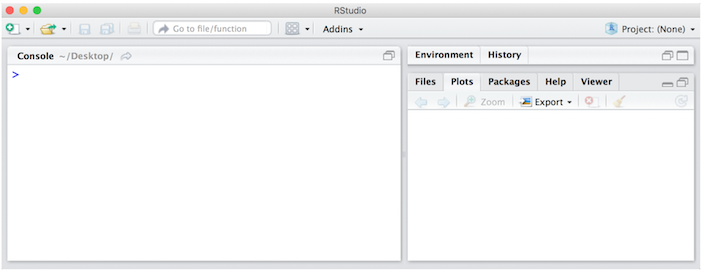
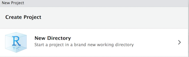
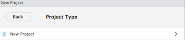
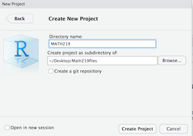
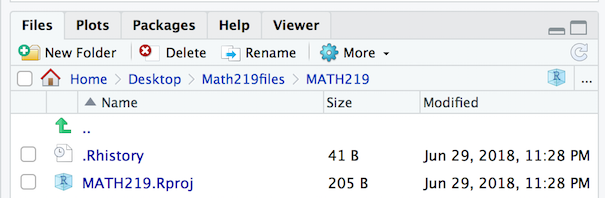
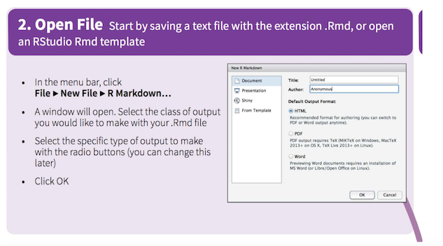
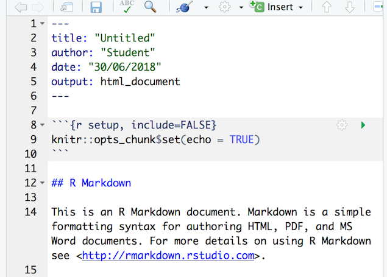
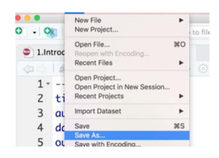
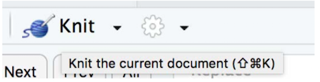
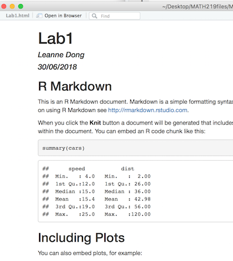

---
title: "Introduction to R and RStudio"
author: "Leanne Dong"
date: "28/06/2018"
output:
  slidy_presentation: default
  ioslides_presentation: default
---


```{r setup, include=FALSE}
knitr::opts_chunk$set(echo = FALSE)
```

## What is R

* R is an open source statistical language with over 2 million users world-wide.

    + R was created by Ross Ihaka and Robert Gentleman at the University of Auckland, New Zealand.

    + It is an implementation of the S programming language.

    + It is the tool of choice for many data scientists.

* R is extremely powerful and highly flexible.

    + We will run R through RStudio, which is an open source integrated development environment (IDE) for R.

  + For a quick overview, try [R Code School](https://www.pluralsight.com/search?q=R).
  
## Why should I use R and what can R do?

While the vast majority of people use Microsoft Excel for data analysis, R offers numerous advantages, such as:

1. Reproducible Research (self-documenting,repeatable)

2. Community learning supports

## RStudio: An Integrated Development Environment (IDE) for R

* RStudio is an integrated development environment (IDE) that allows you to interact with R more readily. RStudio is similar to the standard RGui, but is considerably more user friendly. It has more drop-down menus, windows with multiple tabs, and many customization options. The first time you open RStudio, you will see three windows. A forth window is hidden by default, but can be opened by clicking the File drop-down menu, then New File, and then R Script.. Detailed information on using RStudio can be found at at [RStudio’s Website](https://support.rstudio.com/hc/en-us/sections/200107586-Using-RStudio)

## ACU Computer Setup

R and RStudio have been installed on all ACU computers which have NASIS installed. R and RStudio are typically updated and CCE-approved once a year. The versions on ACU machines may be one to three releases behind the latest version available for public download. Having an outdated version of R rarely creates a problem, although warnings may appear.

## What is RMarkdown and why not Powerpoint?

* Pros of Rmarkdown to PPT

    + Interactive visualizations - these make for much more engaging presentations
    
    + More aesthetic control - not limited to Microsoft conventions
    
    + Include code and code results easily and legibly
    
    + Only require a browser to open - do not require Adobe, Powerpoint, or anything else
    
    + Guarantees that the code you included results in the output shown

    + Visualization options are only limited by what is possible in R (for example, try making a decent looking Sankey diagram in Excel, Word, or Powerpoint)

---

* Cons of Rmarkdown compared to Powerpoint

    + Requires some knowledge of R and R Studio to create documents
    
    + May need some HTML/CSS knowledge to control aesthetics
    
    + Somewhat more difficult to edit/collaborate - the “finished” markdown can look confusing before it is knit, as it can contain some raw HTML, R, YAML, and/or CSS code.
    
--- 

Basically, it is somewhat harder to make your document in Rmarkdown, but it is well worth the effort if you plan to include R code, interactive visualizations, or R-specific visualizations. Additionally, if you need your output to be an HTML file, Rmarkdown can be a great choice.

## Step 1: Open RStudio

* RStudio and R are only installed in the present computer lab in ACU. (The old technology used was SPSS. Due to the popularity in both academia and industry, we replaced SPSS with R)

* We also recomment that you download [R](https://cran.csiro.au/) and then [RStudio](https://www.rstudio.com/products/rstudio/download/) onto your own computer. You can work on your own laptop in labs if you'd like to.


## Step 2: Create a course project (one-off)

Create a course folder on your USB or Desktop (own laptop). eg <mark> MATH219files</mark>

___

* Create a project and save it as <mark>MATH219</mark> in <mark>~Desktop/Math219files</mark>.




---

* It will appear in your files in RStudio as MATH219.Rproj.



\


* It will also appear as a sub-folder (containing Lab1.Rproj) in the MATH219


## Step3: Create a RMarkdown document for each Lab and Project

* This is where you will save all your Rcode and comments.

    

## Step4: Edit your RMarkdown document
 
* You will have an example file, which you can edit.



---

* Name the file: Lab1.Rmd



* Render the file using Knit



___ 

* This will create <mark>Lab1.html</mark>, which you can open in a browser.



* This will appear in your <mark>MATH219files/MATH219</mark> folder as <mark>Lab1.html</mark>.

## Data Management in RStudio

Everytime you come to the lab or in your own laptop, just open "MATH219.Rproj." Then you should be in the right directory.

## Data Management in RStudio: Importing Data

We will be mainly using .csv files. If you follow the advice and open the MATH219.Rproj, then you could simple use the file name, like so

data <- read.csv("data/UStrial.csv")

