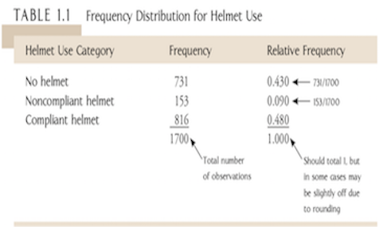

## Type of Data: Summary

```{r echo=FALSE}
library("DiagrammeR")
grViz("
digraph CFA {
# All
node [fontname = Helvetica, fontcolor = White]
# Box
node [shape = box, style=filled, color=Purple, width=1 label='Type'][fillcolor = Purple]
a ;
# Box
node [shape = box, style=filled, color=violet, width=0.5, label='Qualitative or categorical\\n (Categories)'][fillcolor = violet]
b1 ;
# Box
node [shape = box, style=filled, color=violet, width=0.5, label='Quantitative or numerical\\n Measurements'][fillcolor = violet]
b2 ;
# Box
node [shape = box, style=filled, color=violet, width=0.3, label='Ordinal\\n(ordered)'][fillcolor = violet]
b11 ;
# Box
node [shape = box, style=filled, color=violet, width=0.3, label='Nominal\\n(non-ordered)'][fillcolor = violet]
b12 ;
# Box
node [shape = box, style=filled, color=violet, width=0.3, label='Interval\\n(With arbitrary 0)'][fillcolor = violet]
b21 ;
# Box
node [shape = box, style=filled, color=violet, width=0.3, label='Ratio\\n(With fixed scale)'][fillcolor = violet]
b22 ;
# Box
node [shape = box, style=filled, color=violet, width=0.3, label='Discrete\\n(continuum)'][fillcolor = violet]
b221 ;
# Box
node [shape = box, style=filled, color=violet, width=0.3, label='Continuous\\n(continuum)'][fillcolor = violet]
b222 ;
# Box
node [shape = box, style=filled, color=violet, width=0.3, label='Binary\\n(2 categories)'][fillcolor = violet]
b111 ;
# Box
node [shape = box, style=filled, color=violet, width=0.3, label='(3+ categories)'][fillcolor = violet]
b112 ;
# Box
node [shape = box, style=filled, color=violet, width=0.3, label='Binary\\n(2 categories)'][fillcolor = violet]
b121 ;
# Box
node [shape = box, style=filled, color=violet, width=0.3, label='(3+ categories)'][fillcolor = violet]
b122 ;
# Draws
a -> b1 [fontname = Helvetica,fontsize=8]
a -> b2  [fontname = Helvetica,arrowsize = 0.5]
b1->b11 [fontname = Helvetica,style=dashed,fontsize=8]
b1->b12 [fontname = Helvetica,style=dashed,fontsize=8]
b2->b21 [fontname = Helvetica,style=dashed,fontsize=8]
b2->b22 [fontname = Helvetica,style=dashed,fontsize=8]
b11->b111 [fontname = Helvetica,style=dashed,fontsize=8]
b11->b112 [fontname = Helvetica,style=dashed,fontsize=8]
b12->b121 [fontname = Helvetica,style=dashed,fontsize=8]
b12->b122 [fontname = Helvetica,style=dashed,fontsize=8]
b22->b221 [fontname = Helvetica,style=dashed,fontsize=8]
b22->b222 [fontname = Helvetica,style=dashed,fontsize=8]
}
")
```

## A Review of the Levels of Measurement of Variables

**Nominal**: Unordered categorical variables. These can be either binary (only two categories, like gender: male or female) or multinomial (more than two categories, like marital status: married, divorced, never married, widowed, separated). The key thing here is that there is no logical order to the categories.

**Ordinal**: Ordered categories. Still categorical, but in an order. Likert items with responses like: “Never, Sometimes, Often, Always” are ordinal.

**Interval**: Numerical values without a true zero point. The idea here is the intervals between the values are equal and meaningful, but the numbers themselves are arbitrary. 0 does not indicate a complete lack of the quantity being measured. IQ and degrees Celsius or Fahrenheit are both interval.

**Ratio**: Numerical values with a true zero point.

Interval and Ratio variables can be further split into two types: discrete and continuous. Discrete variables, like counts, can only take on whole numbers: number of children in a family, number of days missed from work. Continuous variables can take on any number, even beyond the decimal point.

Not always obvious is that these levels of measurement are not only about the variable itself. Also important are the meaning of the variable within the research context and how it was measured.

*How to distingush interval and ratio data?*

Take temperature on the Celsius scale for instance. In an interval scale, subtraction is defined.  In a ratio scale, division is defined.  The classic example is the Celsius versus Kelvin temperature scales.  On the Celsius scale, a difference of one degree is a meaningful quantity, but you can't say that 100 degrees Celsius is twice as hot as 50 degrees Celsius because the zero point is arbitrary.  On the Kelvin scale, the zero point represents the complete absence of molecular motion, so you can actually say that 100 Kelvins is twice as hot as 50 Kelvins.

The difference between interval and ratio scales is that interval scales have no true zero, whereas ratio scales do. For example, Celsius scale has no such thing as “no temperature”, wheres a linear scale has a true zero length. That is the difference.

[More information](http://psc.dss.ucdavis.edu/sommerb/sommerdemo/scaling/levels.htm)

## Bar plots



```{r}
#Step 1: Create a table directly
helmet <- matrix(c(731,153,816),ncol=3,byrow =TRUE)
colnames(helmet) <- c("No helmet","Noncompliant helmet","Compliant helmet")
rownames(helmet) <- "Frequency"
smoke <- as.table(helmet)
smoke
#barplot
barplot(helmet,main='Frequency Distribution for Helmet Use')
```

## Frequency distribution for quantitative data

A frequency distribution is a tabular presentation of statistical data that aids the analysis of large data sets. Frequency distribution summarize statistical data by assigning it to specified groups, or intervals. In order to build a frequency distribution,

**Procedure**

* Step 1: Define the classes (intervals).

    + We first need to define the classes to which observations will be assigned. By definition, an interval is the set of values that an observation may take on. classes must be *mutually exclusive* in a way that each observation can be placed in only one class, and the total set of intervals should cover the total range of values for the entire population.
    
    + The number of classes used is an important consideration. If too few intervals are used, the data may be too broadly summarised and important characteristics may be lost. On the other hand, if too many intervals are used, the data may not be summarised enough.
    
    
* Step 2: Tally the observations.

    + After the intervals been defined, the observations must be tallied, or assigned to their appropriate interval.In other words, one must assign observations to the correct class.

* Step 3: Count the observations. Having tallied the data set, the number of observations that are assigned to each interval must be counted. The *absolute frequency*, or simply the frequency, is the actual number of observations that fall within a given interval.

---

##Example : Constructing a Frequency distribution

The following data are the annual returns for Intelco, Incc Common Stock. 
10.4%,22.5%,11.1%,-12.4%,9.8%,17.0%, 2.8%,8.4%,34.6%,-28.6%,0.6%,5.0%,-17.6%,5.6% , 8.9%,40.4%,-1.0%,-4.2%,-5.2%,21.0% 
or

0.104,0.225,0.111,-0.124,0.098,0.170,0.028,0.084,0.346,-0.286,0.006,0.050,-0.176,0.056,0.089,0.404,-0.010,-0.042,-0.052,0.210

**Solution**

>- Step 1: Define the class. For Intelco's stock, the range of return is 69% (-28.6% to 40.4%). Using a return interval of 1% would result in 69 separate intervals, which way too many. So let us use 8 nonoverlapping intervals with a width of 10%. The lowest return intervals will be $-30%


>- |  Interval          |  Tallies |   Absolute Frequency| 
   | :----------------- | :------- | :------------------ | 
   | $[-30\%,-20\%)$    |    /     | 1                   | 
   | $[-20\%,-10\%)$    |   //     | 2                   | 
   | $[-10\%,  0\%)$    |  ///     | 3                   |
   |   $[0\%, 10\%)$    |  /////// | 7                   |
   | $[10\%,  20\%)$    |    ///   | 3                   |
   | $[20\%,  30\%)$    |    //    | 2                   |
   | $[30\%,  40\%)$    |    /     | 1                   |
   | $[40\%,  50\%)$    |    /     | 1                   |
   |   Total            |          | 20                  |

Tallying and counting the observations generates a frequency distribution that summarizes the pattern of annual return on Intelco common stock. Note, the interval with the greatest (absolute) frequency is the $[0\%,10\%)$ interval, which includes seven return observations. For any frequency distribution, the interval with the greatest frequency is referred to as the modal interval.

## Example: Histogram

A **histogram** is the graphical presentation of the absolute frequency distribution. It is simply a bar chart of **continuous** data that has been classified into a frequency distribution. The attractive feature of a histogram is that it allows us quickly see where most of the observations are concentrated.

```{r}
# Read in DATA
Return<- c(0.104,0.225,0.111,-0.124,0.098,0.170,0.028,0.084,0.346,-0.286,0.006,0.050,-0.176,0.056,0.089,0.404,-0.010,-0.042,-0.052,0.210)
# Choose the class
breaks=c(-0.3,-0.2,-0.1,0,0.1,0.2,0.3,0.4,0.5)
# Produce a distribution table
table(cut(Return,breaks))
# Produce a histogram
hist(Return,br=breaks,freq=F,right=F, xlab="Return",main="Histogram for return of Inteco's stock")
```

## Calculate and intepret relative frequencies and cumulative relative frequencies, given a frequency distribution.

The **relative frequency** is another useful way to present data. The relative frequency is calculated by dividing the absolute frequency of each return interval by the total number of observations. Simply stated, relative frequency is the percentage of total observations falling within each interval. Continuing with our example, the relative frequencies are presented in Figure 1

   |  Interval          | Absolute Frequency| Relative Frequency|
   | :----------------- | :-----------------| :-----------------|
   | $[-30\%,-20\%)$    | 1                 | 1/20=0.05         |
   | $[-20\%,-10\%)$    | 2                 | 2/20= 0.10        |
   | $[-10\%,  0\%)$    | 3                 | 3/20= 0.15        |
   |   $[0\%, 10\%)$    | 7                 | 7/20= 0.35        |
   | $[10\%,  20\%)$    | 3                 | 3/20=0.15         |
   | $[20\%,  30\%)$    | 2                 | 2/20=0.10         |
   | $[30\%,  40\%)$    | 1                 | 1/20=0.05         |
   | $[40\%,  50\%)$    | 1                 | 1/20=0.05         |
   |   Total            | 20                | 1                 |  
   
   Table: Absolute and Relative Frequencies of Intelco Returns


One can also compute the **cumulative absolute frequency** and **cumulative relative frequency**  by summing the absolute or relative frequencies starting at the lowest interval and progressing through the highest. The cumulative absolute frequencies and cumulative relative frequenciest for the Intelco stock returns are in the following

   |  Interval          | Absolute Frequency| Relative Frequency| Cumulative Abs. Freq.| Cumulative rel. Freq.|
   | :----------------- | :-----------------| :-----------------| :--------------------| :--------------------|
   | $[-30\%,-20\%)$    | 1                 |      0.05         | 1                    | 0.05                 |
   | $[-20\%,-10\%)$    | 2                 |      0.10         | 3                    | 0.15                 |
   | $[-10\%,  0\%)$    | 3                 |      0.15         | 6                    | 0.3                  |
   |   $[0\%, 10\%)$    | 7                 |      0.35         | 13                   | 0.65                 |
   | $[10\%,  20\%)$    | 3                 |      0.15         | 16                   | 0.80                 |
   | $[20\%,  30\%)$    | 2                 |      0.10         | 18                   | 0.90                 |
   | $[30\%,  40\%)$    | 1                 |      0.05         | 19                   | 0.95                 |
   | $[40\%,  50\%)$    | 1                 |      0.05         | 20                   | 1                    |
   |   Total            | 20                |        1          |
  
  Table: Absolute and Relative and cumulative Frequencies of Intelco Returns
 
*Note*:  the cumulative absolute frequency (cum. abs. freq.) or cumulative relative frequency (cum. rel. freq.) for any given interval is the sum of the absolute or relative frequencies up to and including the given interval.For instance, the cum. abs. freq. for $[0,0.1)$ interval is 13=1+2+3+7 and the cum. rel. freq. for this interval is 0.05+0.1+0.15+0.35=0.65.
   
   
## The Queen bees examples

Queen honey bees mate shortly after they become adults.  During a mating flight, the queen usually takes several partners, collecting sperm that she will store and use throughout the rest of her life.  A study on honey bees provided the following data on the number of partners for 30 queen bees.

12,2,4,6,6,7,8,7,8,11,8,3,5,6,7,10,1,9,7,6,9,7,5,4,7,4,6,7,8,10 

```{r}
bees<-c(12,2,4,6,6,7,8,7,8,11,8,3,5,6,7,10,1,9,7,6,9,7,5,4,7,4,6,7,8,10 )
hist(bees,#apply the hist function
     breaks=12,# the number of intervals
     right=F, #intervals closed on the left
     main="The number of partners for 30 queen bees")# the main title
     
hist(bees,#apply the hist function
     breaks=12,# the number of intervals
     freq=F,# the vertical axis is in relative frequency
     right=F, #intervals closed on the left
     main="The number of partners for 30 queen bees")# the main title
```

## Working from home?

Millions of Australians get up each morning and telecommute to work from home.
The following is a sample of age data for individuals working at home

* Compute mean and mode.

* Write down the 5-number summary for these observations.

* Draw a boxplot to visually display these observations and comment on its features.

* The median age of the population of all adults is 35.5 yrs. Use the median age of the data to comment on whether at-home workers tend to be younger or older than the population of all adults.

* Compute the variance and standard deviation.
```{r}
age<-c(18,54,20,46,25,48,53,27,26,37,40,36,42,25,27,33,28,40,45,25)
Mean<-mean(age)
Variance<-var(age)
Median<-median(age)
#To find mode, write a function
Mode=names(table(age))[table(age)==max(table(age))]
#Now we pull a 5-number summary (Minimum,Q1, Median, Q3, Maximum)
summary(age)
boxplot(age,horizontal=T)
```
