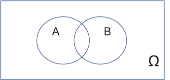
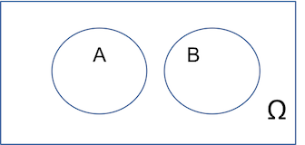
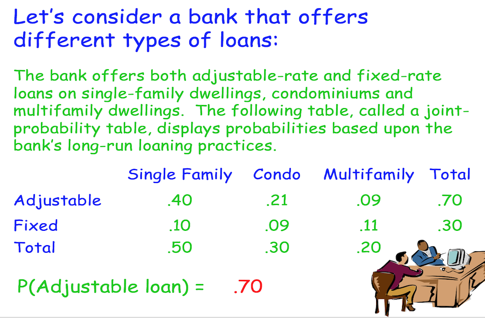
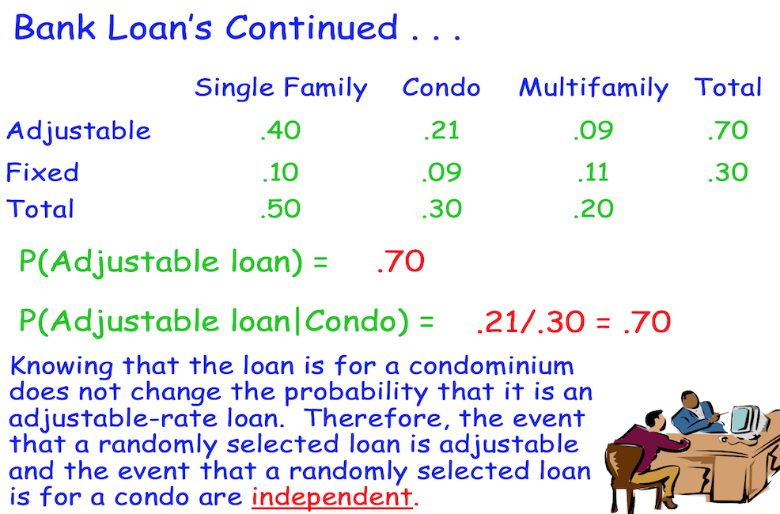

## Learning Objectives

* Define probability

* Determine the number of outcomes using the appropriate principle of counting,

* Identify and apply appropriate approach to assigning probabilities,

* Calculate probabilities using rule of addition and multiplication,

* Define the term conditional probability,

* Calculate a probability using Bayes' theorem

* Define simulation

## Probability: Basic concepts and intuition

* Probability involves the assignment, by some means, of a numerical rating of the likelihood that an event will occur.

* The theory of probability owes much to gambling as many of the rules were developed by the mathematicians Blaise Pascal and Pierre de Fermat in response to a specific request in 1654 by a French gambler, Antoine Gombaud, the Chevalier de Mere. He needed information about a particular dice game.

* Probability theory serves as a foundamental building block of statistical inference, which is about drawing conclusions about the population from the results gained in the descriptive statistics of a sample.

* Roughly speaking, **probability** is a value between 0 and 1, inclusive, describing the relative possibility (chance or likelihood) an event will occur.

* Probability can be given as a fraction between 0 and 1

* Given as a percentage

* Given as 'odds'.

    + The *odds* that an event will occur is the ratio of the probability that the event will occur to the probability it will not occur, provided neither probability is 0. That is, if $E$ is the event, the odds that $E$ will occur is 
    \[\frac{\mathbb{P}(E)}{\mathbb{P}(E^c)}=\frac{\mathbb{P}(E)}{1-\mathbb{P}(E)}\]
    
## Example: Given as odd
    
* **Example**: the odds are $a:b$ that an event will occur. This means the probability event $E$ will occur is \[\mathbb{P}(E)=\frac{a}{a+b}\]

* We say that the odds *against* an event happening are $m:n$ when we partition the likelihood up into $m+n$ parts and estimate the chance of the event occuring as $\frac{n}{m+n}$.

* **Example**: A game of roulette involves rolling a little ball around a spinning dish with a circumference divided into 37 equal parts.  There are 18 red numbers and 18 black numbers and a green slot to give the gambling house an edge.   Find the odds against the ball  resting finally in a red slot in a fair game.
    
    + *Solution*: There are 19 slots which are not red so the odds against the ball resting finally in a red slot in a fair game are 19:18. This means the chance of the ball finishing on red is $\frac{18}{37}$.

## Events and Sample spaces 

When conducting a random experiment, the outcomes cannot be predicted with certainty in advance.

The set of all possible outcomes is called the *sample space*, denoted by $\Omega$.
An element $\omega$ of $\Omega$ is a *sample point*. Any subset of the sample space is said to be an *event*.

Hence in a nutshell, An *event* corresponds to some outcome or collection of outcomes.

Some everyday examples

* In tossing a coin, 'obtaining a head face up' is an event.

* In drawing a card from a card deck, 'obtaining a jack or queen' could be considered as a single event.

## Classical probability - A frequency approach

*Random experiments*: outcomes cannot be determined in advanced.

Let $n$ be a total number of independent samples of a random experiment. Let $n(A)$ be a number of experiements (out of total $n$) in which the event $A$ occured, then one can define a probability through relative frequencies. That is, if we can look at a large number of "identical situations", the the probability of $A$  is defined as $P(A)\approx\frac{n(A)}{n}$.

Hence, the *Frequency approach to the definition of probability* is arrived as
\[P(A)=\lim_{n\to\infty}\frac{n(A)}{n}\].

For any given random experiment one has exactly $n(\Omega)$ physically distinct equally likely outcomes and the number of $n(\Omega)$ outcomes correspond to some event $A$ is counted as $n(A)$. Hence the *classical definition of probability* is defined as
\[P(A)=\frac{n(A)}{n(\Omega)}\]

The *classical definition* of probability is simply that 

* Example: A Russian roulette wheel contains the numbers 0-36.

* The probability of a single spin of the wheel results in an odd number is therefore

\[P(\text{Odd})=\frac{n(\{1,3,5,7,\cdots,33,35\})}{n(\{0,1,2,3,\cdots,35,36\})}=\frac{18}{37}\]

## Example

A fair six-sided die is thrown. Find the probability of getting a multiple of 3.

**Solution**

> - The sample space is $\Omega=\{1,2,3,4,5,6\}$, since there are 6 (i.e. $n(\Omega)$) physically distinct equally likely outcomes.

> - If we define the event $A$ to be 'multiple of 3' then this is denoted by the subset of $\Omega$ given by $A=\{3,6\}$.

> - Two outcomes are counted corresponding to $A$, namely 3 and 6. Then $P(A)=\frac{2}{6}=\frac{1}{3}$.

<!---## Example

Consider the experiment of selecting a card at random from a deck of 52 cards with four different suits: hearts ($H$), diamon ($D$), spades ($S$), or clubs ($C$). Find the probability drawing an ace.

**Solution**

> - Let $\Omega$ be the set of all outcomes of drawing 
--->

## Example

A spinnder is used in a game.
The spinnder is shown in the figure below. 
Find the probability that the spinner will 
come to rest on a 5 if it is spun from rest to a final random position.

**Solution**

>- The sample space $\Omega=\{5,6,7\}$. Clearly $n(\Omega)=360^{\circ}$.

>- One can identify the size or measure of each of the three individual events in terms of the angle subtended by the region associated with the event. So let us define the event $A$ to be the region corresponding to a 5 measures. Hence $n(A)=90^{\circ}$ in size. 

>- Hence the chance of obtaining a 5 is $\frac{1}{4}$. More formally
\[P(5)=\frac{90^{\circ}}{360^{\circ}}=0.25\].

## Approaches to Probability

* Objective

    + Classical Probability: 
    
        + Based on equally likely outcomes.
    \[\text{Probability of an event}=\frac{\text{Number of favorable outcomes}}{\text{Total number of possible outcomes}}\]
    
        + Example: Consider an experiment of rolling a 6-sided die. What is the probability of the event "an even number" of spots appear face up
        
    + Empirical Probability: 
    
        + Based on relative frequencies. 
        
        + The probability of an event happening is the fraction of the time similar events happend in the past. More precisely, The empirical approach to probability is based on what is called the law of large numbers. The key to establishing probabilities empirically is that more observations will provide a more accurate estimate of the probability.
    
        + Example: On February 1, 2003, the Space Shuttle Columbia exploded. This was the second disaster in 123 space missions for NASA. On the basis of this information, what is the probability that a future mission is successfully completed?
        \[\text{Probability of a successful flight}=\frac{\text{Number of successful flight}}{\text{Total number of flights}}=\frac{121}{123}\]

    
* Subjective: 
        
    + Based on available information
    
    + The fundamental idea is that probability can be interpreted as a personal measure of the strength of belief that a particular outcome will occur.
    
    + Example: "It is my personal feeling that the probability the DJIA will close higher tomorrow is $90\%$."

## Counting principle: Notation

In practice, it is difficult and inefficient to list or enumerate the possible samples. Fortunately, we have the great tool from the classical mathematics - Combinatoric to help us find $n(A)$ and $n(\Omega)$ in more complicated probability problems.

Let us now introduce some standard notation used in *Combinatorial counting*.

* Factorial $n: n!=n(n-1)(n-2)\cdots 1$, for any positive integer $n$. Example : $5!=5\cdot 4\cdot 3\cdot 2\cdot 1$

* $0!=1$ (by convention).

* ${n \choose r}=\frac{n!}{r!(n-r)!}$. Example: ${7 \choose 4}=\frac{7!}{4!3!}=\frac{7\cdot 6\cdot 5\cdot 4\cdot 3\cdot 2\cdot 1}{4\cdot 3\cdot 2\cdot 1}=35$.

    + Note ${n \choose r}={n \choose n-r}$ and ${n \choose 0}={n \choose n}=1$ since $0!$ is defined to be 1.
    
## Counting principle

> -  **Multiplication Rule**: Suppose $S_1, S_2, \cdots, S_m$ are $m$ sets with respective number of elements $n_1, n_2, \cdots, n_m$. The number of ways of chooising one element from each set is given by \[n_1\times n_2\times\cdots\times n_m\]

> -  **Permutaion**: The number of ways of arranging any $r$ *ordered* objects from $n$ distinct objects is written as \[^n P_r=n(n-1)(n-2)\cdots (n-r+1)=\frac{n!}{(n-r)!}\]

> -  **Combination**: The number of ways of choosing $r$ objects from $n$ distinct objects, where $r\le n$, is given by\[^n C_r={n \choose r}=\frac{n!}{r!(n-r)!}=\frac{^n P_r}{r!}\]

> -  **Multinomial**: The number of ways that $n$ objects can be grouped into $r$ classes with $n_k$ in the $k$-th class, where $k=1,2,\cdots,r$ and $\sum^r_{=1}n_k=n$, is given by\[{n \choose n_1 n_2\cdots n_r}=\frac{n!}{n_1!n_2!\cdots n_r !}\]

## Exercises

**Example 1** How many four-letter words can be formed by taking four different letters of the alphabet?

**Solution**

>- This is clearly a Permutation problem. Let $n=26$, $r=4$. Hence, the number of 4-letter words that can be formed by taking 4 different letters of the alphabet is

>- \[26(26-1)\cdots (26-4+1)=26!/(26-4)!=26\cdot 25\cdot 24\cdot 23=358800.\]

**Example 2**

An airline has 6 flights daily from Sydney to Honolulu, and 8 flights daily from Honolulu to Los Angeles. The airline offers no direct flight from Sydney to Los Angeles?

**Solution**

>- Use multiplication principle

>- On Day 1  six possible flights and from any of these there are 8 flights on Day 2.

>- Hence $6\times 8=48$.

**Example 3**

A committee is to consist of 4 academics and 2 practitioners, to be selected from a larger group of 8 academics and 5 practitioners. How many ways can you form a committee if:

1. there are no additional restrictions.

2. two of the chosen academics must be the two female members of the group of 8.

**Solution**

>- For part 1: $^8C_4 \times ^5C_2$

>- For part 2, we need assumptions. Suppose there are 4 men and 4 women to choose from. Then the answer should be\[^4 C_2\times ^4C_2\times ^5C_2\]

>- One can generalise this to \[8\,\, \text{Academics}=k\,\, \text{women}+(8-k)\,\, \text{men},\quad\forall\,\,k\ge 2\]

>- The question does not say what is the composition of the group of 8, so there are many answers for $k\ge 2$.

>-  Your turn: give solutions for $k=2$ to $k=8$.

**Example 4**

An actuarial consulting company has four projects to do. Two of the projects require 3 actuaries, one requires 2 actuaries, and the other requires 4 actuaries. The company currently has 15 actuaries, of which 5 are females. How many different ways are there to assign the actuaries to the projects?

**Solution**

>- \[^{15}C_3\times ^{12}C_3\times ^9C_2\times ^7C_4\]

>- Alternatively,\[^{15}C_4\times ^{11}C_2\times ^9C_3\times ^6C_4\]

## Probability in sets

Many probability problems can be conveniently reduced to simple set relationship, which can be visualised in a Venn diagram.

**Example**

In a class of 30 Strathfield Girls High school students, 13 are playing in school sporting teams this week. If a student is selected at random from the class, what is the probability they are in a team this week?

**Solution**

If $A$ denotes the event 'playing in a school sporting  team this week then we can represent this on a Venn diagram as follows. Hence the probability is

 $P(A)=\frac{n(A)}{n(\Omega)}=\frac{13}{30}$

## Set Notations

\[E^c=\{\omega: \text{does not belong }E\}=\{\omega: \omega\notin E\} \quad\text{refers to the complement of}\,\,E\quad (\text{non-occurence of } E)
\]
\[E\cap F= E\,F=\{\omega:\omega\in E\,\,\text{and}\,\,\omega\in F\}\,\,\text{for intersection}\quad \text{which means }\, E\,\text{and}\,F\,\,(\text{both $E$ and $F$ occur}) \]
If $E\cap F=\emptyset$ we call events $E$ and $F$ disjoined.
\[E\cup F= E+F=\{\omega:\omega\in E\,\,\text{or}\,\,\omega\in F\}\,\,\text{for union}\quad \text{which means }\, E\,\text{and}\,F\,\,(\text{at least one of $E$ or $F$ will occur}) \]
\[F\backslash E=F\cap E^c\,\,\text{for the complement of $E$ in $F$}\]
\[\Omega\quad \text{means} \quad\text{the certain event (sample space)}\]

## Example

In a group of 50 schoolgirls it is found that 12 are learning piano, 15 are learnig violin and 32 are not learning any musical instrument. Five students are learning both piano and violin. If a student is selected at random from the group

(a) What is the probability she is not learning an instrument?
(b) What is the probability she is learning violin but not piano not learning an instrument?

**Solution**

Let $P$ be the set of piano students and $V$ be the set of violin students. Then $P^{c}\cap V^{c}$ represents the set of students not playing piano and not playing violin.

>- (a) $\mathbb{P}(P^{c}\cap V^{c})=\frac{32}{50}=0.64$

>- (b) The set of students playing violin but not playing piano is denoted $V\backslash P$.

>- We know from the diagram $a+5=12\,\,\Longrightarrow\,\, a=7$;

>- Then $b+5=15\,\,\Longrightarrow\,\,b=10$

>- Then $\mathbb{P}(V\backslash P)=\frac{10}{50}=0.2$.

## Fundamental property of probability

* Legitimate range:  For any event $E$, $0\le \mathbb{P}(E)\le 1$

* Sample space and null set:  If $\Omega$ is the sample space, then $\mathbb{P}(\Omega)=1$. Vice versa, $\mathbb{P}(\emptyset)=0$

* Addition:  If $E$ and $F$ are any two events (See bottom left diagram), then \[\mathbb{P}(E\cup F)=\mathbb{P}(E)+\mathbb{P}(F)-\mathbb{P}(E\cap F)\] In the case where $E$ and $F$ are disjoint (See bottom right diagram), we have \[\mathbb{P}(E\cup F)=\mathbb{P}(E)+\mathbb{P}(F).\]

* Complement:  For any event $E$, $\mathbb{P}(E^c)=1-\mathbb{P}(E)$

## Conditional probability

The *conditional probability* of $A$, given $B$, as
\[\mathbb{P}(A|B)=\frac{\mathbb{P}(A\cap B)}{\mathbb{P}(B)}\]
provided $\mathbb{P}(B)>0$.

The *multiplication rule* immediately follows
\[\mathbb{P}(A\cap B)=\mathbb{P}(A|B)\times\mathbb{P}(B)\]

## Example: Bankloan

## Example: Bankloan

## Independence

$A$ and $B$ are said to be *independent* if
\[\mathbb{P}(A\cap B)=\mathbb{P}(A)\times \mathbb{P}(B)\]
Equivalently, we have
$$\mathbb{P}(A|B)=\mathbb{P}(A)\,\,\text{and}\,\,\mathbb{P}(B|A)=\mathbb{P}(B)$$

For a collection of several events $E_1, E_2,\cdots, E_n$, we say that the events are *independent* if 
\[\mathbb{P}(E_1\cap E_2\cap\cdots E_n)=\mathbb{P}(E_1)\times\mathbb{P}(E_2)\times\cdots\times\mathbb{P}(E_n) \]

**Mutually Exclusive Events**: $A$ and $B$ are said to be *mutually exclusive* if they cannot happen at the same time, i.e., $A\cap B=\emptyset$ so that $\mathbb{P}(A\cap B)=0$ and 
\[\mathbb{P}(A\cup B)=\mathbb{P}(A)+\mathbb{P}(B)\]
One can generalise this to several events as follows: events $E_1,E_2,\cdots,E_n$ are said to be mutually exclusive events if no two have an element in common (disjoint) and that 
\[\mathbb{P}(E_1\cup E_2\cup \cdots\cup E_n)=\mathbb{P}(E_1)+\mathbb{P}(E_2)+\cdots \mathbb{P}(E_n).\]

**The following properties are also immediate**:

1. $\mathbb{P}(A|B)\ge 0$

2. $\mathbb{P}(A|A)=1$; and

3. If $A_1, A_2,\cdots$ are mutually disjoint events, then
\[\bigcup^{\infty}_{k=1}\mathbb{P}(A_k|B)=\sum^{\infty}_{k=1}\mathbb{P}(A_k|B)\]
**Law of total probability**: If $E_2, E_2,\cdots$ are mutually disjoint ($E_i\cap E_j=\emptyset$ for $i\neq j$) and comprise the entire sample space $(\bigcup^{\infty}_{k=1}E_k=\Omega)$, then for any event $A\in\mathcal{F}$, we have
\[\mathbb{P}(A)=\sum^{\infty}_{k=1}\mathbb{P}(A|E_k)\times \mathbb{P}(E_k)\]

## Bayes Theorem

* A formula discovered by the Reverend Thomas Bayes, an English Presbyterian minister, to solve what he called “converse” problems.

Let’s examine the following problem before looking at the formula . . .

*Lyme’s disease is the leading tick-borne disease in the United States and England. Diagnosis of the disease is difficult and is aided by a test that detects particular antibodies in the blood.  The article, “Laboratory Consideration in the Diagnosis and Management of Lyme Borreliosis”, American Journal of Clinical Pathology, 1993, used the following notations:*

 $+$ represents a positive result on a blood test

 $-$ represents a negative result on a blood test

 $L$ represents the patient actually has Lymes

 $L^{C}$ represents the patient doesn’t have Lymes

The article gave the following probabilities:

\begin{align*}
\mathbb{P}(L)&=0.00207\qquad\mathbb{P}(L^{c})=.99723
\end{align*}

\begin{align*}
\mathbb{P}(+|L)&=0.937\qquad\mathbb{P}(-|L)=.063
\end{align*}

\begin{align*}
\mathbb{P}(+|L^c)&=0.03\qquad\mathbb{P}(-|L^c)=.97
\end{align*}

## Lyme’s Disease Continued . . .

The articles gave the following probabilities:

\begin{align*}
\mathbb{P}(L)&=0.00207\qquad\mathbb{P}(L^{c})=.99723
\end{align*}

\begin{align*}
\mathbb{P}(+|L)&=0.937\qquad\mathbb{P}(-|L)=.063
\end{align*}

\begin{align*}
\mathbb{P}(+|L^c)&=0.03\qquad\mathbb{P}(-|L^c)=.97
\end{align*}

Bayes’s converse problem poses this question:
“Given that a patient test positive, what is the probability that he or she really has the disease?” That is 

\begin{align*}
\mathbb{P}(L|+)
\end{align*}

* This is of primary concern in medical diagnosis problems!

* Bayes reasoned as follows:

\begin{align*}
\mathbb{P}(L|+)&=\frac{\mathbb{P}(L\cap+)}{\mathbb{P}(+)}\\
&=\frac{\mathbb{P}(+|L)\cdot \mathbb{P}(L)}{\mathbb{P}(+|L)\cdot \mathbb{P}(L)+\mathbb{P}(+|L^c)\cdot \mathbb{P}(L^c)}\\
&=\frac{0.937(0.00207)}{0.937(0.00207)+0.03(0.99793)}=0.0596
\end{align*}

*Note: Since $\mathbb{P}(L\cap +)=\mathbb{P}(+\cap L)$, we can use $\mathbb{P}(+|L)\times \mathbb{P}(L)$ for the numerator.*

## Bayes Rule (Theorem)

Suppose $E_1, E_2$ are disjoint events with probabilities $\mathbb{P}(E_1)+\mathbb{P}(E_2)=1$, for any non-empty event $A$, we have

\[\mathbb{P}(E_1|A)=\frac{\mathbb{P}(A|E_1)\mathbb{P}(E_1)}{\mathbb{P}(A|E_1)\mathbb{P}(E_1)+\mathbb{P}(A|E_2)\mathbb{P}(E_2)}\]

More generally, $E_1, E_2,\cdots, E_k$ are disjoint events with probabilities
$\mathbb{P}(E_1)+\mathbb{P}(E_2)+\cdots+\mathbb{P}(E_k)=1$, for any event $A$,

\[\mathbb{P}(E_k|A)=\frac{\mathbb{P}(A|E_k)\mathbb{P}(E_k)}{\mathbb{P}(A|E_1)\mathbb{P}(E_1)+\mathbb{P}(A|E_2)\mathbb{P}(E_2)+\cdots+\mathbb{P}(A|E_k)\mathbb{P}(E_k)}
\]

## Examples: Conditional Probability

Example 3.15 (Tobin, p.109)
A medical trial tests efficacy of a drug by taking two random samples of patients and giving one group the drug and the other a harmless substitute (a placebo).  They examine the outcomes.  If the number receiving placebo and drug are equal and $40\%$ receiving the placebo are cured while $70\%$ of those receiving the drug are cured what is the probability of a randomly selected patient being cured?

**Solution**

>- The events of cure given the drug and cure given the placebo are mutually exclusive.

>-  Hence the chance of a cure is the probability of a cure and taking the drug added to the probability of a cure and not taking the drug.

>-

>-\begin{align}\mathbb{P}(C)&=\mathbb{P}(C\cap D)+\mathbb{P}(C\cap D')\\
&=\mathbb{P}(C|D)\mathbb{P}(D)+\mathbb{P}(C|D')\mathbb{P}(D')\\ &=0.7*0.5+0.4*0.5=0.55\end{align}

## Simulation

* Simulation allows us to create a model that you can manipulate to answer a question.

* Simulation provides a means of estimating probabilities when we are unable to determine them analytically or it is impractical to estimate them empirically by observation.

* Using Simulation to approximate a Probability

>- Design a method that uses a random mechanism (such as a random number generator or table, tossing a coin or die, etc.) to represent an observation. Be sure that the important characteristics of the actual process are preserved.

>- Generate an observation using the method in step 1 and determine if the outcome of interest has occurred.

>- Repeat step 2 a large number of times

>- Calculate the estimated probability by dividing the number of observations of the outcome of interest by the total number of observations generated.

>- Examples: See extra word.doc

<!---
## Example

Suppose that couples who wanted children were to continue having children until a boy was born.  Would this change the proportion of boys in the population?

We will use simulation to estimate the proportion of boys in the population if couples were to continue having children until a boy was born.

>- We will use a single-random digit to represent a child, where odd digits represent a male birth and even digits represent a female birth.

>- Select random digits from a random digit table until a male is selected and record the number of boys and girls.

>- Repeat step 2 a large number of times.

## Boy Simulation Continued . . .

* Continue this process a large number of times.

* Calculate the proportion of boys out of the number of children born.

--->

## Random and pseudo random numbers

* We often have cause to model solutions to problems by simulation which draws on random number sets.

* Computer cannot easily generate random numbers per se but use pseudorandom number sets to provide random facsimiles.

* They do often seed the set using a random feature like time

* We will be exploring some simulation exercise in Lab 4.
