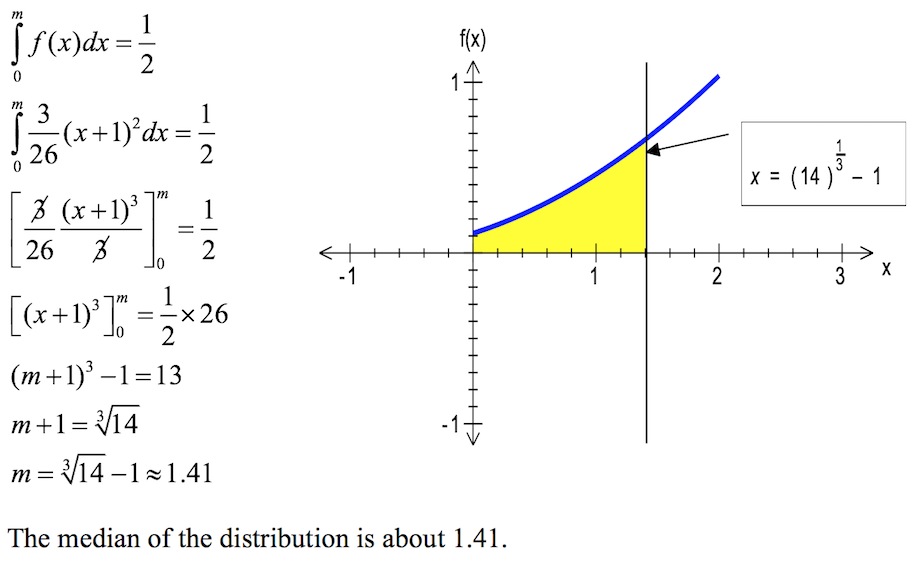
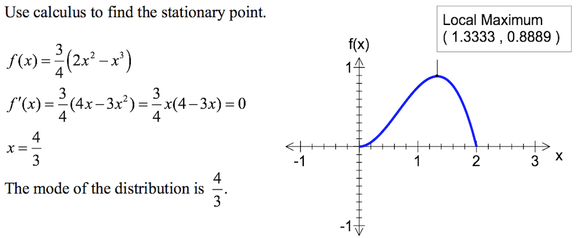
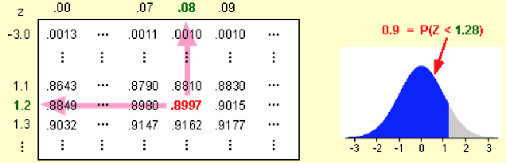

## Continuous random variables: Motivation

* Last week we have looked at *discrete random variables*. That is, variables which can only take a value from a (possibly finite or infinite) sample space and not any values in between them.

* For instance, if we like to know the waiting time (in minutes) til the next shuttle bus arrives, assuming every shuttle bus arrives every 7 minutes, then our sample space for this is a continuous interval $[0,7)$.

* As this interval contains an uncountable number of points, one cannot write down a probability mass function of the form $\mathbb{P}(X=k)=\cdots$

* In any case, the probability that the random variables takes any given value exactly is infinitesimally small. Even if we record that the train arrived after 5.5 minutes, in reality, it is exceptionally unlikely that it arrived at this time exactly or not, say, 5.5000000000010000000010203000000007 minutes.

* Whatever degree of precision we use, the probability of getting an exact value is $\approx 0$. That is
\[\mathbb{P}(X=x)=0\,\,\text{for each}\,\,x\,\,\text{but}\,\,\sum_x \mathbb{P}(X=x)=1 \]

* Probability mass function obviously does not give a sensible interpretation, instead, we define a **probability density function** (pdf) for the continuous variable $X$ to be $f(x)$ such that $\mathbb{P}(a<X<b)=\int^b_a f(x)dx$.

* That is, $f(x)$ gives a relative measure of how likely the random variable is to take a value in a given region. It is not, though, itself a probability.

* Now we have some *standard properties* of a density function

    * $f(x)\ge 0$ for $x\in\mathbb{R}$

    * $\int^{\infty}_{-\infty}f(x)dx=1$, since the probability of an event from somewhere in the sample space has to be $1$.
    
* Note, though we do not require $f(x)\le 1$, we do still require $\int^{\infty}_{-\infty}f(x)dx=1$. Since the integral behaves differently than a sum, it is possible that $f(x)>1$ on a small interval (but the length of this interval shall not exceed 1)

* An intuitive interpretation of the density function is that, for every small $\varepsilon>0$,
\[\mathbb{P}(a-\frac{\varepsilon}{2}<X<a+\frac{\varepsilon}{2})=\int^{a+\frac{\varepsilon}{2}}_{a-\frac{\varepsilon}{2}}f(x)dx\approx\varepsilon f(a)\]

    * In other words, for very small $\varepsilon>0$, the probability that $X=a$ (with a margin of error no more than $\varepsilon$ centred around $a$ is approximately $\varepsilon f(a)$.)
    
## Expectations and variance of continuous variables

* One cannot compute the expectation of a continuous random variables as in the discrete case as the **p.m.f.** is not defined:
$$
\require{cancel} 
\xcancel{\mathbb{E}X=\sum_x x\times \mathbb{P}(X=x)}
$$

* For continuous variables with density function $f(x)$ we have
$$ \mathbb{E}X=\int^{\infty}_{-\infty}xf(x)dx$$

* Similarly $\mathbb{E}X^2=\int^{\infty}_{-\infty}x^2f(x)dx,\quad \mathbb{E}(X-10)=\int^{\infty}_{-\infty}(x-10)f(x)dx$. Consequently, the variance of the continuous distribution is (as in discrete case)
$$\text{Var}(X)=\mathbb{E}(X-\mu)^2=\mathbb{E}X^2-\mu^2. $$ (Note however, $\mathbb{E}X^2=\int^b_a x^2 f(x)dx$ in the continuous case.)

* As in the case for any random variable, transformations and operators with *independent* random variables obey the following rules:
\[\mathbb{E}(aX+bY+c)=a\mathbb{E}X+b\mathbb{E}Y+c\]
\[\text{Var}(aX+bY+c)=a^2\text{Var}(X)+b^2\text{Var}(Y)\]

## Median and Mode in continuous distributions

The **median** of a continuous random variabe $X$ with probability density function $f(x)$ is the value $m$ for which
\[\int^m_{-\infty}f(t)dt=\int^{-\infty}_mf(t)dt=0.5\]
Thus the line $x=m$ divides the area under the graph of $f(x)$ into two equal areas.

**Example**

A continuous r.v. $X$ has a pdf $f(x)=\frac{3}{26}(x+1)^2$,$0\le x\le 2$. Find the median of the distribution.

**Solution**:
<centre>

</centre>

The **mode** of a continuous r.v. $X$ with a pdf $f(x)$ is the value of $x$ for which $f(x)$ takes a maximum value. Thus the mode is the $x$-coordinate of the maximum point on the graph of $f(x)$.

*Hint*: To find $x$ one need to solve for $\{x:f'(x)=0,f''(x)<0\}$ in cases of differentiable $f$ and use other turning point tests for $f$ not differentiable at the turning point.

**Solution**

<centre>

</centre>

## Cumulative distribution functions

* For a continuous random variable (r.v.) with probability density function $f(x)$, the **cumulative distribution function** $F(x)$ is defined as $\mathbb{P}(X\le x)$.

* Just as a cumulative probability mass function for a discrete random variable is obtained by summing all probabilities up to and including a given value, the cumulative density function involves integrating all probability density up to and including a point. This yields
\[\mathbb{P}(X\le x)=F(x)=\int^x_{-\infty}f(t)dt\]
\[\mathbb{P}(X\le x)=\mathbb{P}(X<x)\qquad\text{as}\,\,\mathbb{P}(X=x)=0\]

* Similarly, if we know $F(x)$, we can easily obtain $f(x)$ since $F(x)=\int^x_{-\infty}f(t)dt$ implies $f(x)=\frac{dF(x)}{dx}$.

## Common continuous distribution

* Uniform distribution

* Triangular distribution

* Exponential distribution

* Beta distribution

* Gamma distribution

* Normal distribution

## Uniform Distribution

* The simplest type of continuous distribution is **Uniform Distribution**.

* This distribution is **rectangular in shape** and is defined by minimum and maximum values.

* The probability density function is fixed over a continuous range from $a$ to $b$. This is sometimes denoted by $U[a,b]$.

* <span style="color:purple"> Key characteristics </span>:

    + Probability density function: $f_X(x)=\begin{cases} \frac{1}{b-a}\quad a\le x\le b\\ 0\quad\text{ otherwise} \end{cases}$.
    
    + Cumulative distribution function: $F_X(x)=\frac{x-a}{b-a}$
    
    + Parameter constraints: $a<b$

    + Mean: $\frac{a+b}{2}$ \frenchspacing  variance: $\frac{(b-a)^2}{12}$

```{r,echo=FALSE}
a=0
b=4
x=4
# Draw the uniform distribution
range=seq(a,b,0.01)
y=dunif(range,a,b)
plot(range,y,type='l',ylim=c(0,max(y)+0.1))

# add area to the left of x
cord.a=c(a,seq(a,x,0.01),x)
cord.b=c(0,dunif(seq(a,x,0.01),a,b) ,0)
polygon(cord.a,cord.b,col="blue")
title("Uniform distribution with a=0, b=4")
```

## Uniform Distribution: Example

ACU provides shuttle bus service to students while they are on campus every 10 mininutes between 7am til 9pm during weekdays. Students arrive at the bus stop at random times. The time that a student waits is uniformly distributed from 0 to 10 minutes.

1. Draw a graph of this distribution

```{r,echo=FALSE}
a=0
b=10
x=10
# Draw the uniform distribution
range=seq(a,b,0.01)
y=dunif(range,a,b)
plot(range,y,type='l',ylim=c(0,max(y)+0.1),xlab="length of wait in minutes",ylab="Probabilities")

# add area to the left of x
cord.a=c(a,seq(a,x,0.01),x)
cord.b=c(0,dunif(seq(a,x,0.01),a,b) ,0)
polygon(cord.a,cord.b,col="blue")
title("Uniform distribution with a=0, b=10")
```

2. Show that the area of this uniform distribution is 1.00.

>- The times students must wait for the bus is uniform over the interval from 0 minutes to 10 minutes, so in this case 
$a=0$ and $b=10$. The area is (height)(base) $\frac{1}{10-0}(10-0)=1$.

3. How long will a student have to wait for a bus on average? In other words, what is the mean waiting time?

>- \[\mu=\frac{a+b}{2}=\frac{0+10}{2}=5,\quad \sigma=\sqrt{\frac{(b-a)^2}{12}}=\sqrt{\frac{(10-0)^2}{12}}\]

4. Let $X$ be the waiting time in minutes. What is the probability a student will wait between 3 and 7 minutes?

>- \begin{align*}
\mathbb{P}(3<X<7)&=\underbrace{1/10}_{\text{height}}\times \underbrace{(7-3)}_{\text{base}}\\
&=0.4
\end{align*}


## Gamma distribution

This distribution is often used to model insurance claim modelling. We write $X\sim\text{Gamma}(\alpha,\beta)$ to denote that we have a random variable $X$ that has a Gamma distribution with parameters $\alpha$ (scale) and $\beta$ (rate.

* **probability density**: $f_X(x)=\frac{\beta^{\alpha}}{\Gamma(\alpha)}x^{\alpha-1}e^{-\beta x}$ for $x\ge 0$

* **Parameter constraints**: $\alpha>0,\beta>0$

* **mean**: $\frac{\alpha}{\beta}$ 
**variance**: $\frac{\alpha}{\beta^2}$
**m.g.f.**: $\left(\frac{\beta}{\beta-t}\right)^{\alpha}$, provided $t<\beta$.

```{r,echo=FALSE}
min.y <- 0
max.y <- 20
num.samples <- 1000
y <- seq(min.y, max.y, length=num.samples)
colors <- c("red", "green", "blue", "magenta", "black")
labels <- c("shape=1, rate=1/2", "shape=2, rate=1/2", "shape=3, rate=1/2", "shape=5, rate=1", "shape=10, rate=2")
# Open new plot with x limits from 0 to 20, and y limits from 0 to 0.5
plot(c(0, 20), c(0, 0.5), xlab='y', ylab='f(y)', main="Gamma probability density function", type="n")
lines(y, dgamma(y, shape=1, rate=1/2), col="red")
lines(y, dgamma(y, shape=2, rate=1/2), col="green")
lines(y, dgamma(y, shape=3, rate=1/2), col="blue")
lines(y, dgamma(y, shape=5, rate=1), col="magenta")
lines(y, dgamma(y, shape=10, rate=2), col="black")
legend("topright", title="Gamma distribution",
       labels, lwd=2, lty=c(1, 1, 1, 1, 2), col=colors)
```

## Exponential distribution: Special case of Gamma

 If we set $\beta=\lambda$ and $\alpha=1$, then we have $X\sim\text{Exp}(\lambda)$. The density becomes
\begin{align*}f_X(x)=\begin{cases} \lambda e^{-\lambda x},\quad\text{for}\,\,x\ge 0\\ 0\qquad\text{for}\,\,x< 0 \end{cases}
\end{align*}

Moreover, integrate the density function from $0$ to $x$, we obtain the cumulative distribution function given as
\begin{align*}F_X(x)=\begin{cases} 1-e^{-\lambda x}\quad\forall\quad x\ge 0\\ 0\qquad\text{for}\,\,x< 0 \end{cases}
\end{align*}

One of the interesting properties of the exponential is the memoryless property. (We will discuss this later on of the semester.)

\[\mathbb{E}X=\frac{1}{\lambda},\quad\text{Var}X=\frac{1}{\lambda^2}\]
One interesting properties of the exponential distribution is the *memoryless property*:

* Let $W\sim \exp(\lambda)$ and consider two times a,b>0.

* What is the chance that we need to wait a further $b$ to see an arrival, given that we have already waited $a$,i.e.$\mathbb{P}(W>a+b|W>a)$


\begin{align}
\mathbb{P}(W>a+b|W>a)&=\frac{\mathbb{P}(W>a+b,W>a)}{\mathbb{P}(W>a)}\\
&=\frac{\mathbb{P}(W>a+b)}{\mathbb{P}(W>a)}=\frac{\int^{\infty}_{a+b}\lambda e^{-\lambda x}dx}{\int^{\infty}_{a}\lambda e^{-\lambda x}}dx=\frac{e^{-\lambda(a+b)}}{e^{-\lambda a}}=e^{-\lambda b}\\&=\mathbb{P}(W>b)
\end{align}

* The distribution of future waiting times is independent of the times already waited

* For example, if taxis arrive randomly, the chance you will wait a further 10 minutes is the same regardless of whether you have been waiting 30 minutes already or have just arrived!

**Exercise**

It has been determined over time that for a particular brand of magnetic recording tape the distance $X$ (in centimetres) between surface flaws has the following probability density function
\[f_X(x)=\begin{cases} 0.02 e^{-0.02 x},\quad\text{for}\,\,x\ge 0\\ 0\quad\text{for}\,\,x< 0 \end{cases}\]
A flaw has been detected. What is the probability that another flaw will be detected within the next metre?

**Solution**

Over $1$ metre $x=100cm$. We have
\begin{align*}
\mathbb{P}(0\le X\le 100)=F(100)-F(0)&=F(100)\\
&=\int^{100}_0 0.02 e^{-0.02 t}dt=[-e^{-0.02x}]^{100}_0\\
&=1-e^{-2}=0.8647\,\,\text{approximately.}
\end{align*}

## Density of the Exponential Distribution with $\lambda=1,2,3,4$

```{r,echo}
par(mfrow = c(2,2))
curve(dexp(x, 1), 0, 3, main ="lambda = 1")
curve(dexp(x, 2), 0, 3, main ="lambda = 2") 
curve(dexp(x, 3), 0, 3, main ="lambda = 3") 
curve(dexp(x, 4), 0, 3, main ="lambda = 4")
```

## Relation between Poisson and Exponential Distribution

There exists a natural connection between Poisson and Exponential distribution. If events occur on average at the rate of $\lambda$ per unit of time, then there will be on average $\lambda t$ occurrences per $t$ units of time. The Poisson distribution describes this process is therefore $P(x)=e^{-\lambda t}\frac{(\lambda t)^x}{x!}$, from which $P(x=0)=e^{-\lambda t}$ is the probability of no occurences in $t$ units of time. Put it in another way, $\mathbb{P}(x=0)=e^{-\lambda t}$ is the probability that the time $T$, to the first occurence is greater than $t$, i.e.
\[\mathbb{P}(T>t)=\mathbb{P}(x=0|\mu=\lambda t)=e^{-\lambda t}\]
Conversely, the probability that an event does occur during $t$ units of time is given by
\[\mathbb{P}(T\le t)=1-\mathbb{P}(x=0|\mu=\lambda t)=1-e^{-\lambda t}\]
Note that this is the cumulative distribution which, when differentiated with respect to $t$, produces the probability density function of the exponential distribution $f(t)=F'(t)=\lambda e^{-\lambda t}$.

## The normal (Gaussian) distribution

* One of the most frequently used continuous probability distribution is the *Normal distribution*. The normal distribution plays a very central role in mathematical statistics and the business/physical world. We use the notation $X\sim N(\mu,\sigma^2)$ denotes a normally distributed random variable with mean $\mu$ and variance $\sigma^2$.

```{r,echo=FALSE}
#Standard normal, then shifted to the left
x <- seq(-6,6,length=500)
plot(x,dnorm(x,mean=0,sd=1.5),type = "l",lty=1,lwd=3,col="blue",main="Normal Distribution with different mean",ylim=c(0,0.5),xlim=c(-6,6),ylab="Density")
curve(dnorm(x,-1,1.5),add=TRUE,lty=2,col="blue")
curve(dnorm(x,-2,1.5),add=TRUE,lty=3,col="blue")
legend(2,.5,legend=c("N ~ (0, 1.5)","N ~ (-1, 1.5)","N ~ (-2, 1.5)"),lty=1:3,col="blue")
```

*   **density**: $f_X(x)=\frac{1}{\sqrt{2\pi}\sigma}\exp\left(-\frac{1}{2}\left(\frac{x-\mu}{\sigma}\right)\right)$ for $-\infty<x<\infty$

*   **parameter constraints**: $-\infty<\mu<\infty$, $\sigma>0$.

*   **mean**: $\mu$

*   **variance**: $\sigma^2$


## The standard normal (Gaussian) distribution


* Standard normal: When $\mu=0$ and $\sigma^2=1$, then we have a *standard* normal random variable and we use $Z$ to denote such, i.e. $Z\sim N(0,1)$. The standard normal distribution is presented using the $z$-scores:
\[Z=\frac{X-\mu}{\sigma}\]
which is the number of standard deviation away from the mean.

```{r,echo=FALSE}
#Standard normal, then shifted to the left
x <- seq(-6,6,length=500)
plot(x,dnorm(x,mean=0,sd=1),type = "l",lty=1,lwd=3,col="blue",main="Standard Normal Distribution",ylim=c(0,0.5),xlim=c(-3,3),ylab="Density")
```

## The Standard normal distribution table

\[\Phi(z)=\mathbb{P}(Z\le z)\]
is used to denote the c.d.f. of a standard normal distribution.
For example, Let $Z\sim N(0,1)$. Suppose we want to find out the area up to 0.9, i.e. 
\[\mathbb{P}(Z\le 0.9)\]

```{r,echo=FALSE}
lower.x <- -2
upper.x <- 0.9
step <- (upper.x - lower.x) / 100
sigma <- 1
mu <- 0
bounds <- c(mu-2*sigma, mu+2*sigma)
cord.x <- c(lower.x,seq(lower.x,upper.x,step),upper.x)
cord.y <- c(0,dnorm(seq(lower.x,upper.x,step),mu,sigma),0)
curve(dnorm(x,mu,sigma),xlim=bounds) 
polygon(cord.x,cord.y,col='purple')
```

* Three methods are available.

## Method one: Integration

\[\int^{0.9}_{-\infty}\frac{1}{\sqrt{2\pi}}e^{-\frac{y^2}{2}}dy\] (No closed form!)
    
## Method two: Use table 

<center>

</center>

## Method three: Use R

The `pnorm(x)` command works out the lower tail area.

The `pnorm(x,lower.tail=F)` command works out the lower tail area.


```{r}
pnorm(0.9)
```

## Calculating probabilities using $Z$-scores

The table usually gives values only for positive $z_p$ but using the symmetry property, one can easily derive for negative values. Note,
\[\Phi(-z):=\mathbb{P}(Z\le -z)=1-\mathbb{P}(Z\le z)=:1-\Phi(z)\]
so that for instance,
\[\mathbb{P}(Z\le -0.9)=1-0.2118=0.1841\]

```{r}
pnorm(0.9)
```

```{r}
pnorm(0.3,lower.tail=F)
1-pnorm(0.3)
```

We can get probability values like

\begin{align}\mathbb{P}(-0.3\le Z\le 0.9)&=\Phi(0.9)-\Phi(-0.3)\,\,\text{use}\,\,\Phi(-z)=1-\Phi(z)\\
&=0.8159399-0.3820886= 0.4338513
\end{align}

```{r}
0.8159399-0.3820886
```

For non-standard normal distribution, we can always standardise using the property that if $X\sim N(\mu,\sigma^2)$, then
\[Z=\frac{X-\mu}{\sigma}\sim N(0,1)\]
and
\[\mathbb{P}(X\le x)=\mathbb{P}\left(\frac{X-\mu}{\sigma}\le \frac{x-\mu}{\sigma} \right)=\mathbb{P}\left(Z\le \frac{x-\mu}{\sigma} \right)\]

Say, $X\sim N(100,25)$, then the probability that $X$ will be between 92 and 112 is
\begin{align*}
\mathbb{P}(92\le X\le 112)
&=\mathbb{P}(\frac{92-100}{5}\le Z\le \frac{112-100}{5})\\
&=\Phi(2.4)-\Phi(-1.6)=0.9918-0.0548=0.9370
\end{align*}

## Inverse standard normal: quantile

In the previous slides we explained how to find the probability that a value from a normal distribution will be less than some value, $x$.

Now we wish to solve the inverse problem- given a probability, can we such the value $x$ such that there is this probability of being less. These values are called **quantiles** of the distribution.

**Example**: The distribution of the weights of pink lady apples arriving at a packhouse follows a normal distribution with $\mu=180g$, $\sigma=10g$.Using the standard normal table, we can translate apple weights $x$, into $Z$-scores and uses the $Z$-scores to find the probability of getting an apple with weight less than $x$.

**The largest 10\% of apples will be sold for export. How large will these apples be?**

To find the inverse standard normal, we follow 

\[\text{Probability}\,\,\longrightarrow \,\,\text{z-score}\,\,\longrightarrow \,\,x\]

* Step 1: Using Rstudio,
```{r}
qnorm(0.8997)
```
Alternatively, one can use the standard normal table


The question essentially asks for weight $x$, such that
\[\mathbb{P}(\text{weight}<x)=0.9\]

* Step 2. To get $x$-value from the $Z$-score we will use the following 
\[x=\mu+Z\sigma\]

(Remember the $z$-score tells us how much standard deviation.)

## Lognormal Distribution

* In some applications-especially in financial problems - it proves useful to restrict to a distribution which is positive and skewed. One such useful case arises with the lognormal distribution.

* In probability theory, a log-normal distribution is a continuous probability distribution of a random variable whose logarithm is normally distributed.

* Thus, if the r.v. $X$ is log-normally distributed, then $Y=\text{ln}(X)$ has a normal distribution.

* Consider $X\sim \text{lognormal}(\mu,\sigma^2)$. The density is given as
\[\frac{1}{x\sigma\sqrt{2\pi}}\exp\left[-\frac{1}{2}\left(\frac{\ln x-\mu}{\sigma}\right)\right],\quad x>0\]

* Parameter constrains: $-\infty<\mu<\infty,0<\sigma<\infty$
\[\mathbb{E}X=\exp\left(\mu+\frac{1}{2}\sigma^2\right)\]
\[\text{var}X=e^{2\mu+\sigma^2}(e^{\sigma^2}-1)\]
If $Y\sim N(\mu,\sigma^2)$ and $X=e^Y$, then $X$ is lognormal; or $\text{ln}X\sim N(\mu,\sigma^2)$.

    + $X=\exp(Y)\sim\text{lognormal}(\mu,\sigma^2)$ is said to have a lognormal distribution with paramteters $\mu$ and $\sigma^2$.
    
```{r,echo=FALSE}
x<- seq(0,10,length = 100)
a <- dlnorm(x, meanlog = 0, sdlog = 1, log = FALSE)
 b <- dlnorm(x, meanlog = 0, sdlog = 1.5, log = FALSE)
 g <- dlnorm(x, meanlog = 1.5, sdlog = 0.2, log = FALSE)
matplot(x, cbind(a,b,g), type = "l", ylab = "density", main = "log-normal",
        col = 1:3, lty = 1:3)
legend("topright",
       legend = c("mu = 0, sd = 1", "mu = 0, sd = 1.5", "mu = 1.5, sd = 0.2"),
       col = 1:3,
       lty = 1:3)
```

## Lognormal Distribution: Examples

* Models of stock prices are often based on the lognormal distribution.

* In actuarial science, the distribution is often used to model claim sizes.

* Product of independent lognormal random variables are lognormal (think why?)

* To calculate probabilities for a lognormal random variables, restate them as probabilities about the associated normal random variables.

\begin{align*}
\mathbb{P}(X\le a)&=\mathbb{P}(\text{ln}X\le\text{ln} a)\\
&=\mathbb{P}\left(\frac{\text{ln}X-\mu}{\sigma}\le\frac{\text{ln}a-\mu}{\sigma}\right)
\end{align*}

*  **Exercise**

Losses from large fires can often be modelled using a lognormal distribution.

Suppose that the average loss due to fire for building of a particular type is $25 million and the standard deviation of the loss is $10 million.

Determine the probability that a large fire results in losses exceeding $40 million.

<!---

**Soln**: \begin{align*}
\mathbb{P}(X> 40)&=1- \mathbb{P}(X\le 40)\\
&=1-\mathbb{P}(\text{ln}X\le\text{ln}40)\\
&=1-\mathbb{P}\left(\frac{\text{ln}X-\mu}{\sigma}\le \frac{\text{ln}40-\mu}{\sigma}\right)\\
&=1-\mathbb{P}(Z\le \frac{\text{ln}40-\mu}{\sigma})\\
&=1-\mathbb{P}(Z\le \frac{\text{ln}40-25}{10})
\end{align*}

```{r}
(log(40)-25)/10
pnorm(-2.131112)
```
--->
