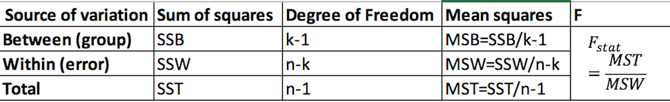
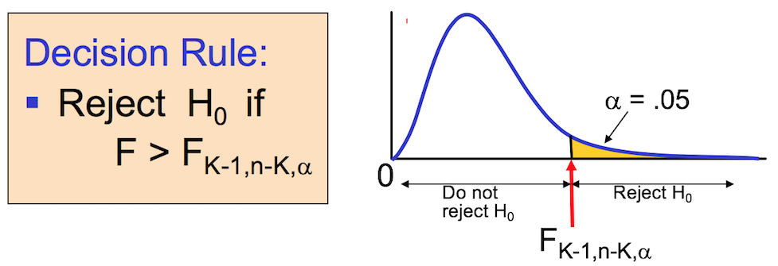
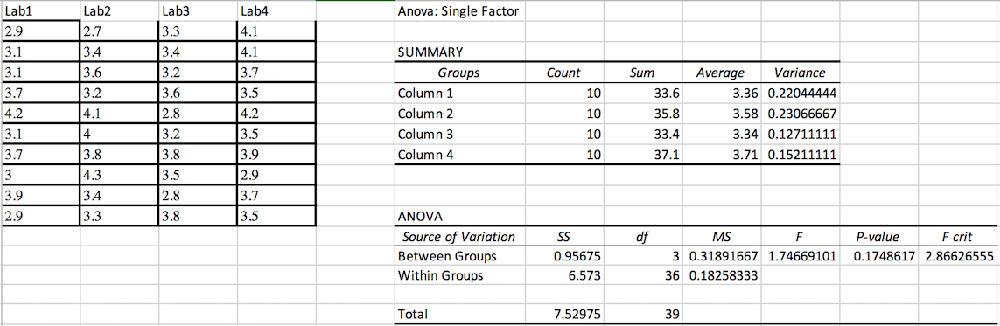
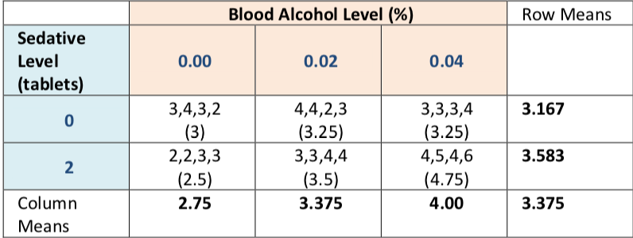
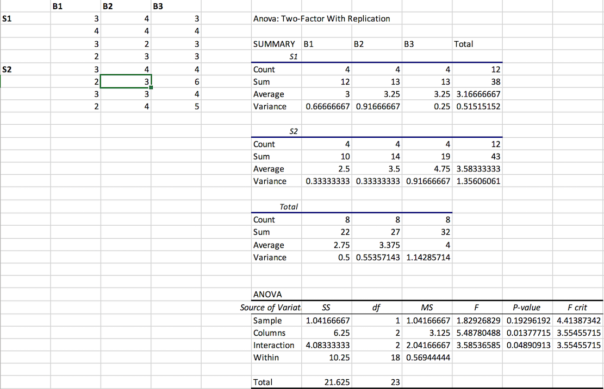

## The ANOVA approach: testing difference in sample means

* In Lecture 9, we use $F$ distribution to test whether two samples from populations having equal variance.

* The $F$ distribution is also used for testing whether two or more sample means came from the same or equal populations.

    * In particular, we use $F$ distribution to compare several population means simultaneously. The simultaneous comparison of several population means is the so-called analysis of variance (ANOVA)
    
* ANOVA is a statistical technique that is used to check if the means of two or more groups are significantly different from each other. ANOVA checks the impact of one or more factors by comparing the means of different samples.

* Assumptions:

    * The sampled populations follow the normal distribution.
    
    * The population have equal standard deviation.
    
    * The samples are randomly selected and are independent.
    
* The null hypothesis is that the population means are the same. The alternative hypothesis is that at least one of the mean is different.
    * \[H_0: \mu_1=\mu_2=\cdots=\mu_k\]
      \[H_1: \mu_i\neq\mu_j\,\,\text{for at least one $i,j$ pair}\]
      
    * Reject $H_0$ if $F>F_{\alpha,k-1,n-k}$

We can use ANOVA to prove/disprove if all the medication treatments were equally effective or not.

## One-Way ANOVA: Partitioning the variation

Let $x_{ij}$ denote observation no.$j$ in group $i$ so that $x_{34}$ is the 4th observation in group $3$; $\bar{x}_i$ is the mean for group $i$ and $\bar{x}$ is the grand mean (average of all observations).

One can decompose the observations as 
\[x_{ij}=\bar{x}+\underbrace{(\bar{x}_i-\bar{x})}_{\substack{\text{deviation of group mean}\\ \text{from grand mean}}}+\underbrace{(x_{ij}-\bar{x}_i)}_{\substack{\text{deviation of}\\ \text{observation from group mean}}}\]

Informally corresponding to the model
\[X_{ij}=\mu+\alpha_i+\epsilon,\quad\epsilon\sim N(0,\sigma^2)\]
in which the hypothesis that all the groups are the same implies that all $\alpha_i$ are zero. Notice that the error term $\epsilon_{ij}$ are assumed to be independent and have the same variance.

* Total variation can be split into two parts:
\[SST=SSB+SSW\]
\[SST=\text{Total Sum of squares}=\color{red}{\sum_i\sum_j(x_{ij}-\bar{x})}=(n-1)S^2\]
\[SSB=\text{sum of square between groups}=\color{red}{\sum_i\sum_j(\bar{x}_i-\bar{x})^2}=\sum_i n_i(\bar{x}_i-\bar{x})^2\]
\[SSW=\text{sum of square within groups}=\color{red}{\sum_i\sum_j(x_{ij}-\bar{x}_i)^2}\]
where
\[n_i=\text{number of observations in group } i\]
\[x_{ij}=i^{\text{th}}\,\,\text{observation from group}\,\,j \]
\[\bar{x}=\text{Grand mean}\]
\[n=\text{total sample size}\]
\[S^2=\text{overall sample variance}\]



## One-Way ANOVA: F Test statistic

\[H_0:\mu_1=\mu_2=\cdots=\mu_k\]
\[H_1:\,\,\text{at least two population means are different}\]

* Test statistic
\[F=\frac{MSB}{MSW}\]

    * MSB is means squares **between** variance
    
    * MSW is means squares **within** variance
    
* Degrees of freedom
\[df_{1}=k-1\quad (k=\text{number of groups})\]
\[df_{2}=n-k\quad (n=\text{sum of sample sizes from all groups})\]

* The F statistic is the ratio of the MSB and MSW.

    * The ratio must always be positive
    
    * $df_1=k-1$ will typically be small
    
    * $df_2=n-k$ will typically be large
    


## Example

Example: Four different laboratory sites undertake a controlled test ten times in each place.  The actual data generated is shown below.
\[Lab1:\quad 2.9, 3.1, 3.1, 3.7, 4.2, 3.1, 3.7, 3.0, 3.9, 2.9\]
\[Lab2:\quad 2.7, 3.4, 3.6, 3.2, 4.1, 4.0, 3.8, 4.3, 3.4, 3.3\]
\[Lab3:\quad 3.3, 3.4, 3.2, 3.6, 2.8, 3.2, 3.8, 3.5, 2.8, 3.8\]
\[Lab4:\quad 4.1, 4.1, 3.7, 3.5, 4.2, 3.5, 3.9, 2.9, 3.7, 3.5\]
Does the pattern of variation suggest that different locations give different test results?

**Soln** (By hand):

We can immediately look at the mean and standard deviations of the results at each lab site.

Lab|Mean|St Dev
---|----|---------|
1  |3.36|	0.469515|
2  |3.58|0.480278 |
3  |3.34|0.356526 |
4  |3.71|	0.390014|

The results show similar means but not all the same, with some variation in standard deviations.  The data themselves vary in the tests. The issue here is does the variation between the labs in some way exceed the variation within them?  We will be explicit about this.

We determine the mean square variation WITHIN laboratories by calculation of the sums of squares of differences between the actual data values and their local lab mean. We then divide by the degrees of freedom (one less than the set number  totalled over the groups which means $4(10– 1)$ = 36 here)

We find
\[SSW=\sum_{\text{lab 1}}(x-\bar{x}_1)^2+\sum_{\text{lab 2}}(x-\bar{x}_2)^2+\sum_{\text{lab 3}}(x-\bar{x}_3)^2+\sum_{\text{lab 4}}(x-\bar{x}_4)^2=6.573\]

Hence \[MSW=\frac{SSW}{df}=\frac{6.573}{36}=0.182583\]
We next determine the mean square variation. We find the sum of squares for the data between labs by weighting up the variation of lab means from the **grand mean**.

The grand mean is $\bar{x}=\frac{3.36+3.58+3.34+3.71}{4}=3.4975$.

We find

\[SSB=10(\bar{x}_1-\bar{x})^2+10(\bar{x}_2-\bar{x})^2+10(\bar{x}_3-\bar{x})^2+10(\bar{x}_4-\bar{x})^2=0.95675\]

Hence
\[MSB=\frac{SSB}{df}=\frac{0.95675}{3}=0.318917\]
Comparing these two sources of variation is done by looking at their ratio – a statistic called Fisher's F named for Sir Ronald Fisher.

We have found 
\[F=\frac{MSB}{MSW}=\frac{0.318917}{0.182583}=1.746691\]
We could look for $F^*$ for $3$ and $36$ degree of freedom. If this $F$ exceeded that for a specified probability level, we would have a significant effect. For 0.05 we find the $F^*$ is about 2.88 so the lab effect is insignificant here.

## Example: in R

In practice we would undertake a one way analysis of variance using a package (such as R or Excel) usually and so we would generate a significant $p$ rather than comparing the $F$ ratio generated to some tabulated values as occurred in the not so distant past.

* The first step in our analysis is to graphically compare the means of the variable of interest across groups. It is possible to create side-by-side boxplots of measurements organised in group using the function `plot()`. 
```{r}
# To make side-by-side boxplots of the variable scores grouped by the variable lab, we first read in the data into the appropriate format.
scores=c(2.9,3.1,3.1,3.7,4.2,3.1,3.7,3.0,3.9,2.9,
         2.7,3.4,3.6,3.2,4.1,4.0,3.8,4.3,3.4,3.3,
         3.3,3.4,3.2,3.6,2.8,3.2,3.8,3.5,2.8,3.8,
         4.1,4.1,3.7,3.5,4.2,3.5,3.9,2.9,3.7,3.5)
# The command rep("Lab1",10) constructs a list of 10 Lab1's in a row. The variable lab is therefore a list of length 40 consisting of 10 Lab1's followed by 10 Lab2's followed by 10 Lab3's followed by 10 Lab4's.
lab=c(rep("Lab1",10),rep("Lab2",10),rep("Lab3",10),rep("Lab4",10))
# Print the table of controlled test scores to see the data is in order
controlled=data.frame(scores,lab)
# Make the boxplot
plot(scores~lab,data=controlled)
```

From the boxplots it appears that the mean scores for Lab1 is lower than that for Lab2, Lab3, Lab4.

Now we invoke the R function `aov()` to fit ANOVA models. The general form is
`aov(scores~lab,data=controlled)`
where `scores` represents the scores variable and `lab` the variable that separates the data into groups. Both variables should be contained in the data framed called `data_name`. Once the ANOVA model is fit, one can look at the results using  `summary()` function. This produces the standard ANOVA table.

```{r}
results=aov(scores~lab,data=controlled)
summary(results)
```

From the ANOVA output above we see that the $F$-statistic is 1.747 with a $p$-value equal to 0.175. We do not reject the null hypothesis of equal means for for all four lab groups.

## Example: in Excel

One could alternatively run the same test in Excel via the Data analysis Tab.


## Example: Summary

**Hypothesis Test**

*  **H**: \[H_0: \text{The 4 lab populations have the same mean (i.e. same effect)}\quad H_1: \text{Not } H_0\]

*  **D**: State the significance level ($\alpha$). Formulate a decision rule at $5\%$, $F^*=F_{0.05,(3,36)}=2.87$ (Use `qf(0.95,3,36)` in R.)

*  **T** The test statistic is: $F=\frac{MSB}{MSW}\sim F_{3,36}$. From the sample $F=1.746691$

*  **P**  The $p$-value is: $\mathbb{P}(F_{3,36} >1.746691)=0.174862$

*  **C**: As the $p$-value is $>0.05$, we retain $H_0$. Hence there does not seem to be a significant difference between the four labs.

## One way ANOVA vs. Two way ANOVA

* Hypothesis test: only one categorical variable or single factor is considered

* Comparison of means of 3 or more samples

* Find difference among different categories which have several possible values

* $H_0$ is the equality in all population means

* $H_1$ will be the difference in at least one mean

## Two-way Analysis of Variance 

The notion of analysis of variance extends to cases where we have more than one effect to examine - Two-way analysis of variance In such cases one often needs to consider the interaction effects. In particular, the Two-way ANOVA examines the effect of

* <span style="color:blue">Two factors of interest</span> on the dependent variable

    * e.g. Sedative tablets intake and Blood Alcohol Level
    
* <span style="color:blue">Interaction between the different levels </span> of these two factors

    * e.g. Does the effect of alcohol intake depend on sedative use?
    
* Assumptions

    * Populations are normally distributed

    * Populations have equal variances
    
    * Independent random samples are drawn

## Example: alcohol, sedatives and reaction time

In a road safety experiment $24$ experienced drivers are given combinations of alcohol and sedatives in order to test reaction times in a car simulator.  The times were measured in multiples of 0.01 seconds (i.e $10$ millisecond lots).  The alcohol was ingested to levels $0, 0.02$ and $0.04$ and either $0$ or $2$ sedative tablets were taken.  Thus the alcohol factor had 3 levels and sedative had $2$ levels.  Four subjects were assigned to each case.  The data is as shown following with cell means in parentheses.

<center>

</center>

Does the data support the idea that either alcohol intake, sedative use or a combination of these affects the reaction time?

## Example: alcohol, sedatives and reaction time (EXCEL)

EXCEL:   tools | data analysis | ANOVA: single factor


## Example: alcohol, sedatives and reaction time (Hypothesis Tests)

**<span style="color:purple">Factor A (sedative)</span>**

**H**
\[H_{01}:\,\,\text{There is no main effect for factor}\,\,A\,\, (\text{i.e. no effect of sedative})\]
\[H_{a1}: \text{Not}\,\,H_{01}\]

**T**: From the sample $F=1.829268$

**P**: The $p$-value is: $0.192962$

**C**: As the $p$-value is $>0.05$, we retain $H_0$. Hence there does not seem to be a significant difference from sedative

**<span style="color:purple">Factor B (Blood alcohol)</span>**

**H**
\[H_{02}:\,\,\text{There is no main effect for factor}\,\,B\,\, (\text{i.e. no effect of blood alcohol})\]
\[H_{a2}: \text{Not}\,\,H_{01}\]

**T**: From the sample $F=5.487805$

**P**: The $p$-value is: $0.013777$

**C**: As the $p$-value is $<0.05$, we reject $H_0$. Hence there does seem to be a significant difference from alcohol.

**<span style="color:purple">Interaction (Sedative and Blood alcohol)</span>**

**H**
\[H_{03}:\,\,\text{There is no main effect for factor}\,\,C\,\, (\text{i.e. no interaction of Sedative and Blood alcohol})\]
\[H_{a3}: \text{Not}\,\,H_{03}\]

**T**: From the sample $F=3.585366$

**P**: The $p$-value is: $0.048909$

**C**: As the $p$-value is $<0.05$, we reject $H_0$. Hence there does not seem to be a significant effect from the interaction of sedative and alcohol.
