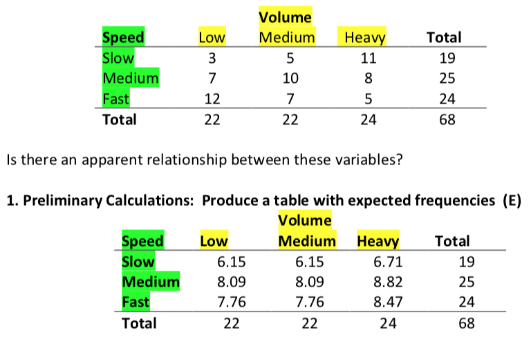
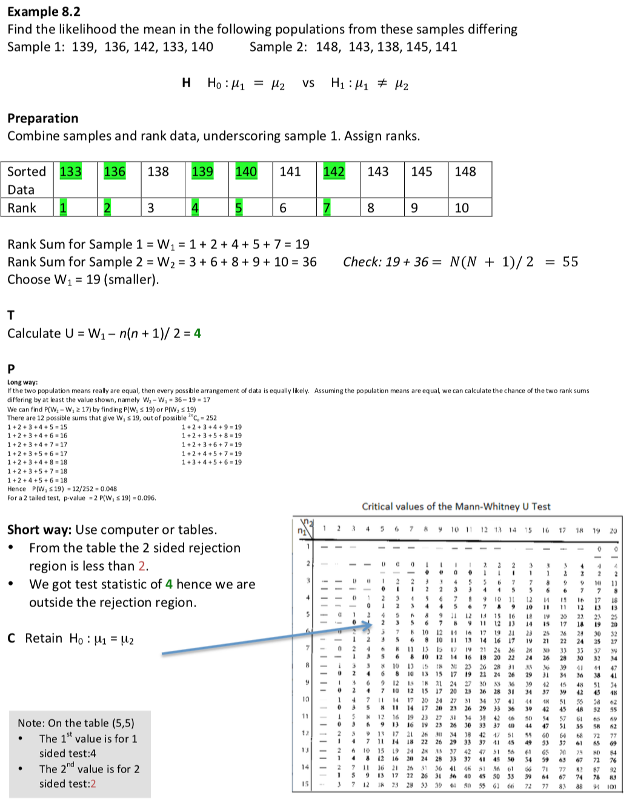
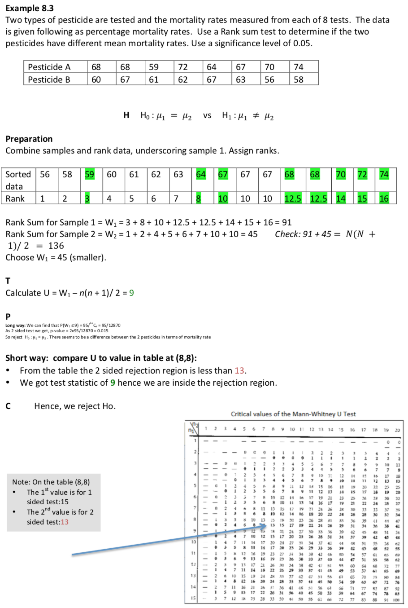

## Contingency tables

* Motivated from the concept of *joint distribution* of the two random variables, here we are interested in the relationship between two qualitative variables. 

* For two qualitative random variables, the joint distribution is usually displayed as a two-way table or *contingency table*. E.g. traffic volumes at a given site would be classified as low, medium or heavy, while traffic speeds at the site could be classified as slow, medium or fast. These two variables are now qualitative.

## Chi-squared test: Prelimary calculations

**Example**: Data on traffic volume and traffic speed from $68$ different sites are summarised in a contingency table thus:  (Note: This is the observed frequencies (O))
<center>

</center>

**Soln**: YES.


**Note**: The row and column totals are called the *marginal distributions*, they are simply the frequency distribution of each variable separately.

The expected frequency of cell $(i,j)$ is 
\[\frac{\text{marginal total }i\times \text{marginal total } j}{\text{grand total}}\]

## Chi-squared test: Hypothesis testing

**H**: 

$H_0$: Traffic speed and traffic volume are independent
    
$H_1$: Traffic speed and traffic volume are not independent

**D**: At the $5\%$ significance level the critical value of the $\chi^2$ statistic, on $4$ df, is $\chi_{5-1,0.05}=9.488$. We will reject the null hypothesis of independence if $\chi^2>9.488.$

**T**: The test statistic is 
\[\chi^2=\sum\frac{(O-E)^2}{E}\]
where \[df=(r-1)(c-1)\,\,df\]
      \[r=\text{number of rows}=3\]
      \[c=\text{number of columns}=3\]
From the sample $\chi^2=\frac{(3-6.15)^2}{6.15}+\cdots\frac{(5-8.47)^2}{8.47}=9.058<\chi^2_{(r-1)(c-1),0.05}$

**P**: The $p$-valye is $\mathbb{P}(\chi^2_4>9.058)>0.05$

As the test statistic is less than the critical value. (Or as the $p$ value is $>0.05$), we retain $H_0$. Hence it seems traffic speed and column are independent.

## R code and output

```{r}
# Enter the data into vectors
slow=c(3,5,11)
medium=c(7,10,8)
fast=c(12,7,5)
# Combining the row vectors in matrices, then converting tinto a data frame
survey=as.data.frame(rbind(slow,medium,fast))
# Assigning column names to this data frame
names(survey)=c('low','medium','heavy')
chisq.test(survey)
```

**Intepretation the Results**: There is insufficient evidence to suggest that traffic speed and volume are dependent.

## Goodness of Fit test

* In week 7 we learnt about the $\chi^2$ test of variance. Note that we can also use the $\chi^2$ distribution to test whether a specified distribution fits our data.

* We again use the test statistic \[\sum\frac{(O-E)^2}{E}\]
where $O$ is the observed frequency and $E$ is the expected frequency for each cell.

* In this case we must subtract $1$ degree of freedom for each calculated quantity used to generate the observed frequencies. This varies according to the problem studied.

* Cell size should not be too small: good rule of thumb is to avoid cell frequencies below 5. This can be arranged by grouping cells together.

**Example**

A die is thrown $120$ times. The upper face is observed and the results catalogued.

1| 2 | 3 | 4 | 5 | 6 
-|---|---|---|---|---
20|22|17|18|19|24|

We hypothesise the die is fair (unbiased) here. Test this at $0.05$ level of significance.

**Soln**: Let us first produce a table with expected frequencies ($E$)

1| 2 | 3 | 4 | 5 | 6 
-|---|---|---|---|---
20|20|20|20|20|20|

Let us now perform the **hypothesis test**

**H**: 
    
$H_0$: The die is unbiaed (i.e. model fits)
    
$H_1$: Not $H_0$

**D**: At the $5\%$ significance level the critical value of the $\chi^2$ statistic, on $5$ df, is $\chi_{6-1,0.05}=10.071$. We will reject the null hypothesis of independence if $\chi^2>10.071.$

**T**: The test statistic is 
\[\chi^2=\frac{(20-20)^2}{20}+\cdots\frac{(22-20)^2}{20}+\cdots+\frac{(24-20)^2}{20}=1.7<\chi^2_{5,0.05}\]

**P**: The $p$-valye is $\mathbb{P}(\chi^2_5>1.7)>0.05$

As the test statistic is less than the critical value. (Or as the $p$ value is $>0.05$), we retain $H_0$. Hence the coin seems to be unbiased.

## Non Parametric Tests

* In our last few weeks lectures we performed hypothesis testing that presents techniques for testing the equality of means in two independent samples. An underlying assumption for appropriate use of the test described was that the continuous outcome was approximately normally distributed or that the samples were sufficient large (usually $n_1\ge 30$ and $n_2\ge 30$) to justify their use based on the Central Limit Theorem. When comparing two independent samples when the outcomes is not normally distributed and the samples are small, a nonparametric test is appropriate.

* A popular nonparametric test to compare outcomes between two independent groups is the Mann Whitney U test. This is used to test whether two samples are likely to derive from the same population (i.e., that the two populations have the same shape).

* The Mann Whitney U test, sometimes called the Mann Whitney Wilcoxon Test or the Wilcoxon Rank Sum Test. This 
The Wilcoxon-Mann-Whitney test (or Wilcoxon rank sum test, or Mann-Whitney U-test) is used when is asked to compare the means of two groups that do not follow a normal distribution: it is a non-parametrical test. It is the equivalent of the t test, applied for independent samples.

* Some investigators interpret this test as comparing the medians between the two populations. Recall that the parametric test compares the means ($H_0: \mu_1=\mu_2$) between independent groups.

* In contrast, the null and two-sided research hypotheses for the nonparametric test are stated as follows:

\[H_0: \text{The two populations are equal}\]
\[H_a: \text{The two populations are not equal}\]

* Idea: If the population means are the same, then if we combine the samples and list the data in increasing order then the data from the two samples should be fairly evenly dispersed.

## The Rank Sum Test (Examples)


We take a look at this in R
```{r}
require(readxl)
dataMW1 <- read_excel("/Users/leannedong/Dropbox/ACU/MATH219files/Datasets/rs1.xlsx")
attach(dataMW1)
names(dataMW1)
boxplot(scores~types, data = dataMW1)
#assumption 1: Samples are independent and randomly drawn
#Test whether samples are drawn from identical populations
wilcox.test(scores~types,mu=0,alt="two.sided",correct=TRUE, paired=FALSE, conf.int=TRUE, data = dataMW1)
```


## More examples


We take a look at this in R

```{r}
require(readxl)
dataMW <- read_excel("/Users/leannedong/Dropbox/ACU/MATH219files/Datasets/rs.xlsx",1)
attach(dataMW)
names(dataMW)
boxplot(scores~types, data = dataMW)
#assumption 1: Samples are independent and randomly drawn
#Test whether samples are drawn from identical populations
wilcox.test(scores~types,mu=0,alt="two.sided",correct=TRUE, paired=FALSE, conf.int=TRUE, data = dataMW)
```
## More examples


We take a look at this in R. Note the `wilcox.test` does not work due to the tied rank. Hence the output below is misleading
```{r}
require(readxl)
dataMW2 <- read_excel("/Users/leannedong/Dropbox/ACU/MATH219files/Datasets/rs2.xlsx")
attach(dataMW2)
names(dataMW2)
boxplot(rates~types, data = dataMW2)
#assumption 1: Samples are independent and randomly drawn
#Test whether samples are drawn from identical populations
wilcox.test(rates~types,mu=0,alt="two.sided",correct=TRUE, paired=FALSE, conf.int=TRUE, data = dataMW2)
```
Note that, when there is a rank tied, the wilcox.test command will not work. Hence we will calculate the critical score manually via the formula $U=W_1-n(n+1)/2=9$.
```{r}
S1<-sum(rank(dataMW2$rates)[dataMW2$types=="PresticideA"])
S2<-sum(rank(dataMW2$rates)[dataMW2$types=="PresticideB"])
U=min(S1,S2)-8*9/2
U
```