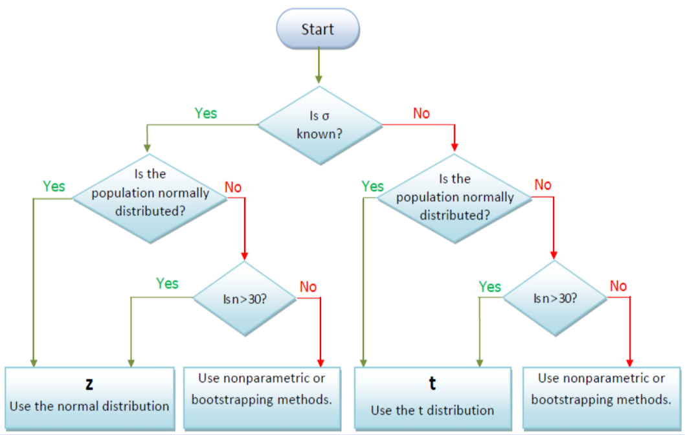

## Lecture 1: Exploratory Data Analysis

<center>
```{r echo=FALSE}
library("DiagrammeR")
grViz("
digraph CFA {
# All
node [fontname = Helvetica, fontcolor = White]
# Box
node [shape = box, style=filled, color=violet, width=1 label='Statistical\\n Methods'][fillcolor = violet]
a ;
# Box
node [shape = box, style=filled, color=violet, width=0.7, label='Descriptive\\n Statistics'][fillcolor = violet]
b1 ;
# Box
node [shape = box, style=filled, color=violet, width=0.7, label='Inferential\\n Statistics'][fillcolor = violet]
b2 ;
# Box
node [shape = box, style=filled, color=Purple, width=0.5, label='Data Types'][fillcolor = Purple]
b11 ;
# Box
node [shape = box, style=filled, color=Purple, width=0.5, label='Graphical\\n Summaries'][fillcolor = Purple]
b12 ;
# Box
node [shape = box, style=filled, color=Purple, width=0.5, label='Numerical\\n Summaries'][fillcolor = Purple]
b13 ;
# Box
node [shape = box, style=filled, color=Orange, width=0.5, label='Estimation'][fillcolor = violet]
b21 ;
# Box
node [shape = box, style=filled, color=Orange, width=0.5, label='Hypothesis\\n Testing'][fillcolor = Purple]
b22 ;

# Draws
a -> b1 [fontname = Helvetica,fontsize=8]
a -> b2  [fontname = Helvetica,arrowsize = 0.5]
b1->b11 [fontname = Helvetica,fontsize=8]
b1->b12 [fontname = Helvetica,fontsize=8]
b1->b13 [fontname = Helvetica,fontsize=8]
b2->b21 [fontname = Helvetica,fontsize=8]
b2->b22 [fontname = Helvetica,fontsize=8]
}
")
```
</center>

* Graphical Summaries

    * Qualitative: barchart vs piechart
    
    * Quantitative: histogram, **stem/leaf plot**, **boxplot**
    
* Numerical summaries

    * Location (Centre)
    
        * Mean
        
        * Median: Q2
        
        * Quartiles: Q2, Q3
    
    * Spread (Disposion)
    
        * Standard deviation (sd)
        
        * Range
        
        * $\text{IQR}=Q3-Q1$
        
        * $\text{CV}=\frac{\bar{x}}{s}$
        
## Lecture 2: Modelling Bivariate Data

Review assignment 1

## Lecture 3: Counting and Probability preliminary

Revise all problems in tutorial 3.

3. In the following the sample space $\Omega=\{2,3,5,7,11,13,17\}$

(a) If $A=\{2,3,7\}$, $B=\{3,7,11,13\}$ and $C=\{17\}$, find
\[(i) A\cap B;\quad (ii) C\cup B \quad (iii) A^{c}\cap B^{c}\]

(b) For the sample space $\Omega=\{1,2,3,4,5,6,7\}$ and the sets $A=\{2,7\},\,\, B=\{1,2,4,6\}$ and $C=\{3,4,5,6\}$, find
\[(i) \mathbb{P}(A\backslash B)\quad (ii) \mathbb{P}(B\backslash A)\quad (iii) \mathbb{P}(A\cap (B\backslash C))\]


Q8 

(a) If $\mathbb{P}(A) = 0.7,\,\,\mathbb{P}(A\cup B)=0.82$ and $\mathbb{P}(A\cap B) =0.28$, find $\mathbb{P}(B)$.

\[\mathbb{P}(A\cup B)=\mathbb{P}(A)+\mathbb{P}(B)-\mathbb{P}(A\cap B)\]
\[0.82= 0.7 + \mathbb{P}(B) - 0.28\]
\[\mathbb{P}(B) = 0.82-0.7+0.28 =0.4\]

(b) If $\mathbb{P}(A) =0.4,\,\,\mathbb{P}(B)=0.5$ and $\mathbb{P}(A\cap B)=0.1$, find $\mathbb{P}(A\cup B)$ and display all of this on a Venn diagram. Hence determine (i) $\mathbb{P}(A^c\cap B)$ and (ii) $\mathbb{P}(A\cap B^c)$.

* Are the events $A$ and $B$ independent?

* Are the events $A$ and $B$ mutually exclusive? Explain your answer.


## Lecture 4: Discrete random variables and distribution

Review Lecture examples and Tutorial exercise on Binomial and Poisson distribution.

## Lecture 5: Continuous distribution

Review Lecture examples and Tutorial exercise on Normal and Exponential distribution.

## Lecture 6: Distribution of the mean and the CLT

Assignment 2

## Statistical Methods

<center>
```{r echo=FALSE}
library("DiagrammeR")
grViz("
digraph CFA {
# All
node [fontname = Helvetica, fontcolor = White]
# Box
node [shape = box, style=filled, color=violet, width=1 label='Statistical\\n Methods'][fillcolor = violet]
a ;
# Box
node [shape = box, style=filled, color=violet, width=0.7, label='Descriptive\\n Statistics'][fillcolor = violet]
b1 ;
# Box
node [shape = box, style=filled, color=violet, width=0.7, label='Inferential\\n Statistics'][fillcolor = violet]
b2 ;
# Box
node [shape = box, style=filled, color=violet, width=0.5, label='Estimation'][fillcolor = violet]
b21 ;
# Box
node [shape = box, style=filled, color=violet, width=0.5, label='Hypothesis\\n Testing'][fillcolor = violet]
b22 ;
# Box
node [shape = box, style=filled, color=violet, width=0.5, label='Point Estimation'][fillcolor = violet]
b211;
# Box
node [shape = box, style=filled, color=purple, width=0.5, label='Interval Estimation'][fillcolor = purple]
b212;


# Draws
a -> b1 [fontname = Helvetica,fontsize=8]
a -> b2  [fontname = Helvetica,arrowsize = 0.5]
b2->b21 [fontname = Helvetica,style=dashed,fontsize=8]
b2->b22 [fontname = Helvetica,style=dashed,fontsize=8]
b21->b211 [fontname = Helvetica,style=dashed,fontsize=8]
b21->b212 [fontname = Helvetica,style=dashed,fontsize=8]
}
")
```
</center>

## Confidence Interval for a Population Mean $\mu$



## $z$-interval for mean

* Assumptions:

    * Population is normal (or $n\ge 30$) and $\sigma$ is <span style="color: red">known</span>
    
* Interval estimator of $\mu$
    \[\bar{x}\pm z^* \frac{\sigma}{\sqrt{n}}\]
    where $z^*=z_{\alpha/2}$
    
* Interval estimate of $\mu$
    
      * This is the numerical values of the interval estimator of $\mu$.
        
## $t$-interval for $\mu$

* Assumptions:

    * Population is normal (or $n\ge 30$) and $\sigma$ is <span style="color: red">unknown</span>
    
* Interval estimator of $\mu$: 
    \[\bar{x}\pm t^* \frac{s}{\sqrt{n}}\quad\text{based on}\,\,\nu=n-1\]
    where $t^*=t_{\alpha/2}$
    
* Interval estimate of $\mu$
    
      * This is the numerical values of the interval estimator of $\mu$.

## Assessing normality

* Normal quantile plot (QQ plot, see lecture 6, s34)

    * This is a plot of the data against its normal scores. If this plot is a straight line, then it suggest normality
    
* Histogram or stem and leaf plot

    * Check if the histogram has a symmetric bell shape
    
* The IQR should be close to $\frac{4}{3}$ times the standard deviation, i.e. $IQR\approx \frac{2}{3}(2s)$

## Confidence Intervals

<center>
```{r echo=FALSE}
library("DiagrammeR")
grViz("
digraph CFA {
# All
node [fontname = Helvetica, fontcolor = White]
# Box
node [shape = box, style=filled, color=purple, width=1 label='Confidence Interval'][fillcolor = purple]
a ;
# Box
node [shape = box, style=filled, color=violet, width=0.7, label='Mean'][fillcolor = violet]
b1 ;
# Box
node [shape = box, style=filled, color=navy, width=0.7, label='Proportion'][fillcolor = navy]
b2 ;
# Box
node [shape = box, style=filled, color=navy, width=0.5, label='sigma known'][fillcolor = violet]
b11 ;
# Box
node [shape = box, style=filled, color=violet, width=0.5, label='sigma unknown'][fillcolor = violet]
b12 ;
# Box
node [shape = box, style=filled, color=navy, width=0.5, label='z-interval'][fillcolor = violet]
b111;
# Box
node [shape = box, style=filled, color=violet, width=0.5, label='t-interval'][fillcolor = violet]
b121;


# Draws
a -> b1 [fontname = Helvetica,fontsize=8]
a -> b2  [fontname = Helvetica,arrowsize = 0.5]
b1->b11 [fontname = Helvetica,style=dashed,fontsize=8]
b1->b12 [fontname = Helvetica,style=dashed,fontsize=8]
b11->b111 [fontname = Helvetica,style=dashed,fontsize=8]
b12->b121 [fontname = Helvetica,style=dashed,fontsize=8]
b2->b11 [fontname = Helvetica,style=dashed,fontsize=8]
}
")
```
</center>

## $z$-interval for $p$

* Assumption (binomial condition have been met)

    * The sample data is the result of counts
    
    * There are only 2 possible outcomes
    
    * The probability of a success remains the same from one trial to the next
    
    * The trials are independent
    
* The sample size is sufficiently large, i.e., $n\widehat{p}\ge 10$ and $n\widehat{q}\ge 10$ 

    * This condition allows us to invoke the CLT and employ the standard normal distribution, that is, $z$, to complete a confidence interval.
    
* <span style="color:red">Interval estimator of $p$</span>: $\widehat{p}\pm z_{\alpha/2}\sqrt{\frac{\widehat{p}\widehat{q}}{n}}$

## Determining sample size

* For the mean $\mu$: \[n=\left(\frac{z_{\alpha/2}\sigma}{\varepsilon}\right)^2\]

* For the Proportion $p$: \[n=pq\left(\frac{z_{\alpha/2}}{\varepsilon}\right)^2\]


## Hypothesis testing

<center>
```{r echo=FALSE}
library("DiagrammeR")
grViz("
digraph CFA {
# All
node [fontname = Helvetica, fontcolor = White]
# Box
node [shape = box, style=filled, color=violet, width=1 label='Statistical\\n Methods'][fillcolor = violet]
a ;
# Box
node [shape = box, style=filled, color=violet, width=0.7, label='Descriptive\\n Statistics'][fillcolor = violet]
b1 ;
# Box
node [shape = box, style=filled, color=violet, width=0.7, label='Inferential\\n Statistics'][fillcolor = violet]
b2 ;
# Box
node [shape = box, style=filled, color=violet, width=0.5, label='Estimation'][fillcolor = violet]
b21 ;
# Box
node [shape = box, style=filled, color=purple, width=0.5, label='Hypothesis\\n Testing'][fillcolor = purple]
b22 ;


# Draws
a -> b1 [fontname = Helvetica,fontsize=8]
a -> b2  [fontname = Helvetica,arrowsize = 0.5]
b2->b21 [fontname = Helvetica,style=dashed,fontsize=8]
b2->b22 [fontname = Helvetica,style=dashed,fontsize=8]
}
")
```
</center>

## Steps in Hypothesis Testing

<span style="color:purple">H</span> : State the null ($H_0$) and alternative ($H_1$) hypotheses

<span style="color:purple">D</span> : Formulate a decision rule based on

 * Critical value
    
 * $p$-value
    
 * Confidence interval

<span style="color:purple">T/P</span> : Calculate the test statistic/p-value/confidence interval

<span style="color:purple">Make a decision</span> :

  * Reject $H_0$
  
  * Fail to reject $H_0$/retain $H_0$

<span style="color:purple">Draw a conclusion</span> :

  * Reject $H_0$: There is sufficient evidence to conclude that $\underbrace{\cdots}_{\text{referring to $H_0$}}$
  
  * Retain $H_0$: There is insufficient evidence to conclude that $\underbrace{\cdots}_{\text{referring to $H_1$}}$

## One sample Tests

<center>
```{r echo=FALSE}
library("DiagrammeR")
grViz("
digraph CFA {
# All
node [fontname = Helvetica, fontcolor = blue]
# Box
node [shape = box, style=filled, color=orange, width=1 label='One\\n Population'][fillcolor = orange]
a ;
# Box
node [shape = box, style=filled, color=orange, width=0.7, label='Mean'][fillcolor = orange]
b1 ;
# Box
node [shape = box, style=filled, color=orange, width=0.7, label='Proportion'][fillcolor = orange]
b2 ;
# Box
node [shape = box, style=filled, color=orange, width=0.7, label='Variance'][fillcolor = orange]
b3 ;
# Box
node [shape = box, style=filled, color=orange, width=0.5, label='z Test'][fillcolor = orange]
b11 ;
# Box
node [shape = box, style=filled, color=orange, width=0.5, label='t-Test'][fillcolor = orange]
b12 ;
# Box
node [shape = box, style=filled, color=orange, width=0.5, label='z Test'][fillcolor = orange]
b21 ;
# Box
node [shape = box, style=filled, color=orange, width=0.5, label='chi-squared Test'][fillcolor = orange]
b31 ;
# Draws
a -> b1 [fontname = Helvetica,fontsize=8]
a -> b2  [fontname = Helvetica,arrowsize = 0.5]
a -> b3  [fontname = Helvetica,arrowsize = 0.5]
b1->b11 [fontname = Helvetica,style=dashed,fontsize=8]
b1->b12 [fontname = Helvetica,style=dashed,fontsize=8]
b2->b21 [fontname = Helvetica,style=dashed,fontsize=8]
b3->b31 [fontname = Helvetica,style=dashed,fontsize=8]
}
")
```
</center>

## One sample $z$ Test for mean (known $\sigma$)

* Assumptions

    * Population is normally distributed (or $n\ge 30$)
    
    * $\sigma$ is known
    
    * A random sample is selected from a population
    
* $z$-test statistic:
\[z=\frac{\bar{x}-\mu}{\sigma/\sqrt{n}}\,\,\sim N(0,1)\,\,\text{under} H_0\]

## One sample $t$ Test for mean (unknown $\sigma$)

* Assumptions

    * Population is normally distributed (or $n\ge 30$)
    
    * $\sigma$ is unknown
    
    * A random sample is selected from a population
    
* $z$-test statistic:
\[t=\frac{\bar{x}-\mu}{s/\sqrt{n}}\,\,\sim t_{n-1}\,\,\text{under} H_0\]

## Two Population Inference: 2 sample $t$ test for mean

* Independent sample

    * 2 sample $t$ test (different variance)
    
    * 2 sample $t$ test (common variance)
    
* Dependent sample

    * Paired $t$ test for difference
    
## 2 sample $t$ test summary


## Lecture 10 (Part I): ANOVA

* The Analysis of Variance (a.k.a. ANOVA) is used to check if the mean of two or more groups are significantly different from each other.

* If the difference of means 

    * is due to one factor, then we use **one-way       ANOVA**.
    
    * is due to two factors, then we use **two-way       ANOVA**.

## Hypothesis testing (One-Way)

<span style="color:purple">H</span>

$H_0: \mu_1=\mu_2=\cdots=\mu_k$

$H_1$: at least two population means are different

<span style="color:purple">D</span>: Reject $H_0$ if $F>F^*$ where $F^*=F_{\alpha,(k-1,n-k)}$


<span style="color:purple">T</span>:
\[F=\frac{\text{MST}}{\text{MSW}}\]
Computer output will be given. (Check tutorial 10)

<span style="color:purple">T</span>:
Reject $H_0$: There is sufficient evidence to conclude that the population mean are different.

Retain $H_0$: There is insufficient evidence to conclude the population mean are different.

## Hypothesis testing (One-Way: Example)
 
See tutorial Q3

## Hypothesis testing (Two-Way)

EXCEL:   tools | data analysis | ANOVA: single factor


## Hypothesis testing (Two-Way)

**<span style="color:purple">Factor A (sedative)</span>**

**H**
\[H_{01}:\,\,\text{There is no main effect for factor}\,\,A\,\, (\text{i.e. no effect of sedative})\]
\[H_{a1}: \text{Not}\,\,H_{01}\]

**T**: From the sample $F=1.829268$

**P**: The $p$-value is: $0.192962$

**C**: As the $p$-value is $>0.05$, we retain $H_0$. Hence there does not seem to be a significant difference from sedative

**<span style="color:purple">Factor B (Blood alcohol)</span>**

**H**
\[H_{02}:\,\,\text{There is no main effect for factor}\,\,B\,\, (\text{i.e. no effect of blood alcohol})\]
\[H_{a2}: \text{Not}\,\,H_{01}\]

**T**: From the sample $F=5.487805$

**P**: The $p$-value is: $0.013777$

**C**: As the $p$-value is $<0.05$, we reject $H_0$. Hence there does seem to be a significant difference from alcohol.

**<span style="color:purple">Interaction (Sedative and Blood alcohol)</span>**

**H**
\[H_{03}:\,\,\text{There is no main effect for factor}\,\,C\,\, (\text{i.e. no interaction of Sedative and Blood alcohol})\]
\[H_{a3}: \text{Not}\,\,H_{03}\]

**T**: From the sample $F=3.585366$

**P**: The $p$-value is: $0.048909$

**C**: As the $p$-value is $<0.05$, we reject $H_0$. Hence there does not seem to be a significant effect from the interaction of sedative and alcohol.


## Lecture 10 (Part II): Nonparametric test: Chi-square goodness of fit test

* Contingency table

    * Here, the $\chi^2$ test is used to examine the relationship between two qualitative variables
    
    * Example: See Lecture 10 (Part II), slide 3-6
    
* Goodness of fit 

    * Can be seen as a one-way contingency table
    
    * Here, the $\chi^2$ test is used to test for the goodness of fit of a data sample to a specified distribution.
    
    * Example: See Lecture 10 (Part II), slide 7-8
    
* The test statistic for both two-way or one-way contingency tables is
\[\chi^2=\sum\frac{(O-E)^2}{E}\]

## Lecture 10 (Part II): Nonparametric test: Rank sum test

* The rank sum test is a substitute of 2-sample $t$ test when data is not known to be normal

* Suppose we have two samples of size $n$, drawn from two independent populations with arbitrary distributions. We aim to test that the two population have equal means.

\[H_0: \mu_1=\mu_2\]

* Idea: If the population means are the sam, then if we combine the sample and list the data in ascending order then the data from the two samples should be fairly evenly dispersed.

* Example: slide 9-10
