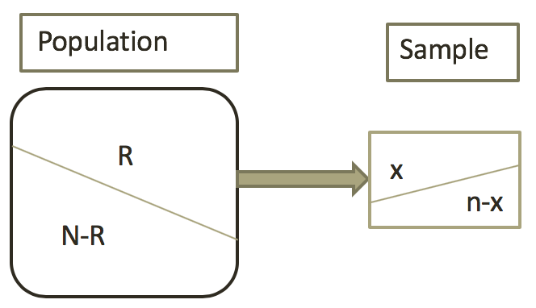

## Random variables

A *random variable*

* Is generally a quantity $X$ whose value depends on the outcome of a random experiment. More precisely, it is a mapping from the sample space $\Omega$ to the set of real numbers $\mathbb{R}$. That is,
\[X: \Omega\to\mathbb{R}\]

* Associates a numerical value with *each outcome* of a chance experiment.

* Two types of random variables

    + Discrete (count) - The set of possible values is a collection of isolated points along a number line.
    
    
    + Continuous (measure) - The set of possible values includes an entire interval on a number line
    

## Types of variables: Discrete or continuous

* The number of broken eggs in each carton ( <span style="color:purple">Discrete</span>)

* The amount of ozone in samples of air ( <span style="color:purple">Continuous</span>)

* The weight of a pineapple (<span style="color:purple">Continuous</span>)

* The amount of time a customer spends in a store (<span style="color:purple">Continuous</span>)

* The number of gas pumps in use ( <span style="color:purple">Discrete</span>)


* **HW exercise**: Verify that the probability function for the die tossing experiment satisfies the rules for assigning probabilities.

<!---
## Moment Generating Function

* The moment-generating function of a random variable $X$ is
\[M_X(u):=\mathbb{E}(e^{u X}),\quad u\in\mathbb{R}\]
--->

## Discrete Probability Distributions

<!---
The *distribution function*, abbreviated cdf, of $X$ is defined by
\[F_X(x)=\mathbb{P}(X\le x)\quad\forall\quad x\]
* Properties of a distribution function:
    + $F_X(\cdot)$ is a non-decreasing function, i.e.$F_X(x_1)\le F_X(x_2)$ whenever $x_1\le x_2$;
    
    + $F_X(\cdot)$ is right-continuous, that is for all $x$, $\lim_{\epsilon\t}
--->

The **probability distribution of a discrete random variable $X$** gives the probabilities associated with the possible values of $X$.


* Properties of a (discrete) distribution function:

    + For every possible $x$ value,
    \[0\le\mathbb{P}(x)\le 1\].
    
    + For all values of $x$,
    \[\sum_x\mathbb{P}(x)=1\] 
    
## Discrete distributions

* Bernoulli Distribution

* Binomial Distribution

* Poisson distribution

* Uniform distribution (Discrete)

* Geometric distribution

* Hypergeometric distribution

## The probability mass function

The probability for a *discrete random variable* is described with a *probability mass function* (probability distribution for *continuous* random variables will use different terminology)

**Example**: Toss a coin three times. Observe the number of heads. The possible results are: Zero heads,  One head,  Two heads, and Three heads. 

What is the probability distribution for the number of heads?

**Solution**:

* Sample space: $\Omega=\{TTT,TTH,THT,THH,HTT,HTH,HHT,HHH\}$

* Random variable $X$ is the number of heads

* Thus $X:\Omega\to\mathbb{R}$ looks like

\[X(TTT)=0\]
\[X(HTT)=X(THT)=X(TTH)=1\]
\[X(HHT)=X(HTH)=X(THH)=2\]
\[X(HHH)=3\]

Thus, $\text{range}(X)=\{0,1,2,3\}$ and 
\[\mathbb{P}(X=0)=\frac{1}{8},\,\,\mathbb{P}(X=1)=\frac{3}{8},\,\,\mathbb{P}(X=2)=\frac{3}{8},\,\,\mathbb{P}(X=3)=\frac{1}{8}\]
Hence the probability mass function is given by
\[p_X(0)=\frac{1}{8},\,\,p_X(1)=\frac{3}{8},\,\,p_X(2)=\frac{3}{8},\,\,p_X(3)=\frac{1}{8},\,\,\]

Or\[ \mathbb{P}(X=k)=
\begin{cases} 
   \frac{1}{8} & \text{if } k=0  \\
   \frac{3}{8} & \text{if } k=1 \\
   \frac{3}{8} & \text{if } k=2 \\
   \frac{1}{8} & \text{if } k=3 \\
       0       & \text{otherwise }
  \end{cases}
  \]

More precisely, for any *discrete random variable* $X$ with possible values $x_1,x_2,\cdots x_n$, a **probability mass function** $p(x_k)$ is a function such that

* $p(x_k)\ge 0$

* $\sum^n_{k=1}p(x_k)=1$

* $p(x_k)=\mathbb{P}(X=x_k)$


## Mean and Variance of discrete random variables

Let $X$ be a discrete random variable with probability mass function $p(x)$. Then 

* The *expected value* of $X$, is defined to be

\[\mathbb{E}(X)=\sum_x x p(x)=:\mu\]

* The variance of $X$ is defined to be

   \[\text{Var}X=\mathbb{E}[(X-\mu)^2]=\mathbb{E}(X^2)-(\mathbb{E}X)^2\]
  or
  \[\text{Var}X=\sum_{x_i}(x_i-\mu)^2\mathbb{P}(X=x)=:\sigma^2\]
  or
    \[\sigma^2=\sum(x-\mu_x)^2 p(x)\]
    
* The standard deviation $\sigma$ is the square root of the variance.

## Calculation of expectation and variance

**Example**: Toss a coin three times. Observe the number of heads. The possible results are: Zero heads,  One head,  Two heads, and Three heads. Compute the expectation and variance.

Let $X$ be the number of heads. We have already seen that this has the probability mass function

\[
 \mathbb{P}(X=x) = 
  \begin{cases} 
   1/8 & \text{if } x=0  \\
   3/8 & \text{if } x=1 \\
   3/8 & \text{if } x=2\\
   1/8 & \text{if } x=3
  \end{cases}
\]
The expectation is therefore
\[\mathbb{E}(X)=(\frac{3}{8}\times 1)+(\frac{3}{8}\times 2)+(\frac{1}{8}\times 3)=1.5\]

```{r,echo=FALSE}
3/8+3/8*2+1/8*3
```
Now for the variance, the probability mass function of $X^2$ is 
\[
 \mathbb{P}(X^2=x) = 
  \begin{cases} 
   1/8 & \text{if } x=0  \\
   3/8 & \text{if } x=1 \\
   3/8 & \text{if } x=4\\
   1/8 & \text{if } x=9
  \end{cases}
\]
which gives $\mathbb{E}(X^2)=(\frac{3}{8}\times 1)+(\frac{3}{8}\times 4)+(\frac{1}{8}\times 9)=3$

```{r,echo=FALSE}
3/8+3/8*4+1/8*9
```
Hence using our 2nd formula for variance we have $\sigma^2_X=3-1.5^2=0.75$.

## The simplest random variable

Consider the following random experiment.

Let X be the number of Hearts cards selected when picking one       card at random from a standard deck of 52 with all cards equally likely to be chosen.

Clearly, \[
 \mathbb{P}(X=x) = 
  \begin{cases} 
   0.25 & \text{if } x=1  \\
   0.75 & \text{if } x=0 \\
   0 & \text{otherwise }
  \end{cases}
\]

Any random variable whose probability mass function can be written as

\[
 \mathbb{P}(X=x) = 
  \begin{cases} 
   p & \text{if } x=1  \\
   1-p & \text{if } x=0 \\
   0 & \text{otherwise }
  \end{cases}
\]

## Bernoulli distribution

The outcome in a Bernoulli experiment is one of two mutually exclusive events, classified as either success or failure.

Denote the probability of success by $p$, $0<p\le 1$. Let $X$ denote the Bernoulli random variable so that 

\[
 X = 
  \begin{cases} 
   1 & \text{w.p. } p  \\
   0       & \text{w.p. } 1-p \\
  \end{cases}
\]

*Notation*: $X\sim \text{Bern} (p)$

This distribution ranges from 0 to 1. Moreover, it depends on the parameter $p$ which gives the probability of obtaining a 1, and 0 otherwise.

For instance, the number of tails from a single fair coin flip $\sim\text{Bern}(0.5)$; Selecting one person at random; the number of selected people born on a Saturday $\sim\text{Bern}(\frac{1}{7})$

* The **expectation** and **variance** of $X\sim\text{Bern}(p)$ can easily be calculated.

\[\mathbb{E}(X)=\sum x\times p(X=x)=[0\times (1-p)]+[1\times p]=p\]

\[\mathbb{E}(X^2)=\sum x^2\times p(X=x)=[0^2\times (1-p)]+[1^2\times p]=p\]
Hence,
\[\sigma^2_X=\mathbb{E}(X^2)-[\mathbb{E}(X)]^2=p-p^2=p(1-p)\]

* These values are perhaps intuitive. If we expect half of our experiments to give a 1 then, on average, each experiment  gives the value 0.5.

* The variance is 0 if $p=0$ or $p=1$. This is because there is no variability between realisations of this experiment – we already knew the outcome would either certainly happen (1) or certainly not happen (0).


## Discrete distributions: Binomial Distribution

* Binomial distribution arise in repeated *Bernoulli* trials where the probability of a success is fixed and constant. 

* In a nut shell. A binomial r.v. can be constructed by adding the outcomes of $n$ i.i.d. Bernoulli variable. More precisely, If $X_1\sim\text{Bern}(p)$, $X_2\sim\text{Bern}(p)$ then $X_1+X_2+\cdots+X_n\sim\text{Bin}(n,p)$

* Clearly $Y\sim\text{Bern}(p)$ is equivalent to $Y\sim\text{Bin}(1,p)$


Let $X$ be the random variable represents the number of success out of $n$ trials has a Binomial distribution and we write $X\sim\text{Bin}(n,p)$. Moreover, 


*  **Probability Mass Function**:\hspace{1cm} $p_X(x)=\mathbb{P}(X=x)= \binom{n}{x}p^x(1-p)^{n-x}$, for $x=0,1,\cdots,n$ 
      
      + Put in another words, this is the probability of obtaining $x$ success from $n$ trials with a success chance of $p$ each time.

*  mean: np
  
* Since each Bernoulli variable takes the value 0 or 1 and we are adding n independent outcomes of these. To compute expectation of the Binomial r.v. $Y$, we use the i.i.d. property of Bernoulli $X$. Note, if $X_1\sim\text{Bern}(p)$, then $\mathbb{E}(X_1)=p$.
    
* Now by the superposition principle, i.e. for any r.v. $A$ and $B$, $\mathbb{E}(A+B)=\mathbb{E}(A)+\mathbb{E}(B)$, then we know that the random sum $X_1+X_2+\cdots+X_n\sim\text{Bin}(n,p)$ has expectation $\mathbb{E}(X_1)+\mathbb{E}(X_2)+\cdots+\mathbb{E}(X_n)=p+p+\cdots+p=np$

*  variance: $np(1-p)$

## Plotting probability mass function of Binomial distribution

```{r,echo=FALSE}
par(mfrow=c(2,1))
k <- c(1:30)
plot(k,dbinom(k,size=30,prob=.1),type="h",main="binomial with n=30, p=0.1")
plot(k,dbinom(k,size=30,prob=.5),type="h",main="binomial with n=30, p=0.5")
```

```{r,echo=FALSE}
par(mfrow=c(2,1))
k <- c(1:300)
plot(k,dbinom(k,size=300,prob=.5),type="h",,main="binomial with n=300, p=0.5")
plot(k,dbinom(k,size=300,prob=.1),type="h",,main="binomial with n=300, p=0.1")
```
  
<!---
  *  **m.g.f.**: $[pe^t+(1-p)]^n$

Note: $\sum^n_{n=0}\binom{n}{x} p^x (1-p)^{n-x}=(p+1-p)^n=1$
according to the binomial theorem.
<span style="color:purple">Derivation of moment generating function (m.g.f)</span>

\begin{align*}
M_X(u)&=\mathbb{E}(e^{u X})=\sum^{n}_{x=0}e^{xu}\binom{n}{x} p^x (1-p)^{n-x}\\
&=\sum^{n}_{x=0}\binom{n}{x}(pe^u)^x(1-p)^{n-x}=[pe^t+(1-p)]^n
\end{align*}
--->

## Binomial distribution: Example

<!---
Consider flipping a (possibly biased) coin which lands Heads on each flip with probability p. Let X be the total number of Heads obtained in 4 flips. What is the probability mass function of $X\sim\text{Bin}(4,p)$? Expectation and Variance?
--->

**Example 1**: There are <span style="color:red">five</span> flights daily from Pittsburgh via US Airways into the Bradford, Pennsylvania, Regional Airport. Suppose the probability that any flight arrives late is <span style="color:red">0.2</span>. What is the probability that <span style="color:red">none</span> of the flights are late today?

**Solution**

Let $X$ be the number of flights arrive late.

>- \begin{align}\mathbb{P}(X=0)&=\binom{n}{0}(0.2)^0(1-0.2)^{5-0}\\
&= (1)(1)(0.3277)\end{align}

What is the average number of late flights?

>- $\mu=n*p=5*0.2=1$

>- $\sigma^2=np(1-p)=5\times0.2\times(1-0.2)=5\times0.2\times0.8=0.8$

**Example 2** (HW): <span style="color:purple">Five percent</span> of the worm gears produced by an automatic, high-speed Carter-Bell milling machine are defective. 

What is the probability that out of six gears selected at random none will be defective ($\mathbb{P}(X=0)$)? Exactly one ($\mathbb{P}(X=1)$) ? Exactly two ($\mathbb{P}(X=2)$)? Exactly three ($\mathbb{P}(X=3)$)? Exactly four ($\mathbb{P}(X=4)$)? Exactly five ($\mathbb{P}(X=5)$)? Exactly six out of six ($\mathbb{P}(X=6)$)?

```{r}
# Suppose X~Bin(6,0.05), compute P(0<=X<=6)
dbinom(0:6,6,0.05)
```

So, \[\mathbb{P}(X=0)=0.735,\,\,\,\mathbb{P}(X=1)=0.232,\,\,\,\mathbb{P}(X=2)=0.031,\,\,\,\mathbb{P}(X=3)=0.002\]
\[\mathbb{P}(X=4)=0.000,\,\,\,\mathbb{P}(X=5)=0.735,\,\,\,\mathbb{P}(X=6)=0.735 \]
**Example 3** : A study by the Illinois Department of Transportation concluded that 76.2 percent of front seat occupants used seat belts. A sample of 12 vehicles is selected.

What is the probability the front seat occupants in exactly 7 of the 12 vehicles are wearing seat belts?

>- \begin{align}\mathbb{P}(X=7|n=12\,\,\text{and}\,\, p=0.762)&=\binom{12}{7}(0,762)^7(1-0.762)^{12-7}\\
&=0.792(0.149171(0.000764))\end{align}

What is the probability the front seat occupants in at least 7 of the 12 vehicles are wearing seat belts?

>- \begin{align}
&\ \mathbb{P}(X\ge 7|n=12\,\,\text{and}\,\,p=0.762)\\
=&\ \mathbb{P}(X=7)+\mathbb{P}(X=8)+\mathbb{P}(X=9)+\mathbb{P}(X=10)+\mathbb{P}(X=11)+\mathbb{P}(X=12)\\
=&\ 0.0902+0.1805+0.2569+0.2467+0.1436+0.0383
\end{align}


## Poisson variables

In probability theory and statistics, the Poisson distribution, names after French mathematician Sim\'eon Denis Poisson, is a discrete probability distribution that expresses the probability of a given number of events occurring in a fixed interval of time or space if these events occur with a known constant rate and independently of the time since the last event. 

The need of Possion variable arises when we have a series of events which occur independently of each other in space or time, but at some known average rate.

For instance, if we assume that in a large building, a lightbulb needs replacing on average once per hour then (assuming bulbs don’t break with any pattern i.e. no power surge etc.) we would model the number of bulbs needing replacement in a given hour by $\text{Pois}(1)$.

* Parameter: $\lambda>0$

* Probability mass function: \[\mathbb{P}(X=k)=
 \begin{cases} 
  \frac{e^{-\lambda}\lambda^x}{x!} &  x=0,1,2,3  \\
   0 & \text{otherwise }
  \end{cases}
\]
    * You can verify that is a valid pmf since
    \[\sum^{\infty}_{x=0}\frac{e^{-\lambda}\lambda^x}{x!}=e^{-\lambda}(1+\frac{\lambda}{1!}+\frac{\lambda^2}{2!}+\frac{\lambda^3}{3!}+\cdots)=e^{-\lambda}(e^{\lambda})=1\]
    
* Mean: $\lambda$
\begin{align*}\mathbb{E}(X)=\sum^{\infty}_{x=0}x\frac{e^{-\lambda}\lambda^x}{x!}=\sum^{\infty}_{x=0}\frac{e^{-\lambda}\lambda^x}{(x-1)!}=\sum^{\infty}_{x=0}\frac{\lambda e^{-\lambda}\lambda^{x-1}}{(x-1)!}&=\lambda e^{-\lambda}(1+\frac{\lambda}{1!}+\frac{\lambda^2}{2!}+\frac{\lambda^3}{3!}+\cdot)=\lambda
\end{align*}

* Variance: $\lambda$

## Poisson variables: How do they arise?

Since $X\sim\text{Bin}(N,\frac{\lambda}{N})$ we know that 
\begin{align*}
\mathbb{P}(X=x)&=\frac{N!}{x!(N-x)!}\left(\frac{\lambda}{N}\right)^k(1-\frac{\lambda}{N})^{N-x}\\
&=\frac{N!}{N^x(N-x)!}\frac{\lambda^x}{x!}(1-\frac{\lambda}{N})^N(1-\frac{\lambda}{N})^{-x}
\end{align*}

Now as $N\to\infty$, we have $(1-\frac{\lambda}{N})^{-x}\to 1$ and $\frac{N!}{x!(N-x)!}=1(1-\frac{1}{N})(1-\frac{2}{N})(1-\frac{3}{N})\cdots(1-\frac{x-1}{N})\to 1$.
On the other hand,
\[(1-\frac{\lambda}{N})^N\to e^{-\lambda}\quad\text{as}\quad N\to\infty\]

Hence, we obtain the result that if $X\sim\text{Pois}(\lambda)$, then 
\[\mathbb{P}(X=x)=\frac{e^{-\lambda}\lambda^x}{x!}.\]

## Poisson variables: Example

* Consider modelling the arrival of calls into a call centre. It is noted that the centre receives an average of 20 calls per hour throughout its working day, with all calls arriving independently of one another and no two periods (of equal length) of the day more or less likely to receive calls than the other.

**Discussion**

* What is the number of calls in a given hour?

* What is the probability that, during one hour, exactly 15 calls arrive is $\frac{e^{-20}20^{15}}{15!}=5.2%$

```{r}
exp(-20)*20^15/factorial(15)
```
## Discrete Uniform Distribution

* A *discrete uniform distribution* arises where each event is equally likely and only a finite number of outcomes is possible, as is seen in example of tossing the die and seeing the outcome distribution. If we have $n$ possible outcomes 
\[\mathbb{P}(X=x)=1/n\]

## Geometric random variable

* Another common random variable which can arise from independent Bernoulli trials is a Geometric variable.

* We write $X\sim\text{Geo}(p)$ if $X$ is the number of successive independent identical Bernoulli variables until the first $1$ is obtained.

* For example, when flipping a fair coin repeatedly, the number of flips until the first Heads $\sim\text{Geo}(0.5)$

* The range of $X\sim\text{Geo}(p)$ is easily seen to be $\{1,2,3,\cdots\}$

* When considering a number of independent $\text{Bern}(p)$ variables,we obtain the first $1$ on the kth variable if and only if the first $(k-1)$ are 0s and the kth is a $1$. That is,
\[\mathbb{P}(X=x)=\begin{cases} 
   (1-p)^{x-1}p & \text{if } x=1,2,3,\cdots  \\
   0 & \text{otherwise }
  \end{cases}\]
  
* <span style="color:purple">Excercise</span> : Geometric Vs Binomial

    * In the mid-semester multiple choice test with questions of equal level, a particular student has a chance of 60% of getting a question correct.  What is the probability they don’t make any mistake until the eighth question?

    * This is geometric and $\mathbb{P}(X=7)$ is the requirement of 7 failures (i.e. correct) before a success (i.e. error)
    \[\mathbb{P}(X=8)=0.6^{8-1}\times 0.4=0.01119744\]
    
    * What is the chance of getting one wrong in the first 8 questions? i.e. getting 7 right!
        \[\mathbb{P}(X=1)=\binom{8}{1}0.6^7\times 0.4=0.08958\]

    * This is binomial.

*Remark* : The r.v. with the **geometric** probability of distribution is associated with an experiment that shares some of the characteristics of a **binomial** experiment. 

*   **Similarity**

    + Both experiments also involves identical and independent trials, each of which can result one of two outcomes: success or failure. 

    + The probability of success is equal to $p$ and is constant from trial and trial. 
    
*   **Difference**

    + <span style="color:purple">Binomial</span>: the random variable $X$ is the number of successes that occur in $n$ trials.

    + <span style="color:purple">Geometric</span>: the random variable $X$ is the number of trial on which the first success occurs. **Thus**, the experiment consists of a series of trials that conclude with the first success. **Consequently**, the experiment could end with the first trial if a success is observed on the very first trial, or the experiment could go on indefinitely.
    
## Hypergeometric Distribution: Motivation from sampling

* Sampling from a finite population can be done by replacement of the items each time (not a very realistic scenario usually) or without replacement.  In the former case we get a binomial outcome but in the latter we generate the <span style="color:purple">hypergeometric distribution</span>

<center>

</center>

* Note: the only difference is that hypergeometric distribution and binomial distribution is that one is without replacement and with replacement.

## Hypergeometric Distribution

A random variable $X$ follows the hypergeometric distribution, i.e. $X\sim \text{Hypergeo}(N,K,n)$ if the probability mass function (**p.m.f**) is given by

\[\mathbb{P}(X=x)=\frac{\binom{R}{x}\binom{N-R}{n-x}}{\binom{N}{n}}\]
\[\mathbb{E}(X)=\frac{nR}{N}\]
\[\text{Var}(X)=\frac{nR}{N}\left(\frac{N-n}{N-1}\right)\left(1-\frac{R}{N}\right)\]

where 

* $N$ is the Population size

* $R$ is the number of success states in the Population.

* $n$ is the number of draws

* $x$ is the number of observed success


**Eg: Generalised Hypergeometric Distribution (Sampling without replacement)**

Suppose a sample of $n$ items is randomly selected from this finite population. Since sampling is done without 
Given an urn of size $N$ with $N_1$ balls of type 1, $N_2$ balls of type 2, \cdots $N_k$ balls of type $k$. Draw a sample of size $n$ without replacement, the $n$ trials are not independent and thus the probabilities associated with the events $E_i$, $i=1,\cdots,r$, are not constant from trial to trial. In addition, let us assume that the sample contains $n_1$ items of type one, $n_2$ items of type two, $\cdots$, and $n_r$ items of type $r$, where $\sum^r_{i=1}n_i=n$. The probability of obtaining this collection of outcomes is
\begin{align*}
\mathbb{P}(\text{Select }n_i\,\,\text{balls of each type }i)&=\mathbb{P}(X_1=n_1,\cdots,X_r=n_r;N,n,N_1,\cdots,N_r)\\
&=\frac{{N_1\choose n_1}{N_2\choose n_2}\cdots {N_r\choose n_r}}{{N\choose n}}\end{align*}
where $N=\sum^r_{i=1}N_i$ and $n=\sum^r_{i=1}n_i$.

 
