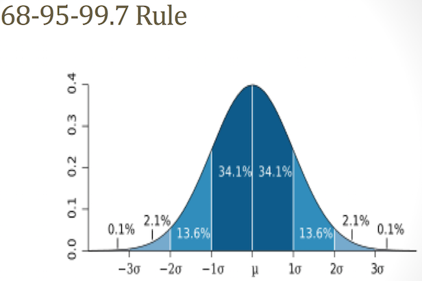
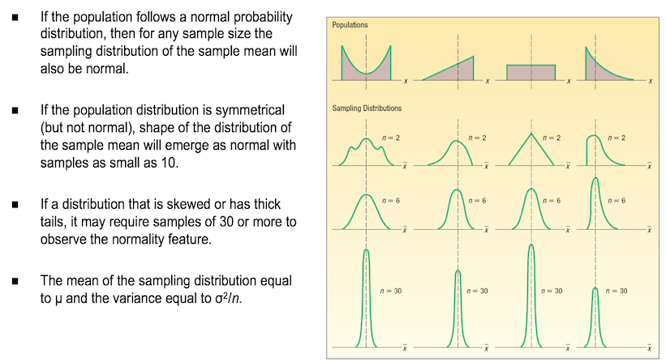

```{r setup, include=FALSE}
knitr::opts_chunk$set(echo = FALSE)
```

## Linear Combination of random variables

* Quite Often, we are interested in a linear combination of random variable rather than just one single random variable.

* Let $X_1,X_2,\cdots,X_n$ be a sequence of independent random variables with $\mathbb{E}X_i=\mu_i$ and $\text{Var}X_i=\sigma^2_i$ for $i=1,\cdots,n$.
\[\mathbb{E}(\sum^n_{i=1}X_i)=\sum^n_{i=1}\mathbb{E}X_i\].

\[\text{Var}(\sum^n_{i=1}X_i)=\sum^n_{i=1}\text{Var}X_i\]

## Linear Combination of random variables: Example 1

Let $X\sim N(\mu=100,\sigma=15)$ and $Y\sim N(\mu=30,\sigma=5)$ be independent random variables. Find the distribution $X-Y$.

**Solution**:

Let $Z=X-Y=(1)X-(-1)Y$, so $a_1=1$ and $a_2=-1$.
\[\mathbb{E}Z=a_1\mu_x+a_2\mu_y=1\times 100+(-1)\times 30=70\]
\[\text{Var}(Z)=a^2_1\text{Var}X+a^2_2\text{Var}Y=1^2\times 15^2+(-1)^2\times 5^2=250\]

## Linear Combination of random variables: Example 2

Let $X_1,X_2, and X_3\sim N(\mu=9,\sigma=4)$ be independent random variables. Fina the distribution of the mean of $X_1,X_2$ and $X_3$.

**Solution**:
\[\bar{X}=\frac{X_1+X_2+X_3}{3}=\frac{1}{3}X_1+\frac{1}{3}X_2+\frac{1}{3}X_3\]
\[\mathbb{E}\bar{X}=\frac{1}{3}\times 9+\frac{1}{3}\times 9+\frac{1}{3}\times 9=9\]
\begin{align*}
\text{Var}(\bar{X})&=(1/3)^2\times 4^2+(1/3)^2\times 4^2+(1/3)^2\times 4^2\\
&=\frac{16\times 3}{9}=\frac{16}{3}=\frac{4^2}{3}=\frac{\sigma^2}{n}
\end{align*}

## Distribution of the sums of normal Random variables and sampling

Given a sequence of independent random variables $X_i\sim N(\mu_i,\sigma^2_i)$ for $i=1,\cdots,n$.
\[\sum^n_{i=1}a_i X_i\sim N(\sum^n_{i=1}a_i\mu_i,\sum^n_{i=1}a^2_i\sigma^2_2)\]

Given a sequence of independent and identically distributed (i.i.d.) random variables $X_i\sim N(\mu,\sigma^2)$ and constant $a_i$ for $i=1,\cdot,n$
\[\bar{X}=\frac{1}{n}\sum^n_{i=1}X_i\sim N(\mu,\frac{\sigma^2}{n}),\,\,\sum^n_{i=1}X_i\sim N(n\mu,n\sigma^2)\]

## Sample mean and variance

* In view of the previous slide, if $X\sim N(\mu,\sigma^2)$, then we know that the distribution of $\bar{X}$ is $N(\mu,\frac{\sigma^2}{n})$ for samples of size $n$!

* If $X\sim N(\mu,\sigma^2)$, then one can infer the distribution of the mean $\bar{X}$, the mean of a sample of size $n$.

* More precisely, by some algebra,
\[\mathbb{E}X=\mu\,\,\text{then}\,\,\mathbb{E}\bar{X}=\mu\]
\[\text{Var}X=\sigma^2\,\,\text{then}\,\,\text{Var}(\bar{X})=\frac{\sigma^2}{n}\]

* <span style="color:red">The variability of the mean of a sample is less variable than the individual observations.</span> (Think why!)

## Sampling from a Normal Population

* In the particular case of normal distribution, if $X\sim N(\mu,\sigma^2)$, we know that the distribution of $\bar{X}$ is $N(\mu,\frac{\sigma^2}{n})$ for samples of size $n$!

* Hence we can use all our knowledge of the normal distribution to apply to the distribution of the mean - only reducing the variance.

## Example: sampling from normal distribution

Consider a population of male students which has a normal distribution with mean height of $176$ and a standard deviation of $4$ cm.  This height $X\sim N(176,16)$ is a random variable.

If a student were selected at random from that population the chance they had a height between $172$ cm and $180$ cm would be
$\mathbb{P}(172\le X\le 180)=0.6826$.

Suppose sets of 4 students were selected randomly and their mean height $\bar{X}$ was calculated.  Then  $\bar{X}\sim N(176,4).$  and $\mathbb{P}(172\le X\le 180)\approx 0.9544$.


## Normal distribution (Review)

* Surely the most frequently encountered continuous probability distribution is the so-called *Normal distribution*. One reason is because it can be used to model the distribution of the errors arising in the measurement of many physical quantities.

* The normal distributution can also be used to estimate discrete distributions (such as Poisson, Binomial) where sample size gets larger by a continuity correction.

* On other hand, it plays a major role in statistical inference as we shall see.

## Normal distribution (Review)



## Approximation using Normals

* Binomial
\[X\sim\text{Bin}(n,p)\,\,\longrightarrow\,\,N(\mu=np,\sigma^2=np(1-p))\]

* Poisson
\[X\sim\text{Pois}(\lambda)\,\,\longrightarrow\,\,N(\mu=\lambda,\sigma^2=\lambda)\]

Moreover, one can improve the approximations using the **continuity correction**, i.e.
\[\mathbb{P}(20\le X\le 22)\approx\mathbb{P}(19.5\le X\le 22.5)\]

## Continuity adjustment

* When approximating a discrete distribution we must use the *continuity correction* i.e. as we cannot determine $\mathbb{P}(X=3)$ directly, say, we calculate $\mathbb{P}(2.5\le X\le 3.5)$.

* Given a discrete integer valued r.v. $X\sim (\mu,\sigma^2)$ and the approximating normal $Y\sim N(\mu,\sigma^2)$ we adjust by 1/2 to (usually) improve the approximation.
\[\mathbb{P}(X\ge x)\to \mathbb{P}(Y\ge x-1/2) \]
\[\mathbb{P}(X\le x)\to \mathbb{P}(Y\le x+1/2) \]

## Distribution of sample mean

* **Normal Distribution**: If $X\sim N(\mu,\sigma^2)$, then $\bar{X}\sim N(\mu,\frac{\sigma^2}{n})$.

* **Any Distribution**: If $X\sim N(\mu,\sigma^2)$, then $\bar{X}\sim N(\mu,\frac{\sigma^2}{n})$ for large enough $n$.

    * This is a 'wonder theorem', called the **Central Limit Theorem**.
    
    * Roughly speaking, the theorem states that, as long as the sample size is "large enough", the distribution of the sample mean will be approximately normal no matter what the distribution of the underlying population.
    

## Central Limit Theorem (CLT)

* The CLT states that if you have a population with mean μ and standard deviation σ and take sufficiently large random samples from the population with replacement, then the distribution of the sample means will be approximately normally distributed.

* More precisely, given a sequence of iid random variables $X_i\sim N(\mu,\sigma^2)$ for $i=1,\cdots,n$, where $\sigma^2<\infty$ and $n$ is large, then as $n\to\infty$,
\[\frac{\sum^n_{i=1}X_i-n\mu}{\sigma\sqrt{n}}=\frac{\bar{X}-\mu}{\sigma/\sqrt{n}}\stackrel{\mathcal{D}}{\to}N(0,1)\]
where "$\stackrel{\mathcal{D}}{\to}$" means the c.d.f. converges to the normal c.d.f..

<!---
the distribution function of $\frac{\sum^n_{i=1}X_i-n\mu}{\sqrt{n\sigma^2}}$ tends to the standard Normal $Z$.
--->

Informally, $\sum^n_{i=1}X_i\to N(n\mu,n\sigma^2)$ and $\bar{X}\to N(\mu,\frac{\sigma^2}{n})$.


## Central Limit Theorem

**Remarks**: 

* If the population follows a normal distribution, then for any sample size the sampling distribution of the sample mean will also be normal.

* If $n$ is large, then $\bar{X}\approx N(\mu,\sigma^2/n)$.

* The $X_i$'s don't have to be normal for CLT to work!

* You usually need $n\ge 30$ observations for the approximation to work well. (Need fewer observation if the $X_i$'s come from a symmetric distribution.)

* You can almost always use the CLT if the observations are i.i.d.

<!---

--->
## Example : Graphical


## Example : Normal approximation to Exponential distribution

Suppose $X_1,\cdots,X_{100} \stackrel{iid}{\sim}\text{Exp}(1/1000)$. Find $\mathbb{P}(950\le\bar{X}\le 1050)$.

**Solution**: Recall that if $X_i\sim\text{Exp}(\lambda)$, then $\mathbb{E}X_i=\frac{1}{\lambda}$ and $\text{Var}X_i=\frac{1}{\lambda^2}$.
Further, if $\bar{X}$ is the sample based on $n$ observations, then
\[\mathbb{E}\bar{X}=\mathbb{E}X_i=\frac{1}{\lambda}\]
\[\text{Var}\bar{X}=\frac{\text{Var}X_i}{n}=\frac{1}{n\lambda^2}\]
For our problem, $\lambda=1/1000$ and $n=100$, so that $\mathbb{E}\bar{X}=1000$ and $\text{Var}\bar{X}=\frac{1}{n\lambda^2}=10000$.

So by the CLT,

\begin{align*}
&\ \mathbb{P}(950\le\bar{X}\le 1050)\\
= &\ \mathbb{P}\left(\frac{950-\mathbb{E}\bar{X}}{\sqrt{\text{Var}\bar{X}}}\le\frac{\bar{X}-\mathbb{E}\bar{X}}{\sqrt{\text{Var}\bar{X}}}\le \frac{1050-\mathbb{E}\bar{X}}{\sqrt{\text{Var}\bar{X}}} \right)\\
\approx &\ \mathbb{P}\left(\frac{950-1000}{100}\le Z\le \frac{1050-1000}{100}\right)\\
\approx &\ \mathbb{P}\left(-\frac{1}{2}\le Z\le \frac{1}{2}\right)=2\Phi(1/2)-1=0.383.
\end{align*}

## Normal approximation to the Binomial(n,p)

Suppose $Y\sim\text{Bin}(n,p)$, where $n$ is very large. In such cases, we usually approximate the Binomial distribution via an approximate Normal distribution.

The CLT applies since $Y=\sum^n_{i=1}X_i$, where the $X_i$'s are iid Bern($p$).

Then
\[\frac{Y-\mathbb{E}Y}{\text{Var}Y}=\frac{Y-np}{\sqrt{npq}}\approx N(0,1).\]

*Why do we need such an approximation?*

**Example**: Suppose $Y\sim\text{Bin}(100,0.8)$ and we want
\[\mathbb{P}(Y\ge 90)=\sum^{100}_{i=90}{100\choose i}(0.8)^i(0.2)^{100-i}.\]

Good luck with the binomial coefficients.

<span style="color:red">So how do we use the approximation?</span>

**Example**: The Braves play $100$ independent baseball games, each of which they have probability of $0.8$ of winning. What’s the probability that they win at least $90$?

**Solution**:

* $Y\sim\text{Bin}(100,0.8)$ and we want $\mathbb{P}(Y\ge 90)$ (as in the last example)...
\begin{align*}
\mathbb{P}(Y\ge 90)&=\mathbb{P}(Y\ge 89.5)\quad (\text{by continuity correction})\\
& \approx \mathbb{P}\left(Z\ge \frac{89.5-np}{\sqrt{npq}}\right)\quad (CLT)\\
&=\mathbb{P}\left(Z\ge\frac{89.5-80}{\sqrt{16}}\right)=\mathbb{P}(Z\ge 2.375)=0.0088.
\end{align*}
We use the continuity correction because the Binomial is a discrete distribution while the Normal is continuous. 

## Inference

* Our earlier work on statitics for samples was largely descriptive. Inference helps us to look at the samples to draw conclusions about the population. We do this in two ways.

* *Estimation* involves use of probability to provide confidence levels on estimates of population parameters based on sample statistics.

* *Hypothesis testing* helps us to make hypothesis about parameters which we test against the data again setting a probability level at which we accept the conclusion.

## Standard Error of the Mean

* We know the key features of the normal distribution given by the 68-95-99.7 rule 

* In fact the normal cdf enables us to make conclusions about any suitable percentage.

* If we apply this to the distribution of the mean it is a similar process except now we use the <span style="color:red">standard error of the mean</span> $\frac{\sigma}{\sqrt{n}}$ rather than the standard deviation $\sigma$.

## Normal Limits

* We have far tighter limits on the normally distributed data than the result from Chebyshev’s inequality and related results discussed previously.  

* The following obtain here.

\[\mathbb{P}\left(|\bar{X}-\mu|<\frac{3\sigma}{\sqrt{n}}=0.9973\right)\]
\[\mathbb{P}\left(|\bar{X}-\mu|<\frac{2\sigma}{\sqrt{n}}=0.9544\right)\]
\[\mathbb{P}\left(|\bar{X}-\mu|<\frac{\sigma}{\sqrt{n}}=0.6826\right)\]

## Example

* The mean performance of a certain brand of car tyre is found to be 40000 km with a standard deviation of 3000 km from a sample of 36 tyres.
  
* Estimate the mean of the population of this brand of tyre.  

* How confident are you of your result?

## Solution

* Let the tyre life be given by the random variable $X$.  

* Scaling the values,  $X\sim (40, 3^2)$ and so $\bar{X}\sim N(40, 3^2/36) = N(40, 0.5^2)$.

* We estimate the mean $\mu=40000$ and two standard errors is $1000$ so we could be about $95\%$ confident that the tyre population mean life lay between $39000$ and $41000$ km.

## Known Standard Deviation

* If a population follows the normal distribution, the sampling distribution of the sample mean will also follow the normal distribution.

* If the shape is known to be nonnormal, but the sample contains at least 30 observations, the central limit theorem guarantees the sampling distribution of the mean follows a normal distribution.

* To determine the probability a sample mean falls within a particular region, use:

\[z=\frac{\bar{X}-\mu}{\sigma/\sqrt{n}}\]

## Unknown standard deviation, or if population is non normal

* If the population does not follow the normal distribution, but the sample is of at least 30 observations, the sample means will follow the normal distribution.

* To determine the probability a sample mean falls within a particular region, use:
\[t=\frac{\bar{X}-\mu}{s/\sqrt{n}}\]

## Using the Sampling Distribution  of the Sample Mean (Sigma Known) - Example

The Quality Assurance Department for Cola, Inc., maintains records regarding the amount of cola in its Jumbo bottle. The actual amount of cola in each bottle is critical, but varies a small amount from one bottle to the next. Cola, Inc., does not wish to underfill the bottles. On the other hand, it cannot overfill each bottle. Its records indicate that the amount of cola follows the normal probability distribution. The mean amount per bottle is $31.2$ ounces and the population standard deviation is $0.4$ ounces. 

At $8$ A.M. today the quality technician randomly selected 16 bottles from the filling line. The mean amount of cola contained in the bottles is $31.38$ ounces. 

Is this an unlikely result? Is it likely the process is putting too much coda in the bottles? To put it another way, is the sampling error of $0.18$ ounces unusual?

## Using the Sampling Distribution  of the Sample Mean (Sigma Known) - Example


## Confidence limits

* One can capture the mean of the population in a confidance limit dictated by the sample mean. This gives the confidence limit as 
\[\bar{x}\pm z_{\alpha/2}\frac{\sigma}{\sqrt{n}}\]

* The critical $z$ is $z^*=z_{\alpha/2}$. This gives half the level at each tail of the distribution.

---

* The most commonly used levels of confidence have the following $z^*$ values:

Confidence level  | $\alpha$| $z^*$|
----------------- | -------|------|
$90\%$            | 0.10   | 1.645|
$95\%$            | 0.05   | 1.96 |
$99\%$            | 0.01   |  2.58|

## Confidence Interval

Given a distribution $X\sim N(\mu,\sigma^2)$, then a $(1-\alpha)\%$ CI for $\mu$ is

* $90\%$ CI for $\mu$: $\bar{x}\pm 1.645\frac{\sigma}{\sqrt{n}}$

* $95\%$ CI for $\mu$: $\bar{x}\pm 1.96\frac{\sigma}{\sqrt{n}}$

* $99\%$ CI for $\mu$: $\bar{x}\pm 2.58\frac{\sigma}{\sqrt{n}}$

## Assessing Normality

For any random variable $X$ we can judge whether it seems to be normally distributed by 

* Histogram or stem and leaf plot

* QQ plot (for small data sets)

    *  This is a plot of the data against its normal scores, and if the plot is a straight line, then it suggests normality.
    
## Example : QQ plot of ToothGrowth data

Here, we’ll use the built-in R data set named ToothGrowth.

```{r,echo=FALSE}
# Store the data in the variable my_data
my_data <- ToothGrowth
qqnorm(my_data$len, pch = 1, frame = FALSE)
qqline(my_data$len, col = "steelblue", lwd = 2)
```


 


