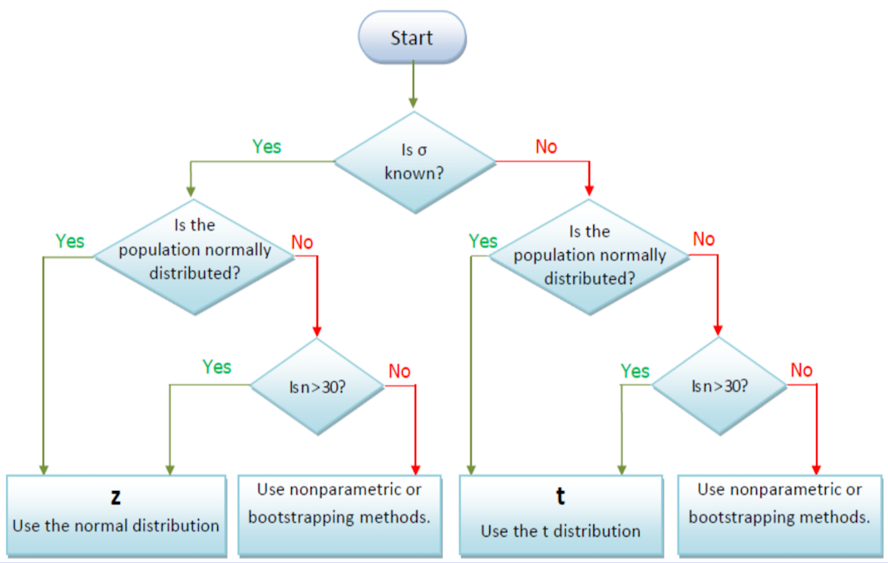

```{r setup, include=FALSE}
knitr::opts_chunk$set(echo = TRUE)
```

## Parameter vs statistic

* Parameter - is a numerical value associated with a population

* Statistic - is a numerical value computed from a *sample*.

* Target Parameter - is the unknown population parameter that we are interested in estimating

* Essentially, we would like to know the parameter. But in most cases it is hard to know the parameter since the population is too large. So we have to estimate the parameter by some proper statistics computed from the sample.

  Statistics   | Pop. Parameter| Sample statististic|
-------------- | --------------|--------------------|
Mean           | $\mu$         |$\bar{X}$           |
Variance       | $\sigma^2$    | $s^2$              |
Standard Deviation  | $\sigma$   |  $s$    |
Proportion          | $p$        |$\widehat{p}$ |

## Central Limit Theorem

* To use the normal distribution to approximate the sample distribution of any statistic when the popilation is non-normal and the sample size is sufficiently large.

* Two applications:

    * Sampling distribution of $\bar{X}$
    
    * Sampling distribution of $\widehat{X}$
    
## Sampling distribution of $\bar{X}$

* Consider a random sample of $n$ observations selected from a population with mean $\mu$ and standard deviation $\sigma$. When $n$ is sufficiently large ($n\ge 30$), the sampling distribution of $\bar{X}$ will be approximately normally distributed with mean $\mu$ and standard deviation $\frac{\sigma}{\sqrt{n}}$. Symbolically, $\bar{X}\approx N(\mu,\frac{\sigma}{\sqrt{n}})$.

* If a random sample of $n$ observations is selected from a normal population, the sampling distribution of $\bar{X}$ will be a normal distribution; i.e., $\bar{X}\sim N(\mu,\frac{\sigma}{\sqrt{n}})$.

## Sampling distribution of $\widehat{p}$

* Let $x$ be the number of elements that possess the characteristic of interest. (a binomial variable). The sampling distribution of $\widehat{p}=\frac{x}{n}$ would follow the binomial distribution.

* If the sample size is sufficiently large, we can approximate $\widehat{p}$ via normal

* Rule of thumb: $np\ge 10$ and $nq\ge 10$

* $\widehat{p}\approx N(p,\sqrt{\frac{pq}{n}})$

## Statistical Methods

<center>
```{r echo=FALSE}
library("DiagrammeR")
grViz("
digraph CFA {
# All
node [fontname = Helvetica, fontcolor = White]
# Box
node [shape = box, style=filled, color=Purple, width=1 label='Statistical\\n Methods'][fillcolor = Purple]
a ;
# Box
node [shape = box, style=filled, color=violet, width=0.7, label='Descriptive\\n Statistics'][fillcolor = violet]
b1 ;
# Box
node [shape = box, style=filled, color=violet, width=0.7, label='Inferential\\n Statistics'][fillcolor = violet]
b2 ;
# Box
node [shape = box, style=filled, color=violet, width=0.5, label='Estimation'][fillcolor = violet]
b21 ;
# Box
node [shape = box, style=filled, color=violet, width=0.5, label='Hypothesis\\n Testing'][fillcolor = violet]
b22 ;

# Draws
a -> b1 [fontname = Helvetica,fontsize=8]
a -> b2  [fontname = Helvetica,arrowsize = 0.5]
b2->b21 [fontname = Helvetica,style=dashed,fontsize=8]
b2->b22 [fontname = Helvetica,style=dashed,fontsize=8]
}
")
```
</center>


## Statistical Inference

* Estimation

    * Point Estimation
    
    * Interval Estimation

* Hypothesis Testing

## Estimator versus Estimate

* Estimator

    * An estimator is any statistics used to estimate an unknown parameter value; it is a random variable
    
* Estimate

    * An estimate is the numerical value of the estimator that results from a specific sample; it provides a best guess of an unknown parameter value; it is fixed, not random
    
## Three Major Elements of the Estimator required for Statistical Inference

* Expected value of the estimator

* Standard error of the estimator

* Sampling distribution of the estimator

|                                   |                                                 |                                                 |
|-----------------------------------| ------------------------------------------------|-------------------------------------------------|
|Target parameter                   | $\mu$                                           |$p$                                              |
|Best point estimator               | $\bar{X}$                                       | $\bar{p}$                                       |
|Expected value of the estimator    | $\mathbb{E}\bar{X}=\mu$                         |  $\mathbb{E}\widehat{p}=p$                          |
|Standar error of the estimator     | $\text{SE}(\bar{X})=\frac{\sigma}{\sqrt{n}}$    |$\text{SE}(\widehat{p})=\sqrt{\frac{p(1-p)}{n}}$ |
|CLT - sample size requirements     | $n\ge 30$                                       | $np\ge 10$ and $nq\ge 10$                       |
|Sample distribution                | $\bar{X}\approx N(\mu,\frac{\sigma}{\sqrt{n}})$ |$\widehat{p}=N\left(p,\sqrt{\frac{p(1-p)}{n}}\right)$|

## Estimation Methods

<center>
```{r echo=FALSE}
library("DiagrammeR")
grViz("
digraph CFA {
# All
node [fontname = Helvetica, fontcolor = White]
# Box
node [shape = box, style=filled, color=Purple, width=1 label='Estimation'][fillcolor = Purple]
a ;
# Box
node [shape = box, style=filled, color=violet, width=0.7, label='Point\\n Estimation'][fillcolor = violet]
b1 ;
# Box
node [shape = box, style=filled, color=violet, width=0.7, label='Interval\\n Estimation'][fillcolor = violet]
b2 ;

# Draws
a -> b1 [fontname = Helvetica,fontsize=8]
a -> b2  [fontname = Helvetica,arrowsize = 0.5]
}
")
```
</center>

## Point Estimation

* Provides a single value

    * Based on observations from one sample
    
* Give no information about how close the value is to the unknown population parameter

* The formula used to compute the point estimate is called the estimator.

* Example: the sample mean $\bar{X}$, is an estimator of the population mean $\mu$ and is computed using the familiar formula:
\[\bar{x}=\frac{\sum x}{n}\]
The value generated with this calculation for a given sample , say $\bar{X}=3$ is called the **point estimate** of the unknown population mean.

## Interval estimation

* Provides a range of values

    * Based on observations from one sample

* Give information about closeness to unknown population parameter

    * Stated in terms of probability
    
    * Knowing exact closeness requires knowing unknown population parameter
    
* A confidence interval - a range of values in which the population parameter is expected to lie. 

    * Example: Unknown population mean lies between 50 and 70 with $95\%$ confidence

* The general formula for all interval estimator is
\[\text{Point Estimator}\pm \text{Error Bound}\]

* Error bound=critical value * standard error

<!---  
## Terminology

* Target parameter

    * This is the unknown population parameter that we are interested in estimating

* Confidence coefficient $(1-\alpha)$

    * This is the probability that an interval estimator encloses the population parameter if the estimator is used repeatedly a very large number of times
    
* Confidence level: 100(1-\alpha)\%

    * This is the confidence coefficient expressed as a percentage
    
    * Typical values are $90\%, 95\%, 99\%$

* $\alpha$

    * This is the probability that target parameter is not within interval

* Error bound/margin of error

    * This is the sampling error that we are willing to tolerate
--->

## Construction of confidence intervals

* Confidence interval estimates result in a range of values within which the actual value of a parameter will lie, given the probability of $1-\alpha$.

* $\alpha$ is called the *level of significance* for the confidence interval, and the probability $1-\alpha$ is referred to as the *degree of confidence*. 

    * Example: Estimate the population mean of random variables will range from 15 to 25 within a $95\%$ degree of confidence, or at the $5\%$ level of significance.
    
* Confidence intervals are ususally constructed by adding or subtracting an appropriate value from the point estimate. In general, confidence intervals take on the following form:

\[\text{point estimate}\pm (\text{reliability factor} \times \text{standard error})\]

where 

\[\text{point estimate}= \text{value of a sample statistic of the population parameter}\]
\[\text{reliability factor}= \text{number that depends on the sampling distribution of the point estimate and the probability that the point estimate falls in the confidence interval, } (1-\alpha) \]
\[\text{standard error}=\text{standard error of the point estimate}\]


## Confidence Interval for a Population Mean



## $Z$-Interval

* Assumptions: Population is normal (or $n\ge 30$) and $\sigma$ is known

* Interval estimator of $\mu$:
\[\bar{X}\pm z_{\alpha/2}\frac{\sigma}{\sqrt{n}}\]

* Interval estimate of $\mu$: Numerical values of the interval estimator of $\mu$

## Finding the critical value, $z_{\alpha/2}$

* Consider a 95\% confidence interval:


* A sample of 11 circuits from a large normal population has a mean resistance of 2.20 ohms. We know from past testing that the population standard deviation is 0.35 ohms. Determine and interpret a 90\% confidence interval for the true mean resistance of the population.

## What if $\sigma$ is unknown

* If the population standard deviation $\sigma$ is unknown, we can replace it with the **sample standard deviation, $s$**.

* This induces extra uncertainty, since $s$ is variable from sample to sample.

* If $X\sim N(\mu,\sigma)$, then
\[Z=\frac{\bar{X}-\mu}{\frac{\sigma}{\sqrt{n}}}\sim N(0,1)\,\,\text{but}\,\,T=\frac{\bar{X}-\mu}{s/\sqrt{n}}\sim t_{n-1}\]

* Characteristics of Student's t distribution

    * It is based on the assumption that the population of interest is normal, or nearly normal
    
    * It is a continuous distribution
    
    * It is bell-shaped and symmetric
    
    * The exact shape of the $t$ distribution depends on a parameter called the degrees of freedom $\nu$, which equals the number of sample observations minus 1, i.e. $n-1$
    
    * It has more probability in the tails ("fatter tails") than the normal distribution.
    
        * Since $\text{Var}(t)=\frac{\nu}{\nu-2}>1$, so the $t$-distribution is more spread out and flatter at the center than is the standard normal distribution.
    
    *  However, as degree of freedom (the sample size $n$) increases, the shape of the $t$-distribution more closely approaches a standard normal distribution.
    
    
    
## $Z$ vesus $t$


## $t$-interval

* Assumptions:

    * Population is normal (or $n\ge 30$) and $\sigma$ is unknown
    
* Interval estimator of $\mu$: $\bar{X}\pm t_{\alpha/2}\frac{s}{\sqrt{n}}$ where $t_{\alpha/2}$ is based on $\nu=n-1$

\mbox{$\bar{X}\pm t_{\alpha/2}\frac{s}{\sqrt{n}}$ where $t_{\alpha/2}$ is based on $\nu=n-1$}

## Student's $t$ table


## Selected $t$ distribution values

* With comparison to the $Z$ value


* Note: $t\to Z$ as $n\to\infty$

* Example: You are a time study analyst in manufacturing. You have recorded the following task times (min): 3.6, 4.2,4.0,3.5,3.8,3.1. Assume that the task is normally distributed. What is the $99\%$ confidence interval estimate of the population mean task time?

## Confidence Intervals

```{r echo=FALSE}
library("DiagrammeR")
grViz("
digraph CFA {
# All
node [fontname = Helvetica, fontcolor = White]
# Box
node [shape = box, style=filled, color=Purple, width=1 label='Confidence\\n Intervals'][fillcolor = Purple]
a ;
# Box
node [shape = box, style=filled, color=violet, width=0.7, label='mean'][fillcolor = violet]
b1 ;
# Box
node [shape = box, style=filled, color=violet, width=0.7, label='proportion'][fillcolor = violet]
b2 ;
# Box
node [shape = box, style=filled, color=violet, width=0.5, label='sigma known'][fillcolor = violet]
b11 ;
# Box
node [shape = box, style=filled, color=violet, width=0.5, label='sigma unknown'][fillcolor = violet]
b12 ;

# Draws
a -> b1 [fontname = Helvetica,fontsize=8]
a -> b2  [fontname = Helvetica,arrowsize = 0.5]
b1->b11 [fontname = Helvetica,style=dashed,fontsize=8]
b1->b12 [fontname = Helvetica,style=dashed,fontsize=8]
}
")
```

## What is the best point estimator of $p$?

* Sample proportion ($\widehat{p}$)

    * $\widehat{p}=\frac{X}{n}$ where $X$ is the number of elements that possess the characteristic of interest
    
## 3 Major Elements of the Estimator Required for statistical inferences

* Statistical inferences behin with a point estimator

* Major elements of the point estimator one needs to know:

    * Expected value of the estimator
    
    * Standard error of the estimator
    
    * Sampling distribution of the estimator

## 3 Major Elements of the Estimator Required for statistical inferences about $p$

* Expected value of the estimator: $\mathbb{E}\widehat{p}=p$

* Standard error of the estimator: $\text{SE}(\widehat{p})=\sqrt{\frac{pq}{n}}$

* Sampling distribution of the estimator: $\widehat{p}\approx N(p,\sqrt{\frac{pq}{n}})$, approximate

    *  $X$ is the number of elements that possess the characteristic of interest is a binomial random variable- the sampling distribution of $\widehat{p}=\frac{x}{n}$ would actually follow the binomial distribution.
    
    *  Provided a large enough sample size, $\widehat{p}$ can be approximated by normal 
    
    *  Rule of thumb: $np\ge 10$ and $nq\ge 10$
    
    *  $\widehat{p}\approx N(p,\sqrt{\frac{pq}{n}})$, approximate
    
## $Z$-interval for $p$

* Assumption (binomial condition have been met)

    * The sample data is the result of counts
    
    * There are only 2 possible outcomes
    
    * The probability of a success remains the same from one trial to the next
    
    * The trials are independent
    
* The sample size is sufficiently large, i.e., $n\widehat{p}\ge 10$ and $n\widehat{q}\ge 10$ 

    * This condition allows us to invoke the CLT and employ the standard normal distribution, that is, $z$, to complete a confidence interval.
    
* <span style="color:red">Interval estimator of $p$</span>: $\widehat{p}\pm z_{\alpha/2}\sqrt{\frac{\widehat{p}\widehat{q}}{n}}$

## Example

The union representing the Bottle Blowers of America (BBA) is considering a proposal to merge with the Teamsters Union. According to BBA union bylaws, at least three-fourths of the union membership must approve any merger. A random sample of 2,000 current BBA members reveals 1,600 plan to vote for the merger proposal. 

* What is the estimate of the population proportion? 

* Develop a 95 percent confidence interval for the population proportion. 

* Basing your decision on this sample information, can you conclude that the necessary proportion of BBA members favor the merger? Why?

**Soln**:

* Compute the sample proportion:
\[p=\frac{x}{n}=\frac{1600}{2000}=0.80\]

* Compute a 95\% C.I.

\[p\pm z_{\alpha/2}\sqrt{\frac{p(1-p)}{n}}=0.80\pm 1.96\sqrt{\frac{.80(1-.80)}{2000}}=.80\pm .018=(0.782,0.818)\]

* Conclusion: The merger proposal will likely pass because the interval estimate includes values greater than 75\% of the union membership.

## Determining sample size

* Determining sample size for the <span style="color:red">mean $\mu$

    * $\bar{X}\pm z_{\alpha/2}\frac{\sigma}{\sqrt{n}}$, where the margin of error is $\varepsilon=z_{\alpha/2}\frac{\sigma}{\sqrt{n}}$
    
    * Now solve for $n$ we get $n=\left(\frac{z_{\alpha/2}\sigma}{\varepsilon}\right)^2$
    
* Determining sample size for the <span style="color:red">proportion $p$

    * $\widehat{p}\pm z_{\alpha/2}\frac{p(1-p)}{\sqrt{n}}$, where the margin of error is $\varepsilon=z_{\alpha/2}\sqrt{\frac{p(1-p)}{n}}$
    
    * Now solve for $n$ we get $n=pq\left(\frac{z_{\alpha/2}}{\varepsilon}\right)^2$

## Example: Determining sample size for mean

A student in public administration wants to determine the mean amount members of city councils in large cities earn per month as remuneration for being a council member. The error in estimating the mean is to be less than $100$ with a $95$ percent level of confidence. The student found a report by the Department of Labor that estimated the standard deviation to be $1,000$. What is the required sample size?

**Soln**: Given in the problem:

* $\varepsilon$, the maximum allowable error, is $100

* The value of $z$ for a $95\%$ level of confidence is 1.96,

* The estimate of the standard deviation is $1000.

\[n=\left(\frac{z*\sigma}{\varepsilon}\right)^2=\left(\frac{1.96*1000}{100}\right)^2=(19.6)^2=384.16\]
Hence the required sample size is 385.

## Example: Determining sample size for proportion

The American Kennel Club wanted to estimate the proportion of children that have a dog as a pet.  If the club wanted the estimate to be within $3\%$ of the population proportion, how many children would they need to contact?  Assume a $95\%$ level of confidence and that the club estimated that $30\%$ of the children have a dog as a pet. 

\[\varepsilon=z_{\alpha/2}\sqrt{\frac{p(1-p)}{n}},\quad n=p(1-p)\left(\frac{z_{\alpha/2}}{\varepsilon}\right)^2\]

\[n=0.30*0.70*\left(\frac{1.96}{0.03}\right)^2=897\]


