```{r setup, include=FALSE}
knitr::opts_chunk$set(echo = TRUE)
```

## Statistical Methods

<center>
```{r echo=FALSE}
library("DiagrammeR")
grViz("
digraph CFA {
# All
node [fontname = Helvetica, fontcolor = White]
# Box
node [shape = box, style=filled, color=violet, width=1 label='Statistical\\n Methods'][fillcolor = violet]
a ;
# Box
node [shape = box, style=filled, color=violet, width=0.7, label='Descriptive\\n Statistics'][fillcolor = violet]
b1 ;
# Box
node [shape = box, style=filled, color=violet, width=0.7, label='Inferential\\n Statistics'][fillcolor = violet]
b2 ;
# Box
node [shape = box, style=filled, color=violet, width=0.5, label='Estimation'][fillcolor = violet]
b21 ;
# Box
node [shape = box, style=filled, color=Purple, width=0.5, label='Hypothesis\\n Testing'][fillcolor = Purple]
b22 ;

# Draws
a -> b1 [fontname = Helvetica,fontsize=8]
a -> b2  [fontname = Helvetica,arrowsize = 0.5]
b2->b21 [fontname = Helvetica,fontsize=8]
b2->b22 [fontname = Helvetica,fontsize=8]
}
")
```

## Revision: Population and samples

|  Samples                                                           | Populations                                                      | 
|--------------------------------------------------------------------|------------------------------------------------------------------|
|The data that we can obtain and<br>use for statistical investigation | The complete collection of data from which a sample is collected|
|Available and not usuallt too large       | Unavailable, usually very large or infinite    | 
|Summarised by **statistics**. E.g.: $\bar{X}$ and $s$  | Summarised by **parameter**. E.g.: $\mu$ and $\sigma$ |
|Statistics are usually different for each sample<br>we take from the population(i.e. they are random)|Parameters are fixed for any particular population|
|Statistics can be accurately calculated<br>from the sample values|Parameter cannot be obtained by calculation: their values can rarely be known for certain|
|We actially have values for statistics| We are really keen in the values for parameters|

---

<center>
```{r, echo=FALSE}
library("DiagrammeR")

grViz(" 
  digraph CFA {
  # All
  node [fontname = Helvetica, fontcolor = White]
    # Box
    node [shape = box, style=filled, color=SteelBlue4, width=1, label='Population',fontsize=10][fillcolor = SteelBlue4]
    a ; 
    # Sample
    node [shape = ellipse, style=filled, color=SteelBlue3, width=0.5, label='Sample',fontsize=10][fillcolor = SteelBlue3]
    b ; 
    # Draws
    a -> b [label = ' Sampling ',style=dashed,fontsize=6]
    b -> a [label = '  Is the data consistent with H0',fontsize=6,fontcolor=red]
  }
")
```
</center>

* Population is assumed to be described by a model and we want to infer information about the model by inspecting at samples of the model from the population.

* Information (parameters) about the population can be inferred by the sample.

* In elementary statistics, one often assumes that the population is descrived by a Gaussian/Normal mode. 

* Sample means are unbiased estimators then of the true mean. So we infer population/model parameters from calculating statistics (function of data) of samples.

## Deductive versus Inferential Argument

* Most areas of Mathematics use deductive reasoning to construct an argument.

    * *Deduction* is defined as "a set of propositions or formulae, in which some are derived from others according to rules of proof, all such possible derivations being held to be included".[Oxford English Disctionary]
    
    * Examples of deduction:
    
        * All data scientists are well paid, all well paid people are respected, therefore data scientists are respected.
        
## Deductive versus Inferential Argument

* An inferential argument is quite different. The premises of the argument are based on likelihood, and conclusion is not certain
  
    * *Induction* is defined as "the use of induction, or reasonaing from particular facts to general principles"[Oxford dictionary]
    
* Examples:

    * Most actuaries are good at statistics, Jo is a actuary, therefore Jo is likely to be good at statistics.
    
    * Ann's birthday is in November, last November was her MATH219 exam month, therefore it is likely that MATH219 exam will be scheduled on Ann's birthday
    
## Hypothesis Testing

* In statistics, when testing claims we use an objective method called hypothesis testing.

* A **hypothesis** is a statement about the value of a population parameter developed for the purpose of testing a theory or belief.

    * Hypotheses are stated in terms of the population parameter to be tested, like the population mean, $\mu$. 
    
    * For instance, a Lecturer may be interested in the average score of the MATH219 Final Exam. Hence, the hypothesis may be that the average score on Final Exam is 66.
    
* Hypothesis testing give us an objective way of assessing whether a hypothesis is a reasonable statement or not.

* Hypothesis testing are based on contradictory arguments.

    * Formulate a *null hypothesis* ($H_0$)
    
    * Formulate a *alternative hypothesis* ($H_a$)
    
    * Calculate a test statistic.
    
    * If the test statistic is close to what you expect under $H_0$, do not reject $H_0$.
    
    * If the test statistic is far from what you expect under $H_0$, reject $H_0$.
    
## Why Hypothesis testing?

* Why do we check if $H_0$ is plausible and not if $H_a$ is plausible?

    * Think about the logic of jury trials:
    
        * To prove someone is guilty, we start by assuming they are innocent. 
        
        * We retain that hypothesis until the facts make it unlikely beyond a reasonable doubt.
        
        * Then, and only then, we reject the hypothesis of innocence and declare the person guilty.
        
    * The same logic used in jury trials is used in statistical tests of hypotheses:
    
        * We begin by assuming that the null hypothesis is true.
        
        * Next we consider whether the data are consistent with this hypothesis
        
        * If they are, all we can do is retain the hypothesis we started with. Otherwise, then like a jury, we ask whether they are unlikely beyond a reasonable doubt.
        
## A trial as a Hypothesis Test

* Hypothesis testing is very much like a court trials. This does not prove the hypothesis but we can say that the data support it.

* $H_0:\,\,\text{Defendent is innocent}.\quad H_a: \text{Defendent is guilty}$.

* We then present the evidence - collect data.

* Then we judge the evidence - "Could these data plausibly have happened by chance if the null hypothesis were true?"

    * If they were very unlikely to have occured, the the evidence raises more than a reasonable doubt in our minds about the null hypothesis.
    
* Ultimately we must make a decision. How unlikely is unlikely? 

## A trial as a Hypothesis Test

* If the evidence is not strong enough to reject the presumption of innocent, the jury returns without verdict of "not guilty"

    * The jury does not say that the defendent is innocent.
    
    * All it says is that there is insufficient evidence to convict, to reject innocence.
    
    * The defendant may, in fact, be innocent, but the jury has no way to be sure.
    
* Said statistically, we fail to reject the null hypothesis.

    * We never declare the null hypothesis to be true, because we simply do not know whethe  it is true or not.
    
    * Therefore we never "accept the null hypothesis"
    
## A Trial as a Hypothesis Test

* In a trial, the burden of proof is on the prosectution.

* In a hypothesis test, the burden of proof is on the unusual claim.

* The null hypothesis is the ordinary state of affairs (the status quo), so it is the alternative hypothesis that we consider unusual (and for which we must gather evidence).

    
## Hypothesis Testing: Procedure

* State the null ($H_0$) and alternative ($H_a$) hypothesis

* Specify the significance level, $\alpha$. Identify the appropriate critical test statistic and specify the sampling distribution of the test statistic under $H_0$.

* Formulate a decision rule based on 

    * <span style="color:purple">Critical value</span>: Reject $H_0$ if the test statistic falls in the rejection region
    
    * <span style="color:purple">$p$-value</span>: Reject $H_0$ if $p$-value $<\alpha$
    
    * <span style="color:purple">Confidence Interval</span>: Reject $H_0$ if the null value is not included in the confidence interval
    
* Calculate the sample test statistic

* Make a decision

    * Reject $H_0$
    
    * Fail to reject $H_0$
    
* Draw a conclusion
    
## The Null and Alternative Hypothesis

* The **null hypothesis**, designated $H_0$, is the hypothesis that the researcher wants to reject.

      * It is the hypothesis that is actually tested and is the basis for the selection of the test statistics.
    
      * The null is generally stated as a simple statement about a population parameter.
      
      * Typical statements of the null hypothesis for the population mean include
      
        \[H_0:\mu=\mu_0,\quad H_0:\mu\le\mu_0,\quad\text{and}\quad H_0:\mu\ge\mu_0\]
        
* The **alternative hypothesis**, designated $H_a$, is what is concluded if there is sufficient evidence to reject the null hypothesis. It is usually the alternative hypothesis that you are really trying to assess. Why? Since you can never really prove anything with statistics, when the null hypothesis is discredited, the implication is that the alternative hypothesis is valid.

|Basis for comparison|Null Hypothesis|Alternative Hypothesis|
|--------------------| ------------------------------------------------|-------------------------------------------------|
|Meaning|A null hypothesis is a statement,\n in which there is no relationship \n between two variable|An alternative hypothesis is a \n statement in which there is some \n statistical significance between \n two measured phenomenon |
|What is it?| It is what the researcher tries to disprove| It is what the researcher tries to prove  |
|Acceptance| No changes in opinions or actions| Changes in opinion or actions   |
|Denoted by| $H_0$|$H_1$ |
|Mathematical\n formulation|Equal sign|Unequal sign|


## One-Tailed and Two-Tailed Tests of Hypothesis

* The alternative hypothesis can be one-sided or two-sided. A one-sided test is referred to as a **one-tailed test**, and a two-sided test is referred to as a **two-tailed test**. 

* Whether the test is one or two-sided depends on the proposition being tested. 

* If a researcher wants to test whether the mean UAI/ATAR in the education program is greater than 65, a one-tailed test should be used. However, a two-tailed test should be used if the research question is whether the mean UAI/ATAR in the education program is simply different from 65.

## Two-tailed test 

* A **two-tailed test** for the population mean may be structured as 
\[H_0:\mu=\mu_0\,\,\text{versus}\,\,H_a:\mu\neq\mu_0\]

* Since the alternative hypothesis allows for values above and below the hypothesized parameter, a two-sided test uses two **critical values**.

* The *general decision rule* for a two-sided test is:
\[\text{reject}\,\,H_0\,\,\text{if}\,\,\,\text{test statistic}>\text{upper critical value}\quad\text{or}\]
\[\text{test statistic}<\text{lower critical value}\]

* The *decision rule* (rejection rule) for a two-tailed $z$-test at $\alpha=0.05$ can be stated as
\[\text{reject}\,\,H_0\,\,\text{if}\,\,\,\text{test statistic}<-1.96\quad\text{or}\]
\[\text{test statistic}>1.96\]

* The following figure shows the standard normal distribution for a two-tailed hypothesis testing using the $z$-distribution. Notice that the significance level of $0.05$ means that there is $0.05/2=0.025$ probability (area) under each tail of the distribution beyond $\pm 1.96$.

<center>


</center>

## The Choice of the Null and Alternative Hypothesis

* The most common null hypothesis will be an "$=$" hypothesis. Combined with a "$\neq$" alternative, this will require a two-tailed test. The alternative is often the hoped-for hypothesis. When the null is that a coefficient is equal to $0$, we hope to reject it and show the significance of the relationship.

* When the null is "$<$" or "$\leq$", the (mutually exclusive) alternative is framed as greater than, and a one-tail test is appropriate. For instance, if you try to demonstrate that the entry ATAR for a education degree is greater than $60$ in most Australian universities, this would be the correct formulation. 

## Test statistics

* Hypothesis testing involves two statistics: the *test statistic* calculated from the sample data and the *critical value* of the test statistic.

* The value of the computed test statistic relative to the critical value is a key step in assessing the validity of a hypothesis.

* A test statistic is calculated by comparing the point estimate of the population parameter with the hypothesized value of the parameter. As indicated in the following expression, the *test statistic* is the difference between the sample statistic and the hypothesized valued, scaled by the standard error of the sample statistic.
\[\text{test statistic}=\frac{\text{sample statistic-hypothesized value}}{\text{standard error of the sample statistic}}\]

## The power of the test

While the significance level of a test is the probability yof rejecting the null hypothesis when it is true, the **power of a test** is the probability of correctly rejecting the null hypothesis when it is false. The power of a test is actually one minus the probability of making a Type II error.
<center>

</center>

## Level of Significance $\alpha$

* $\alpha=\mathbb{P}(\text{Type I error})$

* Designated $\alpha$

    * Typical values are $0.01,0.25,0.05,0.10$
    
    * Default $\alpha=0.05$
    
* Defines unlikely values of sample statistic if null hypothesis is true

    * Called **rejection region** of sampling distribution
    
* Selected by researcher at start

## The $p$-value

* The **$p$-value** is a measure of the strength of the evidence against the null hypothesis.

* By definition, the $p$-value is
\begin{align*}
\mathbb{P}(\text{getting the observed value of the test statistic (or something more extreme)}|H_0\,\,\text{is true})\end{align*}

* It is the smallest level of significance for which the null hypothesis can be rejected.

**Example**: Suppose $X_1, X_2,\cdots, X_n$ is a random sample from $N(0,1)$ and that we wish to test $H_0: \mu=0$ vesus $H_a:\mu\neq 0$. Suppose that the observed sample mean $\bar{x}$ turned out to be 3. Then clearly you would reject the null hypothesis $H_0$ and the 
\begin{align*}
p-\text{value}= &\ \mathbb{P}(|\bar{X}\ge 3|\mu=0)\\
= &\ \mathbb{P}(|\bar{X}|\ge 3|\mu=0)+\mathbb{P}(|\bar{X}|<- 3|\mu=0)\\
=&\ \mathbb{P}(Z\ge 3\sqrt{n})+\mathbb{P}(Z\le -3\sqrt{n})
\end{align*}
which is smaller than the level of significance (check this). Therefore you can reject $H_0$.

## The $p$-value

* For one-tail test, the $p$-value is the probability that lies above the computed test statistic for upper tail tests or below the computed test statistic for lower tail tests.

* For two-tail test, the $p$-value is the probability that lies above the positive value of the computed test statistic *plus* the probability that lies below the negative value of the computed test statistic.

 

## The $p$-value: Video

<center>
<iframe src="https://www.youtube.com/embed/eyknGvncKLw" width="740" height="560" frameborder="0" allowfullscreen></iframe>
</center>

## $p$-value: Demonstration
<center>

</center>

## One-sample tests

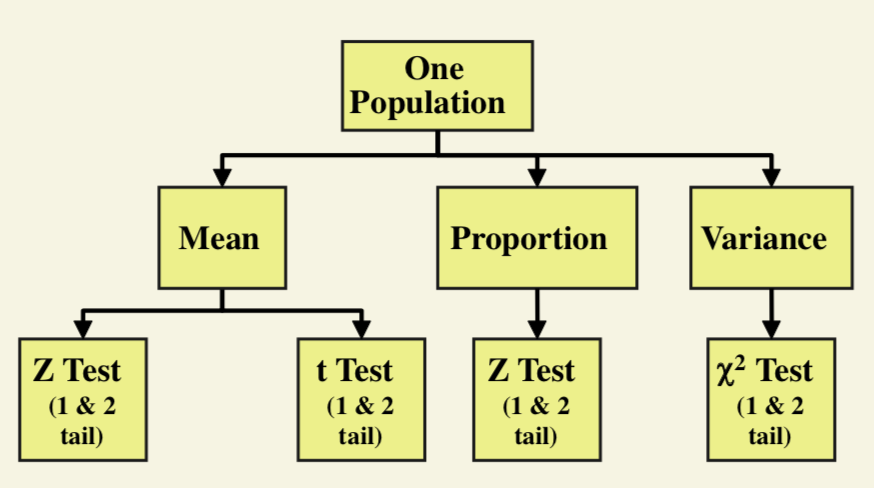

## One-sample $Z$ test of mean ($\sigma$ known)

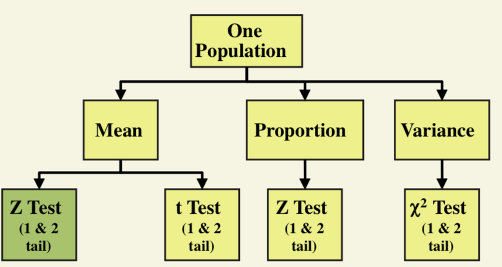

## One-sample $Z$ test of mean ($\sigma$ known)

* Assumptions

    * Population is normally distributed (or $n\ge 30$)
    
    * $\sigma$ known
    
    * A random sample is selected from a population
    
* $Z$-test statistic:

    * \[z_{\text{stat}}=\frac{\bar{x}-\mu}{\frac{\sigma}{\sqrt{n}}}\sim N(0,1)\,\,\text{under}\,\,H_0\]

## One-sample $Z$ test of mean ($\sigma$ known): Example

Suppose a Q/C inspector wants tofind out if a new machine is making electrical cords to customer specification: **average** breaking strength of $70$ lb, with $\sigma=3.5$ lb. You take a sample of $36$ cords and compute a sample mean of $69.7$ lb. At the $0.05$ level of significance, does there exist any evidence that the machine is NOT meeting the average breaking strength? Use the critical value approach.

**Soln**:

* We first specify the null and alternative hypotheses.
\[H_0: \mu=70,\quad H_a: \mu\neq 70\]

* Since the null hypothesis is an equality, this is a two-tailed test. At a $5\%$ level of significance, the critical $z$-values for a two-tailed test are $\pm 1.96$, so the decision rule can be stated as:
\[\text{Reject}\,\,H_0\,\,\text{if}\,\,1.96<\text{test statistic}<-1.96\]

* The standard error of the population mean is the adjusted standard deviation of the sample. When the sample statistic is the population mean $\mu$, the standard error of the sample statistic for sample size $n$ is calculated as: $\sigma_x=\frac{\sigma}{\sqrt{n}}$.
Since our sample statistic here is a sample mean, the standard error of the sample mean for a sample size of 250 is $\sigma_x=\frac{\sigma}{n}=\frac{3.5}{\sqrt{36}}$ and our **test statistic** is
\[Z=\frac{\bar{x}-\mu}{\frac{\sigma}{\sqrt{n}}}=\frac{69.7-70}{\frac{3.5}{\sqrt{36}}}=-0.51\]

* Since $-0.51>-1.96$, we do not reject the null hypothesis that the machine is meeting the average breaking strength of $70$ lb. We conclude that the average breaking strength is significantly different from $70$.

---

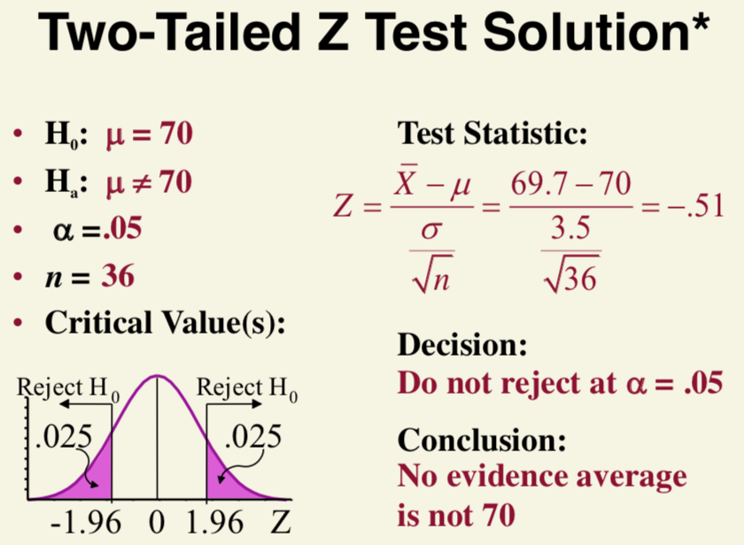

## One-sample $Z$ test of mean ($\sigma$ known): Example

You are an analyst for Ford. You want to find out if the average miles per gallon of Escorts is at least 32 mpg. Similar models have a standard deviation of $3.8$ mpg. You take a sample of $60$ Escorts and compute a sample mean of $30.7$ mpg. At the $0.01$ level of significance, does there exist any evidence that the miles per gallon is *at least 32*? Use the $p$-value approach.

 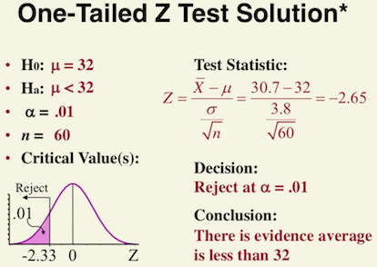  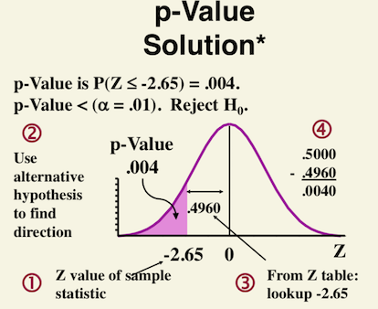
 
## One-sample $t$ test of $\mu$ ($\sigma$ unknown)

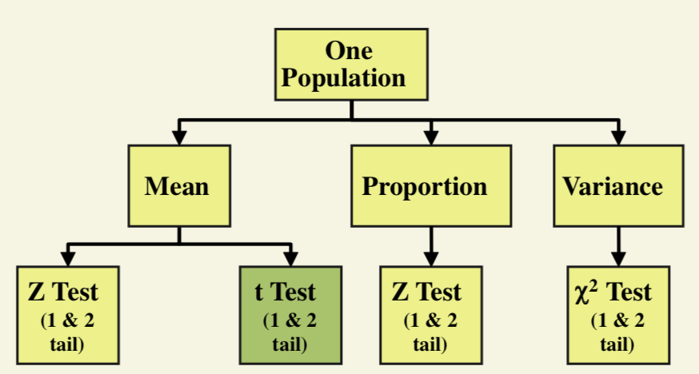

## One-sample $t$ test of $\mu$ ($\sigma$ unknown)

* Assumptions

    * Population is normally distributed (or $n\ge 30$)
    
    * $\sigma$ unknown
    
    * A random sample is selected from a population
    
* $Z$-test statistic:

    * \[t_{\text{stat}}=\frac{\bar{x}-\mu}{\frac{s}{\sqrt{n}}}\sim t_{n-1}\,\,\text{under}\,\,H_0\]
    
## One-sample $t$ test of $\mu$ ($\sigma$ unknown): Example

Suppose you work for the Fair Trade Commission (FTC). A Manufacturer of detergent claims that the mean weight of detergent is $3.25$ lb. You take a random sample of $64$ containers. You calculate the sample average to be $3.238$ lb. With a standard deviation of $0.117$ lb. At the $0.01$ significance level, is the manufacturer correct? Use the critical value approach.

<center>
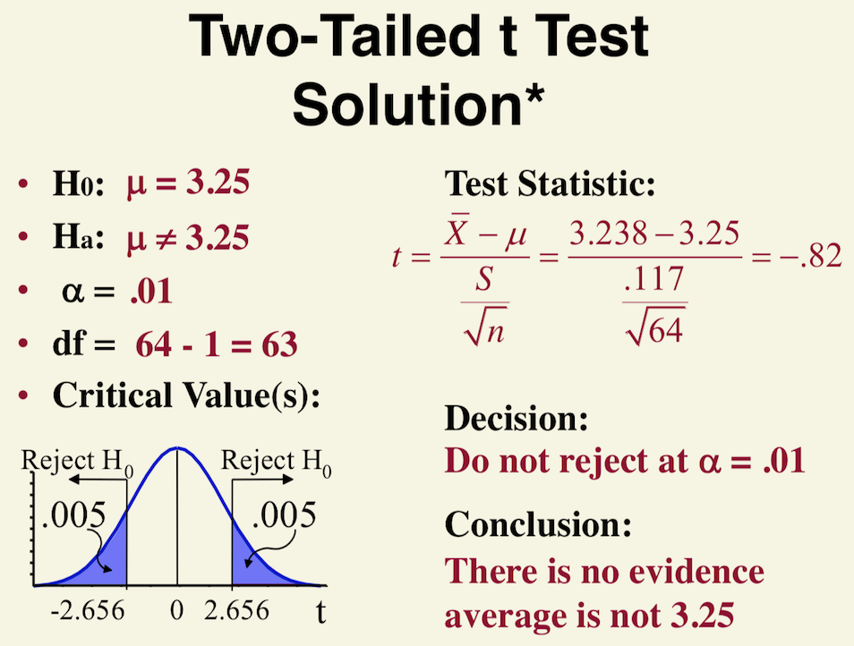
</center>

## One-sample $t$ test of $\mu$ ($\sigma$ unknown): Example

Is the average capacity of batteries *at least 40* ampere-hours? A random sample of $20$ batteries had a mean of $138.47$ and a standard deviation of $2.66$. Assume a normal distribution. Test at the $0.05$ level of significance. Use the $p$-value approach.

<center>
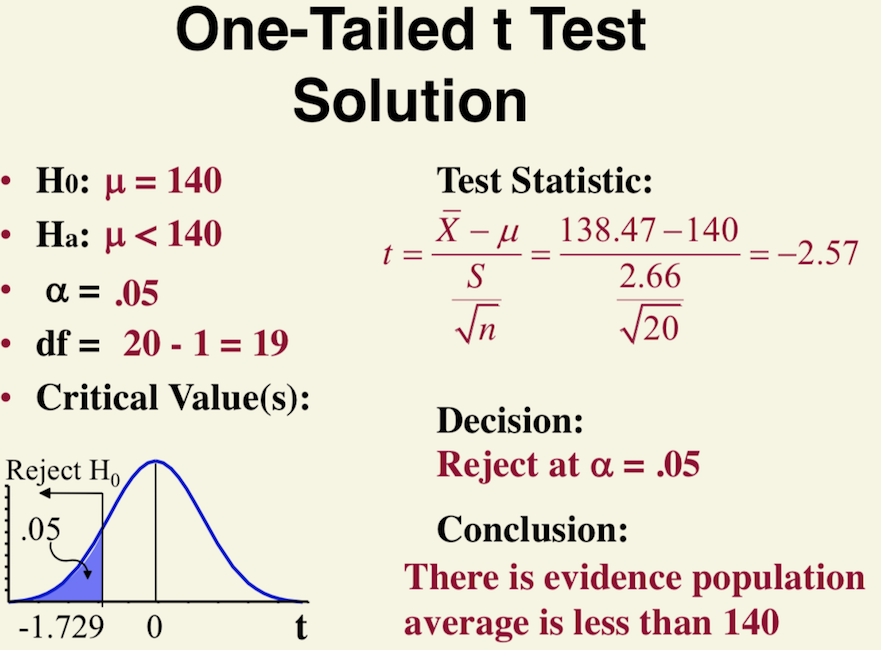
</center>

## One-sample $t$ test: Example

You are a marketing analyst for WalMart. Wal-Mart had teddy bears on sale last week. The weekly sales ($ 00) of bears sold in $10$ stores was: 
\[8\,\, 11\,\, 0\,\, 4\,\, 7\,\, 8\,\, 10\,\, 5\,\, 8\,\, 3\]
At the 0.05 level of significance, does there exists any evidence that the average bear sales per store is *more than $5$* (\($\)00)?

```{r}
# input the data
sales<-c(8,11,0,4,7,8,10,5,8,3)
# calculate sample mean
mean(sales)
t.test(sales,mu=5,alternative="less",conf.level=0.95)
```

## Z test of Proportion

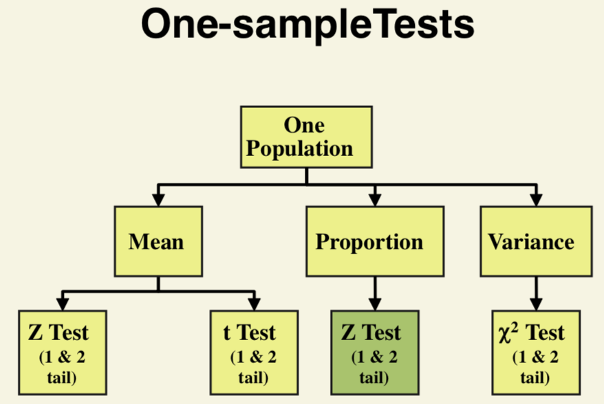

## One-sample $Z$ test for proportion

* Assumptions

    * Random sample selected from a binomial population
    
    * The sample size is large, i.e., $np\ge 10$ and $nq\ge 10$.
    
* $Z$-test statistic for proportion:

    * \[z_{\text{stat}}=\frac{\widehat{p}-p}{\sqrt{\frac{pq}{n}}}\sim N(0,1)\,\,\text{under}\,\,H_0\,\text{approx.}\]

## One-sample $Z$ test for proportion: Example

You are an accounting manager. A year-end audit showed $4\%$ of transactions had errors. Your implement new procedures. A random sample of $500$ transactions had $25$ errors. Has the *proportion* of incorrect transactions changed at the $0.05$ level of significance? Use the critical value approach.

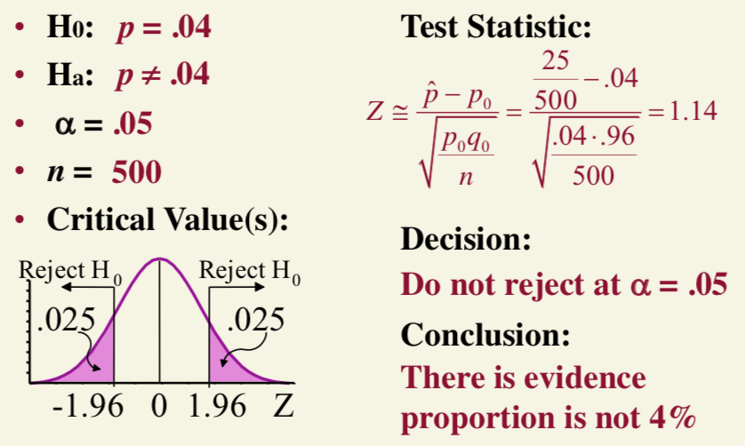


## One-sample $Z$ test for proportion: Example (Continue)

* Use the $p$-value approach?

\begin{align*}
p-\text{value}= &\ \mathbb{P}(\hat{p}>0.05|p=0.04)\\
= &\ \mathbb{P}(|Z|>1.14|p=0.04)+\mathbb{P}(|Z|<-1.14|p=0.04)
= 0.25
\end{align*}
which lies inside the non-rejection region.

```{r}
2*(1-pnorm(1.14))
```


## Chi-Square ($\chi^2$) Test of variance

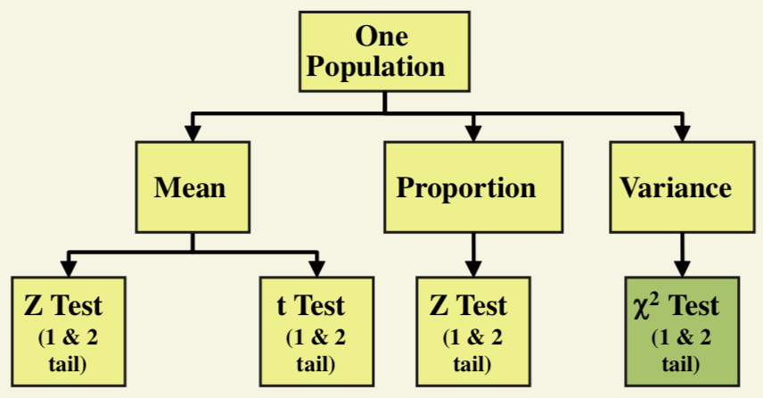

## Chi-Square ($\chi^2$) Test of variance

* The *Chi-square* test is used for hypothesis tests concerning the variance of a normally distributed population. 

* Let $\sigma^2$ represent the true population variance and $\sigma^2_0$ represents the hypothesized variance, the hypotheses for a two-tailed test of a single population are structured as:

\[H_0: \sigma^2=\sigma^2_0\,\,\text{versus}\,\,H_a: \sigma^2\neq \sigma^2_0\quad\text{for a two-tailed test}\]

The hypotheses for one-tailed tests are structured as:
\[H_0: \sigma^2\leq\sigma^2_0\,\,\text{versus}\,\,H_a: \sigma^2> \sigma^2_0\quad\text{for a lower one-tailed test}\]
\[H_0: \sigma^2\ge \sigma^2_0\,\,\text{versus}\,\,H_a: \sigma^2< \sigma^2_0\quad\text{for a upper one-tailed test}\]

* Test statistic: $\chi^2_{n-1}=\frac{(n-1)s^2}{\sigma^2_0}$ where: 
\[n=\text{sample size}\]
\[s^2=\text{sample variance}\]
\[\sigma^2_0=\text{hypothesized value for the population variance}\]

* Similar to other hypothesis tests, the chi-square test compares the test statistic, $\chi^2_{n-1}$, to a critical chi-square value at a given level of significance and $n-1$ degrees of freedom. (Note that the chi-square value can never be negative since it is bounded below by zero.)

* Significance level: $\alpha=0.05$

* Critical Region: Reject the null hypothesis that the variance is a specified value, $\sigma^2_0$, if
\begin{align*}
\chi^2&>\chi^2_{1-\alpha,n-1}\quad\text{for an upper one-tailed alternative}\\
\chi^2&<\chi^2_{\alpha,n-1}\quad\text{for an upper one-tailed alternative}\\
\chi^2&<\chi^2_{\alpha/2,n-1}\quad\text{for a two-tailed alternative}\\
\chi^2&>\chi^2_{1-\alpha/2,n-1}
\end{align*}

where $\chi^2_{\cdot,n-1}$ is the critical value of the $\chi$-square distribution with $n-1$ degree of freedom.

The formula for the hypothesis test can easily be converted to form an interval estimate for the variance:

\[\sqrt{\frac{(n-1)s^2}{\chi^2_{1-\alpha/2,n-1}}}\le \sigma\le \sqrt{\frac{(n-1)s^2}{\chi^2_{\alpha/2,n-1}}} \]

**Example**: A chi-square test was performed for the [GEAR.DAT](https://www.itl.nist.gov/div898/handbook/eda/section3/eda3581.htm) data set. The observed variance for the 100 measurements of gear diameter is $0.00003969$ (the standard deviation is $0.0063$). We will test the null hypothesis that the true variance is equal to $0.01$. 

**Solution**:

* State the hypothesis: The null hypothesis is that the standard deviation is equal to $1\%$ and, therefore, the variance of  $H_0:\sigma^2=0.01,\quad H_a: \sigma^2\neq 0.01$

* Select the level of significance. Let us use a $5\%$ level of significance, meaning there will be $2.5\%$ probability in each tail of the chi-square distribution.

* State the decision rule base on the critical value. With a sample size of 100, there are 99 degree of freedom. Using the table of chi-square values at the table for 99 degree of freedom and probabilities of 0.975 and 0.025, we find two critical value: 
This, the decision rule is 
\[\text{Reject} H_0\,\,\text{if}\,\,\chi^2<73.361,\,\,\text{or}\,\,\chi^2>128.442\]

```{r}
qchisq(0.025,df=99)
qchisq(0.975,df=99)
```

* Calculate the sample Test statistic: $\chi^2=\frac{(n-1)s^2}{\sigma^2_0}=\frac{(100-1)0.00003969^2}{0.01}=0.3903$

* Make a decision regarding the hypothesis and conclude. Since the test statistic value of $0.3903$ is much smaller than the lower critical value, so we reject the null hypothesis and conclude that the variance is not equal to 0.01. 

* **HW**: The chi-square test can be used to answer the following questions:

      * Is the variance equal to some pre-determined threshold value?
      
      * Is the variance greater than some pre-determined threshold value?
      
      * Is the variance less than some pre-determined threshold value? 

---

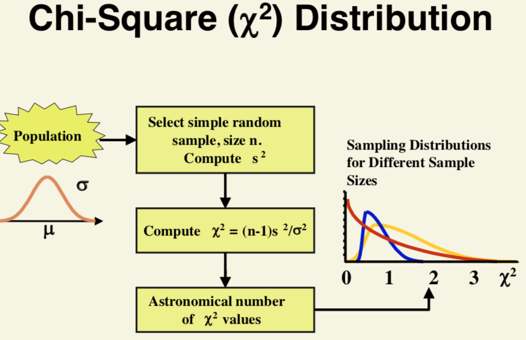
