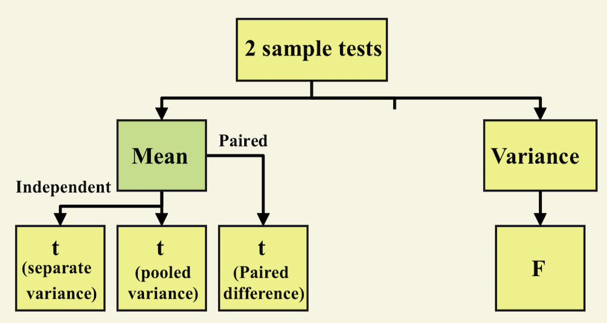
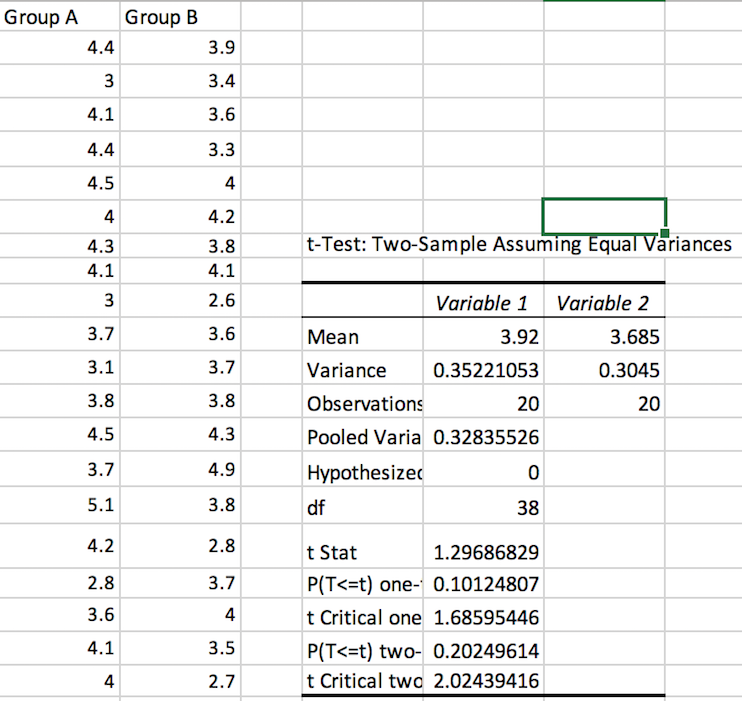

<style>
  .col2 {
    columns: 2 200px;         /* number of columns and width in pixels*/
    -webkit-columns: 2 200px; /* chrome, safari */
    -moz-columns: 2 200px;    /* firefox */
  }
  .col3 {
    columns: 3 100px;
    -webkit-columns: 3 100px;
    -moz-columns: 3 100px;
  }
</style>

## Paired comparison

One can use $t$-tests to make comparisons, in 2 ways

* Compare related observations on a single individual
(e.g. heart rate of a set of athletes before and after an exercise session, where two observations are generated for each individual)

* Compare observations from 2 independent groups, where

    * the 2 populations have different variances
    
    * the 2 populations have common (pooled) variances

## Learning outcomes

* Identify the appropriate test statistic and conduct a hypohesis test concerning the **mean difference between paired and dependent observations of a single population (paired comparison test)**

* Identify the appropriate test statistic and conduct hypohesis test concerning the **the equality of the population means of two at least approximately normally distributed populations, based on indepedent random sample with <span style="color:purple">equal</span> assumed variance **

* Identify the appropriate test statistic and conduct hypohesis test concerning the **the equality of the population means of two at least approximately normally distributed populations, based on indepedent random sample with <span style="color:purple">unequal</span> assumed variance **

## Two Population Inference



## Independent and Related Populations

<div class="col2">
|Independent|
|-----------|
|Different data sources: Unrelated or Independent|
|Use difference between the two sample means: $\bar{X}_1-\bar{X}_2$|

|Related|
|-----------|
|Same data source: Paired or matched; repeated measure (before/after)|
|Use difference between the two sample means: $d_i=X_{1i}-X_{2i}$|
</div>

## Paired t-test

* Tests means of 2 **Related** Populations

    * Samples are paired or related in some fashion
    
    * Repeated measures (before/after)
    
    * Use **difference** between paired values: $d_i=X_{1i}-X_{2i}$
    
* Eliminates variation among subjects

* Assumptions: 
    
    * The samples are **paired**.
    
    * The $n$ sample differences can be viewed as a **random sample** from a population of differences

    * Population of differences is normal (or at least approximately normal) or $n\ge 30$ with $\sigma_d$ unknown

* Examples

    * If you wished to buy a car you could look at the same car at two (or more) *different* dealerships and compare the prices.
    
    * If you wished to measure the effectiveness of a new diet you would weight the dieters at the start and at the finish of the program.
    
    * Test statistic: $t=\frac{\bar{d}-\text{hypothesized value}}{s_d/\sqrt{n}}$
    
        * $\bar{d}$ is the mean of the difference
        
        * $s_d$ is the standard deviation of the difference

        * $n$ is the number of pairs (difference)

## Example of paired samples

* An engineering association wants to see if there is a difference in the mean annual salary for electrical engineers and chemical engineers.  A random sample of electrical engineers is surveyed about their annual income.  Another random sample of chemical engineers is surveyed about their annual income.

>- No, there is no pairing of individuals, you have two **independent** samples

* A pharmaceutical company wants to test its new weight-loss drug.  Before giving the drug to volunteers, company researchers weigh each person.  After a month of using the drug, each person’s weight is measured again.

>- Yes, you have two observations on each individual, resulting in paired data.

## Example 11.6 (p.584) Improve Memory by Playing Chess

Can playing chess improve your memory?  In a study, students who had not previously played chess participated in a program in which they took chess lessons and played chess daily for 9 months.  Each student took a memory test before starting the chess program and again at the end of the 9-month period.

At the 0.10 significance level, can we conclude there is a difference in the mean difference in memory scored before chess training and the memory scores after chess training


## Example 11.6 (p.584) Improve Memory by Playing Chess: Hypothesis testing

*   **H**: State the null and alternative hypotheses.
\[H_0:\bar{d}=0\qquad H_a: \bar{d}\neq 0\]
where $\bar{d}$ is the mean memory score difference between students with no chess training and students who have completed chess training.

*   **D**: State the level of significance level, $\alpha$ 
and formulate decision rule.

    * At $10\%$ significance level, $t^*=t_{0.05,12-1}=-1.796$. 
    
    * Reject $H_0$ if $t_{\text{stat}}<-t^*=-1.796$ or $t_{\text{stat}}>t^*=1.796$
  or  
    
    * Reject $H_0$ if $p<0.1$
    
*Note*: Comparing the $t$-statistic to the cut-off $t$-value (as shown above) is equivalent to comparing the $p$-value to $\alpha$.


*    **T**:  find the appropriate test statistic $t_{\text{stat}}$. In this case, 
\[t=\frac{-144.6-0}{109.74/\sqrt{12}}=-4.56\]

We will use 0.1 significance level as stated in the problem. The $t$-test will be used.

```{r}
Pre<-c(510,610,640,675,600,550,610,625,450,720,575,675)
Post<-c(850,790,850,775,700,775,700,850,690,775,540,680)
t.test(Pre,Post,alternative="two.sided", paired=TRUE,conf.level = 0.9)
```

*   **C**:  Make a decision and conclude in context. 

    * Since the $p$-value less than $0.05$,(or since $t<-1.796$) we reject $H_0$. There is convincing evidence to suggest that the mean memory score after chess training is higher than the mean memory score before training.

## Example 11.6 (p.584) Improve Memory by Playing Chess: Confidence Interval

Now let us construct the confidence interval, that is 

\[\bar{d}\pm t_{\alpha/2}\frac{s_d}{\sqrt{n}}\]
where $\mu_d=-144.6$, $t^*=1.796$ and  $s_d=\sqrt{\frac{\sum^n_{i=1}(d_i-\bar{d})^2}{n-1}}=109.74$, $n=12$.

Hence
\[-144.6\pm 1.796\frac{109.74}{\sqrt{12}}=(-201.5,87.69)\]
We are $90\%$ confident that the true mean difference in memory scores before chess training and the memory scores after chess training is between    $-201.5$ and $-87.69$.

## Comparing two independent population means

<center>
```{r echo=FALSE}
library("DiagrammeR")
grViz("
digraph CFA {
# All
node [fontname = Helvetica, fontcolor = White]
# Box
node [shape = box, style=filled, color=Purple, width=1 label='Population means,\\n Independent samples'][fillcolor = pink]
a ;
# Box
node [shape = box, style=filled, color=violet, width=0.7, label='Unknown population variance\\n not assumed unequal'][fillcolor = blue]
b1 ;
# Box
node [shape = box, style=filled, color=violet, width=0.7, label='Unknown population variance\\n assumed unequal'][fillcolor = blue]
b2 ;
# Box
node [shape = box, style=filled, color=violet, width=0.5, label='Use sample standard deviation\\n to estimate unknown\\n population standard deviation'][fillcolor = violet]
b11 ;
# Box
node [shape = box, style=filled, color=violet, width=0.5, label='Use s_p to estimate unknown\\n population standard deviation.\\n Use a Pooled-variance'][fillcolor = violet]
b22 ;

# Draws
a -> b1 [fontname = Helvetica,fontsize=8]
a -> b2  [fontname = Helvetica,arrowsize = 0.5]
b1->b11 [fontname = Helvetica,style=dashed,fontsize=8]
b2->b22 [fontname = Helvetica,style=dashed,fontsize=8]
}
")
```
</center>

## Hypothesis Tests for $\mu_1-\mu_2$

### Two Population Means, Independent samples

<div class="col3">
* Lower-tail test: $H_0:\mu_1-\mu_2=0$  $H_1:\mu_1-\mu_2<0$

* right-tail test: $H_0:\mu_1-\mu_2=0$  $H_1:\mu_1-\mu_2>0$


* Two-tail test: $H_0:\mu_1-\mu_2=0$  $H_1:\mu_1-\mu_2\neq 0$

</div>

## Comparing two population means

* No assumptions about the shape of the populations are required.

* The samples are from **independent** populations

* The sample sizes are large (generally 30 or larger) or the population distributions are (at least approximately) normal.

* The formula for computing the test statistic ($z$) is:

    * $z=\frac{\bar{X}_1-\bar{X}_2}{\sqrt{\frac{\sigma^2_1}{n_1}+\frac{\sigma^2_2}{n_2}}}$ if $n>30$ or population distribution are (at least approximately) normal and if $\sigma_1$ and $\sigma_2$ are known
    
    * $t=\frac{\bar{X}_1-\bar{X}_2}{\sqrt{\frac{s^2_1}{n_1}+\frac{s^2_2}{n_2}}}$ if $n>30$ or population distribution are (at least approximately) normal and if $\sigma_1$ and $\sigma_2$ are unknown
    
    * $t=\frac{\bar{X}_1-\bar{X}_2}{s_p\sqrt{\frac{1}{n_1}+\frac{1}{n_2}}}$ if $n>30$ or population distribution are (at least approximately) normal and if common variance is assumed but unknown
    
* When comparing two treatment groups, use the following assumptions:

    * Individuals or objects are randomly assigned to treatments (or vice versa)

    * The sample sizes are large (generally 30 or larger) or the treatment response distributions are approximately normal.

    
## Comparison of 2 independent groups: separate-variance $t$ test 

In a study on food intake after sleep deprivation, men were randomly assigned to one of two treatment groups.  The experimental group were required to sleep only $4$ hours on each of two nights, while the control group were required to sleep $8$ hours on each of two nights.  The amount of food intake (Kcal) on the day following the two nights of sleep was measured.Use a $5\%$ significance level to determine if there is convincing evidence that the mean food intake for the two sleeping conditions are different?

**Assumption**:

* Men were randomly assigned to two treatment groups

* The assumption of normal response distributions is plausible because both boxplots are approximately symmetrical with no outliers.
```{r}
x=c(3585,4470,3068,5338,2221,4791,4435,3099,3187,3901,3868,3869,4878,3632,4518)
y=c(4965,3918,1987,4993,5220,3653,3510,3338,4100,5792,4547,3319,3336,4304,4057)
boxplot(x,y,names=c("4-hr sleep","8-hr sleep"), col=c("orange","purple"),horizontal=TRUE)
```

|4-hour sleep|3585|4470|3068|5338|2221|4791|4435|3099|3187|3901|3868|3869|4878|3632|4518|
|------------|----|----|----|----|----|----|----|----|----|----|----|----|----|----|----|
|8-hour sleep|4965|3918|1987|4993|5220|3653|3510|3338|4100|5792|4547|3319|3336|4304|4057|

Here two groups are in equal size. To compare the means, we analyse the sample statistic given by 
\[t=\frac{\bar{X}_1-\bar{X}_2}{\sqrt{\frac{s^2_1}{n_1}+\frac{s^2_2}{n_2}}}\]

\[df=\frac{(s^2_1/n_1+s^2_2/n_2)}{\frac{(s^2_1/n_1)^2}{n_1-1}+\frac{s^2_2/n_2)^2}{n_2-1}}\]

where we compare means of $X_1$ and $X_2$, with associated sample variance $s^2_1$ and $s^2_2$ and sample sizes $n_1$ and $n_2$

The null hypothesis is rejected in favor of the alternaive if,
for $H_a:\mu_1\neq\mu_2$,
\[t<t_{-\alpha/2}\quad\text{or}\quad t>t_{\alpha/2}\]
for $H_a:\mu_1\ge\mu_2$,
\[t<t_{-\alpha/2}\quad\text{or}\quad t>t_{\alpha}\]
for $H_a:\mu_1\leq\mu_2$,
\[t<t_{-\alpha/2}\]
Comparing the $t$-statistic to the cut-off $t$-value (as shown above) is equivalent to comparing the $p$-value to $\alpha$.

We now look at this in R. 
```{r}
 t.test(x,y,alternative="two.sided", paired = FALSE, var.equal = FALSE, conf.level = 0.95)
```
For this data $p=0.6596>0.05=\alpha$. We do not reject the hypothesis and there is not convincing evidence that the mean food intake for the two sleep conditions are different.

Alternatively, we can look at this in EXCEL and the conclusion remains the same base on the $t$-statistic and $p$-value.


## Comparison of 2 independent groups: pooled-variance $t$ test 

To undertake an independent-groups paired test with a **common**(pooled) variance we test
\[t=\frac{\bar{X}_1-\bar{X}_2}{s_p\sqrt{\frac{1}{n_1}+\frac{1}{n_2}}}\]
distributing as $t$ with $n_1+n_2-2$ degrees of freedom, where pooled variance is
\[s^2_p=\frac{(n_1-1)s^2_1+(n_2-1)s^2_2}{n_1+n_2-2}\]
\[df=n_1+n_2-2\]
Now we have a look at R

```{r}
 t.test(x,y,alternative="two.sided", paired = FALSE,var.equal = TRUE, conf.level = 0.95)
```
$p=0.6595>0.05=\alpha$. We do not reject the hypothesis and there is not convincing evidence that the mean food intake for the two sleep conditions are different.

Alternatively, we can look at this in EXCEL and the conclusion remains the same base on the $t$-statistic and $p$-value.


## Comparison of 2 independent groups: pooled-variance $t$ test 

A class of $40$ university students in final year psychology undertakes an experiment to determine the effect of a small amount of alcohol ingestion on reaction times to a simulated accident. Students are randomly assigned into two groups $A$ and $B$. The Group B were used as a control for reaction times and group A received alcohol sufficient to bring them to a level of $0.03$ on blood alcohol reading.  The aim of the experiment was to see if alcohol affected reaction time (in particular slowed it down).

We take a look at this data in R. It is clear that the variance for group and reaction time variable are quite close.
```{r}
groupA=c(4.4,3,4.1,4.4,4.5,4,4.3,4.1,3,3.7,3.1,3.8,4.5,3.7,5.1,4.2,2.8,3.6,4.1,4)
groupB=c(3.9,3.4,3.6,3.3,4,4.2,3.8,4.1,2.6,3.6,3.7,3.8,4.3,4.9,3.8,2.8,3.7,4,3.5,2.7)
var(groupA)
var(groupB)
```
Hence we proceed to run a 2-sample $t$-test with equal variance assumption in R.
```{r}
t.test(groupA,groupB,alternative="two.sided", paired = FALSE,var.equal = TRUE, conf.level = 0.95)
```

Since $p=0.2025>0.05$, there is insufficient evidence that reaction time are different. Hence we conclude that there is no significant different here in reaction time.

Alternatively, you can perform the same test in EXCEL. The same conclusion shall be reached.

