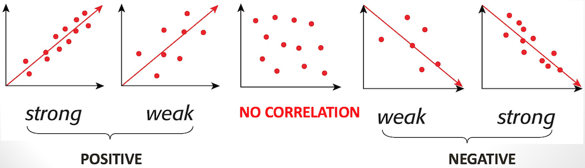
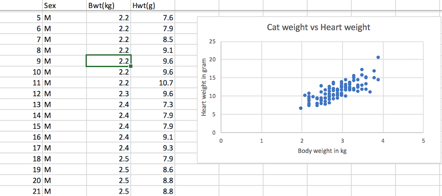
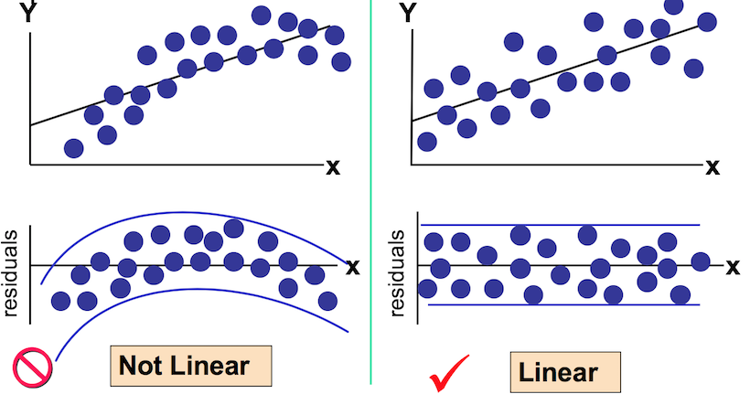
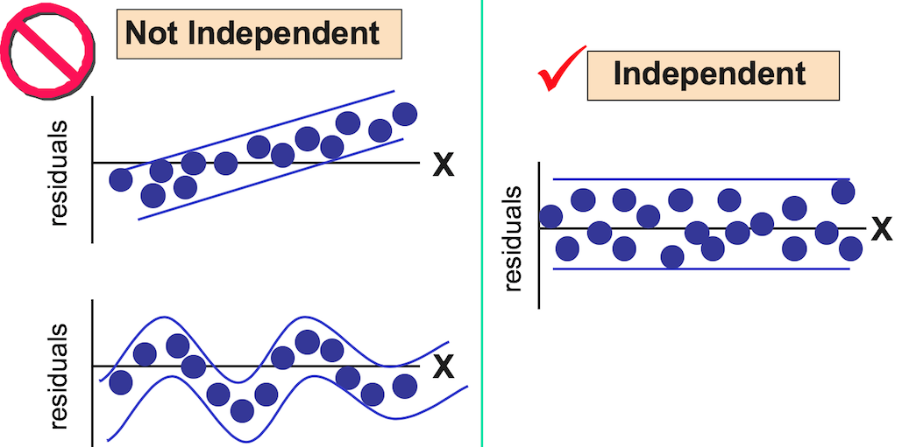
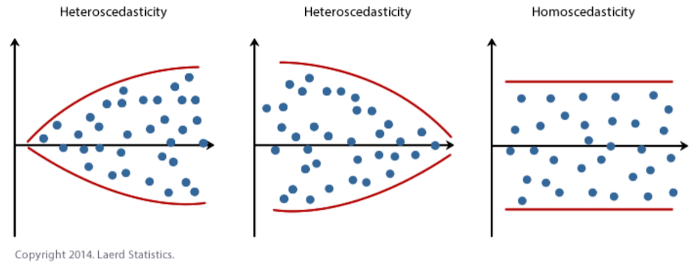
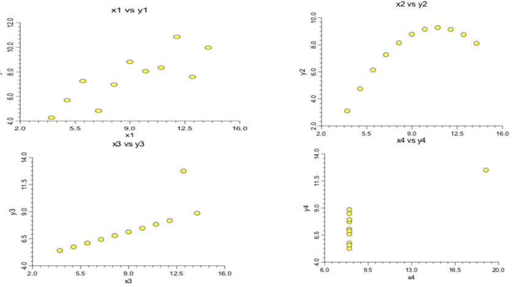

## Learning Objective

* Construct a Scatter Plot

* Fit the least square's Line

* Construct a residual plot

* Calculate the coefficient of determination ($r^2$)

* Prediction

* Mistakes in Regression

## Bivariate DATA

* Quite often we are more interested in the relationship between two variables.

    + This is called a **bivariate relationship**.
    
    + The method that we use to display bivariate relationships depends on the type of data.
    
## Scatterplots

* A **scatter plot** is a useful graphical summary of a set of bivariate data.

* To draw a scatter plot, we need two variables. We scale one variable along the horizontal axis ($X$) of a graph and the other variable along the verticle axis ($Y$)

* In R, we use the basic function **plot(x,y)**, where $x$, which yields the scatterplot of $y$ against $x$.

* Type of correlation



## Scatterplots: Examples

* Stock market valuation ($X$) and quarterly corporate earnings ($Y$) are recorded for each company in a sample.

* Height ($X$) and weight ($Y$) are measured for each individual in a sample.

* Ages of husband ($X$) and wife ($Y$) in a sample of married couples.

* Exercises per week ($X$) and body weight ($Y$) for each individual in a sample.


## Example: Cat bodyweights and heartweights

* Domain knowledge

144 adult (over 2kg in weight) cats used for experiments with the drug digitalis had their heart(in grams) and body weight (in kilograms) recorded. 47 of the cats were female and 97 were male. 

* It is hard to find a relationship between all of this data, so let us look at it by making a scatterplot in excel.



## Example: Cat bodyweights and heartweights

* Can we predict a cat's heartweight from bodyweight?

    + Bodyweight will be our "X" and heartweight will be our "Y".
    
    + Does there exist a relationship between cat's heartweight and bodyweight? If so, what sort of relationship is it?
    
    + According to our data, the heartweight of a cat is positively related to the bodyweight: The heavier the cat weight, the heavier her/his heart.

## Linear association

* The linear association between 2 variables describes how tightly the points cluster around a line.

* If there is a **strong** association, the cloud of points are **tightly clustered** around a line, and this allows for good predictions from 1 variable to the other.

* If one variable tends to **increase** with the other, then one has the **positive** association.

* Now, how do we measure association?

## Pearson's Correlation Coefficient

* Suppose our scatterplot shows a linear relationship between $X$ and $Y$ (note: both must be quantitative)

* The correlation coefficient, $\rho_{XY}$, measures the strength and direction of the **linear** relationship. 

    + -1 indicates a Perfect negative linear relationship.
    
    + $(-1,0)$ indicates partial negative linear relationship. weak or strong
    
    + A result of zero indicates no relationship at all.
    
    + $(0,1)$ Partial positive linear relationship, weak or strong
    
    + 1 indicates a Perfect positive linear relationship.

* Correlation are indications of linear relationships - it is possible that two variables have zero correlation, but are strongly dependent (non-linear).
    
* The formulae of $\rho$ is 

\[\rho_{X,Y}=\frac{\text{Cov}(X,Y)}{\sigma_X\sigma_Y}=\frac{\mathbb{E}[(X-\mu_X)(Y-\mu_Y)]}{\sqrt{\mathbb{E}(X-\mu_X)\mathbb{E}(Y-\mu_Y)}}\]

where:

  + cov is the covariancen, $\sigma_X, \sigma_Y$ are resp. the standard deviation of $X$ and $Y$. Formula: $\text{Cov}(X,Y)=\mathbb{E}[(X-\mu_X)(Y-\mu_Y)]$
    
  + $\sigma_X$, $\sigma_Y$ are resp. standard deviation of $X$ and $Y$.
    
  + $\mu_X$ is the mean of $X$;
    
  + $\mu_Y$ is the mean of $Y$;
    
  + $\mathbb{E}$ is the expectation;

and the value of the correlation coefficient is between -1 and 1, i.e. $-1\le \rho_{XY}\le 1$.

* Examples:

    + Age and Bond Density
    
    + Father and sun height
    
    + Etc.
    
*  Correlations are indication of linear relationship - it is possible that two variables have zero correlation, but are strongly dependent (non-linear).

* The correlation coefficient is a population parameter that can be estimated from data.

## Use of Pearson's correlation Coefficient $\rho$

Assumptions:

* The two variables should be measured at the interval or ratio level. In other words, they should be continuous.

* There needs to be a linear relationship between the two variables.

* There should be no significant outliers.

* The two variables should be approximately normally distributed (i.e. bivariate normally distributed)


## Correlation Coefficient

Suppose we have $n$ pairs of observations denoted by

\[(x_1,y_1),(x_2,y_2),\cdots,(x_n,y_n)\]

Estimate the population correlation $\rho_{XY}$ using
$$ s_{xx}=\sqrt{\frac{1}{n-1}\sum^n_{k=1}(x_k-\bar{x})^2}\quad\text{and}\quad s_{yy}=\sqrt{\frac{1}{n-1}\sum^n_{k=1}(y_k-\bar{y})^2}$$
    
Estimate the covariance by 

\[\text{Cov}(X,Y)=\frac{1}{n-1}\sum^n_{k=1}(x_k-\bar{x})(y_k-\bar{y})\]

Hence the sample correlation coefficient is

\[r=\frac{1}{n-1}\frac{\sum^n_{k=1}(x_k-\bar{x})(y_k-\bar{y})}{s_x s_y}\]

## Spearman rank correlation

* If the assumptions of normality are not met, one has to consider the **Spearman's ranked correlation**. This is just the Pearson correlation coefficients between ranked variables. In this case, one only has to assume a *monotonic* relation between two variables.
\[\rho_s=1-\frac{6\sum^n_{k=1}d^2_k}{n(n^2-1)}\]

* Spearman's rank correlation coefficient allows you to identify whether two variables relate in a monotonic function (i.e., that when one number increases, so does the other, or vice versa).

*  To calculate Spearman's rank correlation coefficient, you'll need to rank and compare data sets to find $\sum_k d^2_k$, then plug that value into the standard or simplified version of Spearman's rank correlation coefficient formula. You can also calculate this coefficient using Excel formulas or R commands.

* Example
[Test scores](http://www.statisticshowto.com/spearman-rank-correlation-definition-calculate/)

* Example in R

```{r}
#scatterplot
physics<-c(35,23,47,17,10,43,9,6,28)
maths<-c(30,33,45,23,8,49,12,4,31)
plot(physics,maths)
#fit least square line
fit<- lm(maths~physics)
fit
abline(fit, col="red", lwd=2)
# Produce a residual plot
plot(physics,fit$residuals)
abline(h=0)
# Find Pearson correlation coefficient and R^2
cor(maths,physics,method="spearman")
cor(maths,physics,method="spearman")^2
```

<!---

## Spearman rank correlation: Example


 **Steps**

  * In your third column rank the data in your first column from 1 to n (the number of data you have). Give the lowest number a rank of 1, the next lowest number a rank of 2, and so on.
  
  * In your fifth column do the same, but instead rank the 4th column.
  
      + If two (or more) pieces of data in one column are the same, find the mean of the ranks as if those pieces of data had been ranked normally, then rank the data with this mean. (See Tutorial 2 Exercise 3)
        
  * In the 6th column calculate the difference between the two numbers in each pair of ranks. ( if one is ranked 1 and the other 3 the difference would be 2. (The sign doesn't matter, since the next step is to square this number.)
    
  * Square each of the numbers in the "6th" column and write these values in the 7th column.
    
  * All up all data in the 7th column. This is $\sum d^2_k$.
    
  * Apply the Spearman's Rank Correlation formula 
    \[1-\frac{6\sum^n_k d^2_k}{n(n^2-1)}=1-\frac{6\times 1038}{n(n^2-1)}\] and replace the "$n$" with the number of pairs of data you have to calculate the answer.
    \[1-\frac{6\sum^n_k d^2_k}{n(n^2-1)}=1-\frac{6\times 1038}{15(15^2-1)}\]
    
```{r}
1-6*1038/(15*(15^2-1))
```
--->


[Calculate Pearson and Spearman correlation in R](https://www.theanalysisfactor.com/r-tutorial-pearson-spearman-correlation/)


## Fitting a Linear Model to a Bivariate Data set

* Final the line of best fit by minimising the sum of square residual

* Use the sample values of $(x,y)$, estimate the intercept ($a$) and slope ($b$)

\[a=\bar{y}-b\bar{x},\quad b=\frac{S_{xy}}{S_{xx}}=\frac{\sum^n_{k=1}(x_k-\bar{x})(y_k-\bar{y})}{\sum^n_{k=1}(x_k-\bar{x})^2}\]

*   The Least Square Line: $\widehat{y}=a+bx$

## Construct Residual Plot

* This is a plot of $\epsilon_i$ vs $x_i$, where $\epsilon_i=y_i-\widehat{y}=y_i-(a+bx_i)$ are the residuals, also called the deviation. 

* If the plot is random, then Linear model suffices. Otherwise, one has to consider more complex model or a transformation.

## Homoscedasticity vs heteroscedasticity

* Where residuals has a similar scatter around 0 at all levels of the independent variable 

* Redidual Analysis for Homoscedasticity



## Homoscedasticity

* Redidual Analysis for Independence



## Heteroscedasticity

When residuals has different spread around 0 at different level of the independent variable ($x$) is called heteroscedasticity.



## The Coefficient of Determination ($r^2$ or $R^2$)

* $R^2$ is simply the square of the correlation coefficient in a simple linear regression models.
It is a measure of the **goodness of fit**

* $R^2$ is the proportion of variability of $y$ explained by $x$ or the proportion of $y$ explained by the linear regression.

* Properties:
\[0\le R^2\le 1\]

* $R^2$ does not have to be big to validate the model (i.e. there exists linear model inherits low association between $X$ and $Y$)

## Partioning the Variability

The squared deviations $(y_k-\bar{y})^2$ provide us with a measure of the spread of the data. 

Define

\[\text{Total SS}=\sum^n_{k=1}(y_k-\bar{y})^2\]

to be the total sum of squares.

Using the estimated regression line, one can compute the *fitted value*

\[\widehat{y}_k=\widehat{\alpha}+\widehat{\beta}x_k\]

Partition the total deviation as

\[\underbrace{y_k-\bar{y}}_{\text{total deviation}}=\underbrace{(y_k-\widehat{y})}_{\text{unexplained deviation}}+\underbrace{(\widehat{y}_k-\bar{y})}_{\text{explained deviation}}\]

We then obtain
\[\underbrace{\sum^n_{k=1}(y_k-\bar{y})}_{\text{total SS}}=\underbrace{\sum^n_{k=1}(y_k-\widehat{y})}_{\text{Error SS}}+\underbrace{\sum^n_{k=1}(\widehat{y}_k-\bar{y})}_{\text{Regression SS}}\]
where SS stands for sum of squares.

Interpret these sums of squares as follows:

1. Total SS is the total variability in the absence of knowledge of the variable $x$;

2. Error SS is the total variability remaining after introducing the effect of $x$; and

3. Regression SS is the total variability "explained " because of knowledge of $x$.

## Mathematical representation of $R^2$

The R-squared is given by

\[R^2=1-\frac{SSE}{SST}=\frac{SSR}{SST}\]
where 

*  $SSE$ is the error SS.
    
*  $SSR$ is the regression SS.
    
*  $SST$ is the total SS.

Denote the sample means of the data by $\bar{x}=\frac{1}{n}\sum^n_{k=1}x_k$ and 
$\bar{y}=\frac{1}{n}\sum^n_{k=1}y_k$.

The sums of squares are $S_{xx}=\sum^n_{k=1}(x_k-\bar{x})^2=(n-1)S^2_x$
and $S_{yy}=\sum^n_{k=1}(y_k-\bar{y})^2=(n-1)S^2_y$.

The sum of cross-product is
\[S_{xy}=\sum^n_{k=1}(x_k-\bar{x})(y_k-\bar{y})\]

The (least squares) estimates of $\alpha$ and $\beta$ are given by 

\[\hat{\beta}=\frac{S_{xy}}{S_{xx}}=\frac{\sum^n_{k=1}(x_k-\bar{x})(y_k-\bar{y})}{\sum^n_{k=1}(x_k-\bar{x})^2}=r\frac{S_y}{S_x}\]
and
\[\hat{\alpha}=\bar{y}-\hat{\beta}\bar{x}\]

The $\beta$ is referred to as the slope of the regression line and $\alpha$ the intercept.

## Mistakes in Regression

* Correlation does not imply causation.

* Causation does not imply linear correlation

* The same value of $r$ can be very different models

* Regression is sensitive to outliers

    + Beaware of outliers when using regression
    
    + Draw the scatter plot before regress!
    


## Summary: Steps for analysis

* Construct a Scatter plot

    + This is a plot of $y$ against $x$. Does there exist a linear relationship between $Y$ and $X$, or not?
    
    + Measure *Association* - Perason's correlation coefficient $r$. How strong is the linear association?
    
    + Fit a *Linear Regression* (least square line) : $\widehat{y}=a+bx$
    \[a=\bar{y}-b\bar{x},\quad b=\frac{S_{xy}}{S_{xx}}=\frac{\sum^n_{k=1}(x_k-\bar{x})(y_k-\bar{y})}{\sum^n_{k=1}(x_k-\bar{x})^2}\]
    
* Construct a **Residual Plot** to see if residuals are random.

    + This is simply a plot of $\epsilon_i$ vs $x_i$, where 
    \[\epsilon_i= y_i-\widehat{y}=y_i-(a+bx_i)\]
    
    + If the plot is random: then the LSL fit is good.
    
    + If the plots show a relationship, then the Linear regression is not adequate and one need a more complex function or transformation (i.e. log(x))
    
*  Keep in mind: Valid range, Homoscedasticity/hetereoscedasticity

<!---

Source of Variation  | Sum of Squares | Degree of Freedon | Mean Squares                  |       F
-------------------- | ---------------| ------------------|-------------------------------|
 Between group       | SSTR           | k-1               | $\text{MSTR}=\frac{SSA}{k-1}$ |
 Within (error)      | SSE            | n-k               | $\text{MSE}=\frac{SSE}{n-k}$  |
 Total               | SST            | n-1               | $\text{MST}=\frac{SST}{n-1}$  |

--->